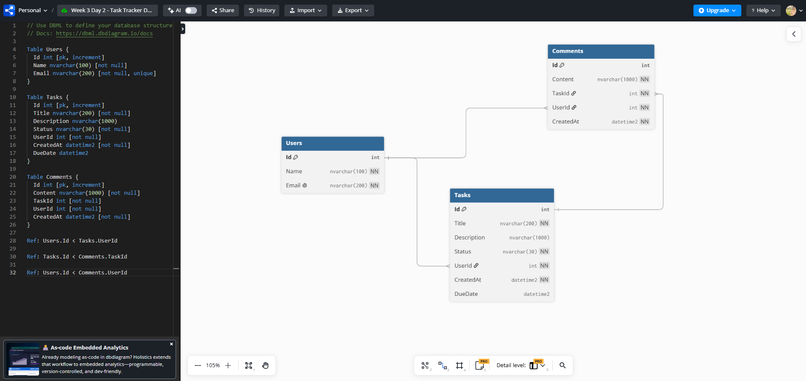
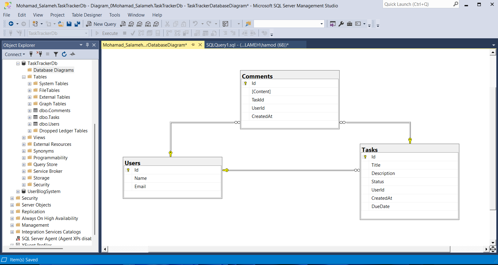

# Day 2 — SQL Server Schema Design & Normalization

## Overview

During this day, I designed and implemented a normalized database schema for the Task Tracker API created during Day 1.

The database contains three main entities:

- `Users`
- `Tasks`
- `Comments`

The initial schema was designed using `dbdiagram.io` and then implemented in SQL Server using SQL Server Management Studio.

## Learning Objectives

- Understand why database normalization is important.
- Apply First, Second, and Third Normal Form.
- Define primary keys and foreign keys.
- Model one-to-many relationships.
- Select appropriate SQL Server column types.
- Create an Entity Relationship Diagram.
- Implement the database schema in SQL Server.

## Database Normalization

Normalization organizes data into related tables and reduces unnecessary duplication.

The Task Tracker schema satisfies the first three normal forms.

### First Normal Form — 1NF

The schema satisfies `1NF` because every column stores one atomic value.

For example, comments are stored as separate records in the `Comments` table instead of storing multiple comments inside one column in the `Tasks` table.

### Second Normal Form — 2NF

Each table uses a single-column primary key:

```text
Users.Id
Tasks.Id
Comments.Id
```

Every non-key column depends on the complete primary key of its table.

### Third Normal Form — 3NF

User, task, and comment information is stored in separate tables.

The `Tasks` and `Comments` tables reference related records using foreign keys instead of duplicating user or task information.

## Database Entities

### Users Table

The `Users` table stores application users.

| Column | Type | Constraints |
|---|---|---|
| Id | int | Primary Key, Identity |
| Name | nvarchar(100) | Not Null |
| Email | nvarchar(200) | Not Null, Unique |

### Tasks Table

The `Tasks` table stores tasks assigned to users.

| Column | Type | Constraints |
|---|---|---|
| Id | int | Primary Key, Identity |
| Title | nvarchar(200) | Not Null |
| Description | nvarchar(1000) | Nullable |
| Status | nvarchar(30) | Not Null |
| UserId | int | Foreign Key, Not Null |
| CreatedAt | datetime2 | Not Null |
| DueDate | datetime2 | Nullable |

### Comments Table

The `Comments` table stores comments written by users on tasks.

| Column | Type | Constraints |
|---|---|---|
| Id | int | Primary Key, Identity |
| Content | nvarchar(1000) | Not Null |
| TaskId | int | Foreign Key, Not Null |
| UserId | int | Foreign Key, Not Null |
| CreatedAt | datetime2 | Not Null |

## Database Relationships

The database contains three one-to-many relationships:

```text
Users.Id → Tasks.UserId
Tasks.Id → Comments.TaskId
Users.Id → Comments.UserId
```

These relationships represent:

- One user can have many tasks.
- One task can have many comments.
- One user can write many comments.

## Database Design Using dbdiagram.io

The initial schema was designed using DBML in `dbdiagram.io`.

```dbml
Table Users {
  Id int [pk, increment]
  Name nvarchar(100) [not null]
  Email nvarchar(200) [not null, unique]
}

Table Tasks {
  Id int [pk, increment]
  Title nvarchar(200) [not null]
  Description nvarchar(1000)
  Status nvarchar(30) [not null]
  UserId int [not null]
  CreatedAt datetime2 [not null]
  DueDate datetime2
}

Table Comments {
  Id int [pk, increment]
  Content nvarchar(1000) [not null]
  TaskId int [not null]
  UserId int [not null]
  CreatedAt datetime2 [not null]
}

Ref: Users.Id < Tasks.UserId
Ref: Tasks.Id < Comments.TaskId
Ref: Users.Id < Comments.UserId
```

### dbdiagram.io ERD

The following screenshot displays the DBML code and the generated Entity Relationship Diagram.



## SQL Server Implementation

The schema was implemented in SQL Server Management Studio.

### Create the Database

```sql
CREATE DATABASE TaskTrackerDb;
GO
```

### Create the Users Table

```sql
USE TaskTrackerDb;
GO

CREATE TABLE Users
(
    Id INT IDENTITY(1,1) PRIMARY KEY,
    Name NVARCHAR(100) NOT NULL,
    Email NVARCHAR(200) NOT NULL UNIQUE
);
GO
```

### Create the Tasks Table

```sql
CREATE TABLE Tasks
(
    Id INT IDENTITY(1,1) PRIMARY KEY,
    Title NVARCHAR(200) NOT NULL,
    Description NVARCHAR(1000) NULL,
    Status NVARCHAR(30) NOT NULL,
    UserId INT NOT NULL,
    CreatedAt DATETIME2 NOT NULL,
    DueDate DATETIME2 NULL,

    CONSTRAINT FK_Tasks_Users
        FOREIGN KEY (UserId)
        REFERENCES Users(Id)
);
GO
```

### Create the Comments Table

```sql
CREATE TABLE Comments
(
    Id INT IDENTITY(1,1) PRIMARY KEY,
    Content NVARCHAR(1000) NOT NULL,
    TaskId INT NOT NULL,
    UserId INT NOT NULL,
    CreatedAt DATETIME2 NOT NULL,

    CONSTRAINT FK_Comments_Tasks
        FOREIGN KEY (TaskId)
        REFERENCES Tasks(Id),

    CONSTRAINT FK_Comments_Users
        FOREIGN KEY (UserId)
        REFERENCES Users(Id)
);
GO
```

## SQL Server Database Diagram

After creating the tables and foreign-key constraints, I created a database diagram inside SQL Server Management Studio.

The diagram confirms that the implemented database matches the original design.



## Column Type Selection

The schema uses SQL Server-compatible column types:

- `INT` for identifiers.
- `NVARCHAR` for Unicode text.
- `DATETIME2` for dates and times.

The text columns use specific maximum lengths instead of using `nvarchar(max)` for every field.

The current database does not contain monetary values. If monetary values are added later, they should use:

```sql
DECIMAL(18,2)
```

instead of `FLOAT`.

## Tools Used

- SQL Server Management Studio
- dbdiagram.io
- Notion

## What I Learned

- Why database normalization reduces duplicated data.
- How to apply `1NF`, `2NF`, and `3NF`.
- How primary keys uniquely identify records.
- How foreign keys connect related tables.
- How to model one-to-many relationships.
- How to select appropriate SQL Server column types.
- How to create an ERD using `dbdiagram.io`.
- How to create databases and tables using SQL.
- How to create a database diagram in SQL Server Management Studio.