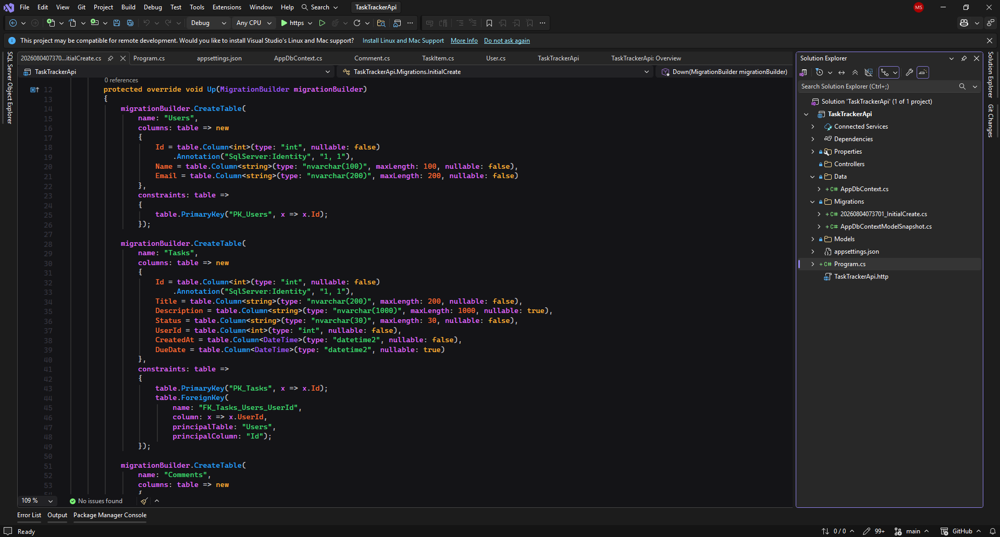
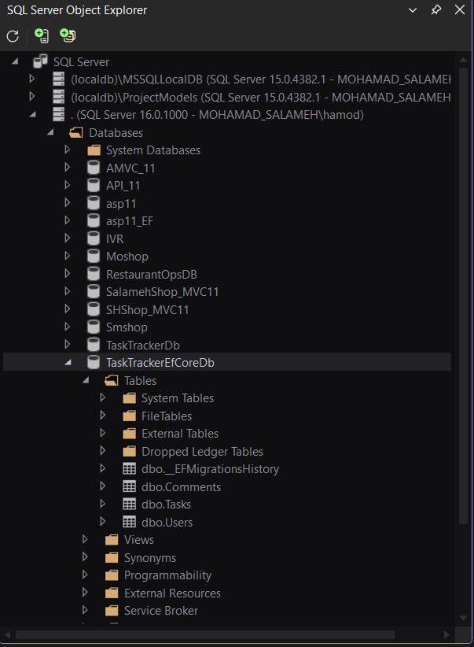

# Day 3 — Entity Framework Core Setup & Code-First Migrations

## Overview

During this day, I created a new ASP.NET Core Web API project for the Task Tracker domain and configured Entity Framework Core with SQL Server.

I defined entity classes matching the Day 2 database schema, created an `AppDbContext`, configured the relationships using Fluent API, generated the `InitialCreate` migration, and applied it to SQL Server.

## Learning Objectives

- Install and configure Entity Framework Core with SQL Server.
- Define entity classes matching the Day 2 schema.
- Create and configure a `DbContext`.
- Register the `DbContext` using Dependency Injection.
- Configure a SQL Server connection string.
- Generate a Code-First migration.
- Apply the migration to the database.
- Verify the generated tables.

## Project

A new ASP.NET Core Web API project was created:

```text
TaskTrackerApi
```

The project targets:

```xml
<TargetFramework>net10.0</TargetFramework>
```

## EF Core Packages

The following NuGet packages were installed:

```text
Microsoft.EntityFrameworkCore.SqlServer
Microsoft.EntityFrameworkCore.Tools
```

`Microsoft.EntityFrameworkCore.SqlServer` allows EF Core to communicate with SQL Server.

`Microsoft.EntityFrameworkCore.Tools` provides migration commands inside Visual Studio Package Manager Console.

## Entity Models

The project contains three entity models:

```text
User
TaskItem
Comment
```

The name `TaskItem` is used instead of `Task` to avoid confusion with the built-in .NET `Task` class.

### User

```csharp
namespace TaskTrackerApi.Models
{
    public class User
    {
        public int Id { get; set; }

        public string Name { get; set; } = string.Empty;

        public string Email { get; set; } = string.Empty;

        public List<TaskItem> Tasks { get; set; }
            = new List<TaskItem>();

        public List<Comment> Comments { get; set; }
            = new List<Comment>();
    }
}
```

### TaskItem

```csharp
namespace TaskTrackerApi.Models
{
    public class TaskItem
    {
        public int Id { get; set; }

        public string Title { get; set; } = string.Empty;

        public string? Description { get; set; }

        public string Status { get; set; } = string.Empty;

        public int UserId { get; set; }

        public User User { get; set; } = null!;

        public DateTime CreatedAt { get; set; }

        public DateTime? DueDate { get; set; }

        public List<Comment> Comments { get; set; }
            = new List<Comment>();
    }
}
```

### Comment

```csharp
namespace TaskTrackerApi.Models
{
    public class Comment
    {
        public int Id { get; set; }

        public string Content { get; set; } = string.Empty;

        public int TaskId { get; set; }

        public TaskItem Task { get; set; } = null!;

        public int UserId { get; set; }

        public User User { get; set; } = null!;

        public DateTime CreatedAt { get; set; }
    }
}
```

## AppDbContext

The `AppDbContext` class inherits from `DbContext` and exposes a `DbSet<T>` for every entity.

```csharp
public DbSet<User> Users => Set<User>();

public DbSet<TaskItem> Tasks => Set<TaskItem>();

public DbSet<Comment> Comments => Set<Comment>();
```

The following tables are represented:

```text
Users
Tasks
Comments
```

## Fluent API Configuration

The `OnModelCreating` method was used to configure:

- Table names
- Primary keys
- Required columns
- Maximum text lengths
- Unique email index
- Foreign keys
- One-to-many relationships
- Delete behavior

The configured relationships are:

```text
Users.Id → Tasks.UserId
Tasks.Id → Comments.TaskId
Users.Id → Comments.UserId
```

These relationships represent:

- One user can have many tasks.
- One task can have many comments.
- One user can write many comments.

`DeleteBehavior.NoAction` was used to prevent automatic deletion of related records and avoid multiple cascade-delete paths in SQL Server.

## Connection String

The SQL Server connection string was added to `appsettings.json`.

```json
{
  "ConnectionStrings": {
    "DefaultConnection": "Server=.;Database=TaskTrackerEfCoreDb;Trusted_Connection=True;TrustServerCertificate=True;"
  }
}
```

The connection uses:

```text
Server=.
```

to connect to the local SQL Server instance.

The generated database is named:

```text
TaskTrackerEfCoreDb
```

Windows Authentication is used, and the connection string contains no username or password.

## Dependency Injection Registration

The `AppDbContext` was registered in `Program.cs`.

```csharp
using Microsoft.EntityFrameworkCore;
using TaskTrackerApi.Data;

var builder = WebApplication.CreateBuilder(args);

builder.Services.AddDbContext<AppDbContext>(options =>
    options.UseSqlServer(
        builder.Configuration.GetConnectionString("DefaultConnection")));

builder.Services.AddControllers();
```

This registration allows ASP.NET Core to create and inject `AppDbContext` when it is required.

## Initial Migration

The first migration was generated using Visual Studio Package Manager Console:

```powershell
Add-Migration InitialCreate
```

The command generated a `Migrations` folder containing:

```text
<timestamp>_InitialCreate.cs
AppDbContextModelSnapshot.cs
```

The migration creates:

```text
Users
Tasks
Comments
```

It also creates:

- Primary keys
- Foreign keys
- Foreign-key indexes
- A unique index for `Users.Email`

### Generated Migration



## Applying the Migration

The migration was applied using:

```powershell
Update-Database
```

This command created the database and applied the generated schema.

The following tables were created:

```text
dbo.Users
dbo.Tasks
dbo.Comments
dbo.__EFMigrationsHistory
```

The `__EFMigrationsHistory` table records which EF Core migrations have been applied.

### Generated Database Tables



## Migration Workflow

Future schema changes will follow this workflow:

```text
Modify Entities or EF Core Configuration
                ↓
Add a New Migration
                ↓
Inspect the Migration
                ↓
Update the Database
                ↓
Verify the Generated Schema
```

This keeps the C# models and the SQL Server database synchronized.

## Project Structure

```text
Day 3/
├── README.md
├── initial-create-migration.png
├── task-tracker-efcore-tables.png
└── TaskTrackerApi/
    └── TaskTrackerApi/
        ├── Data/
        │   └── AppDbContext.cs
        ├── Models/
        │   ├── User.cs
        │   ├── TaskItem.cs
        │   └── Comment.cs
        ├── Migrations/
        ├── Program.cs
        ├── appsettings.json
        └── TaskTrackerApi.csproj
```

## Tools Used

- ASP.NET Core Web API
- Entity Framework Core
- SQL Server
- Visual Studio
- Visual Studio Package Manager Console
- Visual Studio SQL Server Object Explorer
