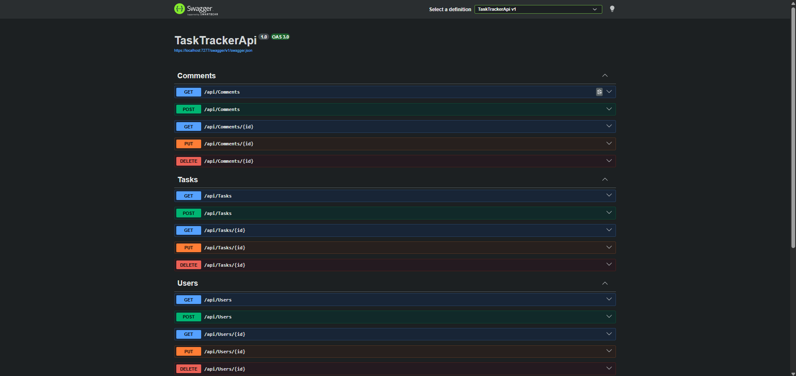
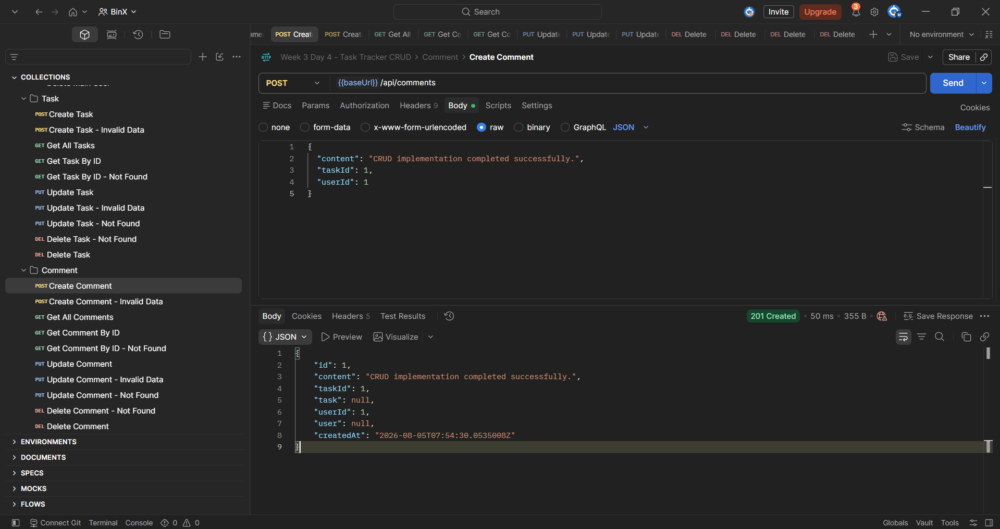

# Week 3 — Day 4: Implementing CRUD Operations with EF Core

## Overview

This project implements asynchronous CRUD operations for the Task Tracker API using Entity Framework Core and SQL Server.

CRUD operations were implemented for:

- Users
- Tasks
- Comments

The application uses controllers, request models, service interfaces, service classes, and Dependency Injection.

## Technologies

- ASP.NET Core Web API
- Entity Framework Core
- SQL Server
- C#
- Swagger
- Postman

## Project Structure

```text
TaskTrackerApi
├── Controllers
│   ├── UsersController.cs
│   ├── TasksController.cs
│   └── CommentsController.cs
├── Data
│   └── AppDbContext.cs
├── Models
│   ├── User.cs
│   ├── TaskItem.cs
│   └── Comment.cs
├── Requests
│   ├── CreateUserRequest.cs
│   ├── UpdateUserRequest.cs
│   ├── CreateTaskRequest.cs
│   ├── UpdateTaskRequest.cs
│   ├── CreateCommentRequest.cs
│   └── UpdateCommentRequest.cs
├── Services
│   ├── Interfaces
│   │   ├── IUserService.cs
│   │   ├── ITaskService.cs
│   │   └── ICommentService.cs
│   └── Classes
│       ├── UserService.cs
│       ├── TaskService.cs
│       └── CommentService.cs
└── Program.cs
```

## Service Layer

Database operations were placed inside separate service classes instead of being written directly inside the controllers.

Each service provides the following asynchronous methods:

```text
GetAllAsync
GetByIdAsync
CreateAsync
UpdateAsync
DeleteAsync
```

The services were registered in `Program.cs`:

```csharp
builder.Services.AddScoped<IUserService, UserService>();
builder.Services.AddScoped<ITaskService, TaskService>();
builder.Services.AddScoped<ICommentService, CommentService>();
```

## EF Core Operations

Create operations use:

```csharp
_context.Add(entity);
await _context.SaveChangesAsync();
```

Read-only operations use:

```csharp
AsNoTracking()
```

Update operations retrieve tracked entities, modify their properties, and call:

```csharp
await _context.SaveChangesAsync();
```

Delete operations use:

```csharp
_context.Remove(entity);
await _context.SaveChangesAsync();
```

## Request Validation

Separate request models were created for create and update operations.

Validation was implemented using Data Annotations such as:

```csharp
[Required]
[MaxLength]
[EmailAddress]
[Range]
```

Invalid requests automatically return:

```text
400 Bad Request
```

## API Endpoints

### Users

```text
POST   /api/users
GET    /api/users
GET    /api/users/{id}
PUT    /api/users/{id}
DELETE /api/users/{id}
```

### Tasks

```text
POST   /api/tasks
GET    /api/tasks
GET    /api/tasks/{id}
PUT    /api/tasks/{id}
DELETE /api/tasks/{id}
```

### Comments

```text
POST   /api/comments
GET    /api/comments
GET    /api/comments/{id}
PUT    /api/comments/{id}
DELETE /api/comments/{id}
```

## HTTP Status Codes

The API returns the following status codes:

```text
200 OK
201 Created
204 No Content
400 Bad Request
404 Not Found
```

Create endpoints use `CreatedAtAction` to return `201 Created` with a `Location` header.

## Delete Order

Because the entities are connected through foreign-key relationships, related records were deleted in this order:

```text
Comment → Task → User
```

## Postman Testing

A Postman collection was created with separate folders for:

```text
Users
Tasks
Comments
```

Successful and invalid cases were tested for create, read, update, and delete operations.

## Screenshots

### Swagger CRUD Endpoints



### Postman CRUD Tests

