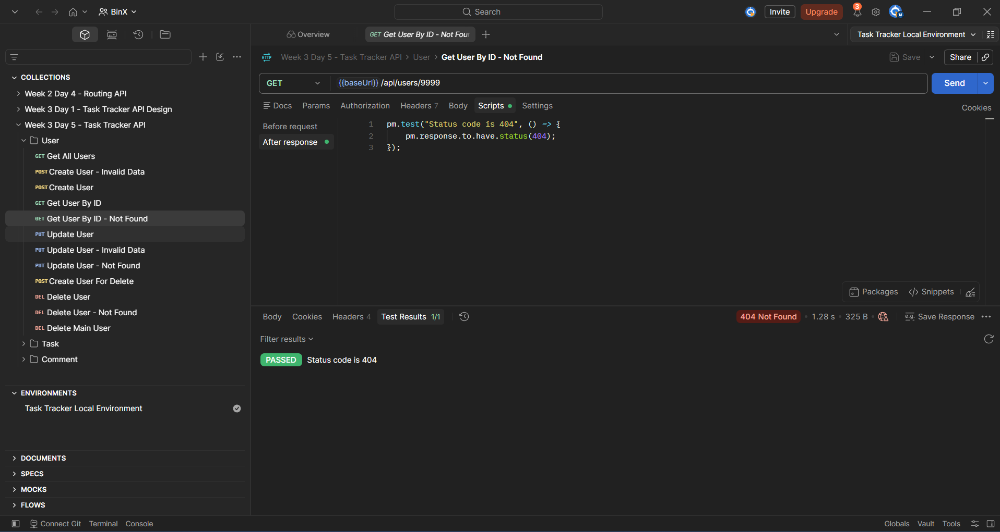

# Week 3 — Day 5: Testing & Documenting the API with Postman

## Overview

This exercise focused on organizing, testing, automating, exporting, and documenting the Task Tracker API using Postman.

The existing CRUD requests from Day 4 were organized into a reusable Postman collection covering:

```text
Users
Tasks
Comments
```

The collection includes successful requests, realistic error cases, automated test scripts, and environment-based URLs.

## Tools Used

- Postman
- Notion
- ASP.NET Core Web API
- Entity Framework Core
- SQL Server
- Git
- GitHub

## Postman Collection

The Postman collection was named:

```text
Week 3 Day 5 - Task Tracker API
```

The collection contains three resource folders:

```text
Users
Tasks
Comments
```

Each folder contains saved requests for the available CRUD operations.

The requests include:

```text
Create
Create - Invalid Data
Get All
Get By ID
Get By ID - Not Found
Update
Update - Invalid Data
Update - Not Found
Delete
Delete - Not Found
```

## Success and Error Paths

The collection tests successful API operations and realistic failure cases.

Successful responses include:

```text
200 OK
201 Created
204 No Content
```

Error responses include:

```text
400 Bad Request
404 Not Found
```

The tested error cases include:

- Missing or invalid required fields
- Reading a resource that does not exist
- Updating a resource with invalid data
- Updating a resource that does not exist
- Deleting a resource that does not exist

## Automated Test Scripts

Post-response scripts were added to automatically verify expected results.

### Verify a Successful Read

```javascript
pm.test("Status code is 200", () => {
    pm.response.to.have.status(200);
});
```

### Verify Resource Creation

```javascript
pm.test("Status code is 201", () => {
    pm.response.to.have.status(201);
});

pm.test("Response has an id", () => {
    pm.expect(pm.response.json()).to.have.property("id");
});
```

### Verify a Missing Resource

```javascript
pm.test("Status code is 404", () => {
    pm.response.to.have.status(404);
});
```

These scripts turn manual response checking into repeatable automated tests.

## Postman Environment

A Postman environment was created with the name:

```text
Task Tracker Local Environment
```

It contains the following variable:

| Variable | Value |
|---|---|
| `baseUrl` | `https://localhost:7277` |

API requests use the environment variable instead of repeating the complete URL:

```http
GET {{baseUrl}}/api/users
GET {{baseUrl}}/api/tasks
GET {{baseUrl}}/api/comments
```

The value of `baseUrl` can later be changed without editing every saved request.

## Exported Collection

The completed collection was exported as:

```text
task-tracker-api.postman_collection.json
```

The JSON file can be imported into Postman to restore and run the collection.

[View the Exported Postman Collection](./task-tracker-api.postman_collection.json)

## Screenshot

### Automated Postman Test



## Week 3 Close-Out

Week 3 covered the complete workflow from API planning to testing and documentation:

```text
REST API Design
        ↓
Database Schema and Normalization
        ↓
Entity Framework Core and Migrations
        ↓
Asynchronous CRUD Operations
        ↓
Postman Testing and Documentation
```

The completed Week 3 deliverables include:

- REST API resource design
- SQL Server ERD
- Normalized database schema
- Entity Framework Core models and relationships
- Code-First migration
- CRUD endpoints for Users, Tasks, and Comments
- Request validation
- Success-path and error-path requests
- Automated Postman tests
- Postman environment
- Exported Postman collection
- Notion and GitHub documentation