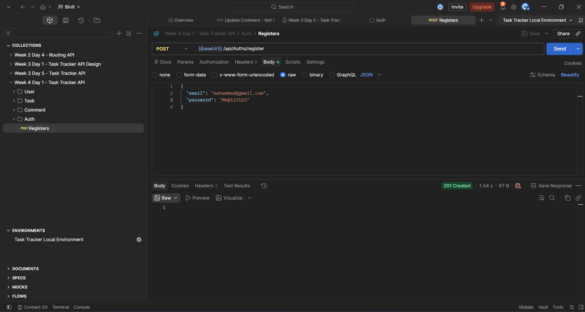
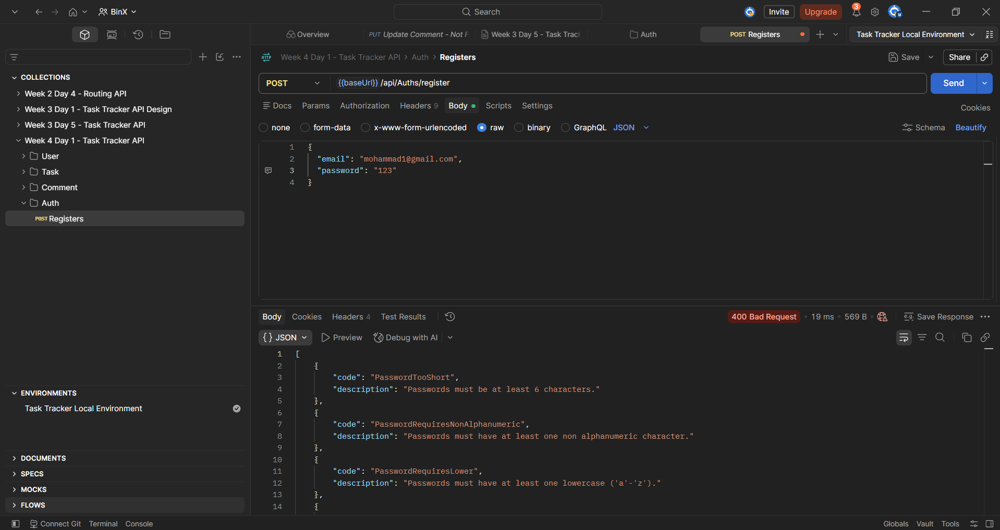

# Week 4 — Day 1: ASP.NET Core Identity & User Registration

## Overview

This exercise focused on integrating ASP.NET Core Identity into the existing Task Tracker API and implementing user registration.

ASP.NET Core Identity was configured with Entity Framework Core and SQL Server. A registration endpoint was implemented using `UserManager<IdentityUser>` to create users and securely hash their passwords.

The registration endpoint was tested in Postman with both valid credentials and a deliberately weak password.

## Learning Objectives

- Explain what ASP.NET Core Identity provides out of the box.
- Configure ASP.NET Core Identity with Entity Framework Core.
- Add the Identity database schema using EF Core migrations.
- Register Identity services using Dependency Injection.
- Implement user registration using `UserManager.CreateAsync`.
- Understand how Identity handles password hashing.
- Return meaningful validation errors for invalid registration requests.

## ASP.NET Core Identity

ASP.NET Core Identity provides a built-in system for managing application users.

It provides features such as:

- User storage
- Password hashing
- Role management
- Account confirmation

Using Identity avoids implementing custom password storage and hashing logic.

## Identity Package

The following NuGet package was added to the project:

```text
Microsoft.AspNetCore.Identity.EntityFrameworkCore
```

This package integrates ASP.NET Core Identity with Entity Framework Core.

## AppDbContext Configuration

The existing `AppDbContext` was updated to inherit from:

```csharp
IdentityDbContext<IdentityUser>
```

Example:

```csharp
public class AppDbContext : IdentityDbContext<IdentityUser>
{
}
```

The existing application entities remained in the same context:

```csharp
public DbSet<User> Users => Set<User>();

public DbSet<TaskItem> Tasks => Set<TaskItem>();

public DbSet<Comment> Comments => Set<Comment>();
```

The call to:

```csharp
base.OnModelCreating(modelBuilder);
```

allows Identity to configure its database model alongside the existing Task Tracker entities.

## Identity Migration

A new migration was created after adding Identity:

```powershell
Add-Migration AddIdentity
```

The migration was then applied to SQL Server:

```powershell
Update-Database
```

This added the ASP.NET Core Identity schema to the existing database.

## Identity Service Registration

Identity services were registered in `Program.cs`:

```csharp
builder.Services.AddIdentity<IdentityUser, IdentityRole>()
    .AddEntityFrameworkStores<AppDbContext>();
```

This configures:

```text
IdentityUser → Application users
IdentityRole → Application roles
AppDbContext → Identity data storage
```

The authentication and authorization middleware were also added to the request pipeline:

```csharp
app.UseAuthentication();
app.UseAuthorization();
```

Authentication runs before authorization so that the application can identify the user before checking what the user is allowed to access.

## Registration Request

A separate request model was created for user registration:

```csharp
public class RegisterRequest
{
    [Required]
    [EmailAddress]
    public string Email { get; set; } = string.Empty;

    [Required]
    public string Password { get; set; } = string.Empty;
}
```

The registration request contains an email address and password.

Example:

```json
{
  "email": "testuser@example.com",
  "password": "Test@12345"
}
```

## Registration Endpoint

A registration endpoint was added to `AuthsController`:

```http
POST /api/Auths/register
```

The endpoint creates a new `IdentityUser` using the supplied email:

```csharp
var user = new IdentityUser
{
    UserName = request.Email,
    Email = request.Email
};
```

The user is then created using:

```csharp
var result = await _userManager.CreateAsync(
    user,
    request.Password);
```

`UserManager.CreateAsync` handles password hashing and persists the new Identity user.

If registration fails, the Identity validation errors are returned:

```csharp
if (!result.Succeeded)
{
    return BadRequest(result.Errors);
}
```

A successful registration returns:

```text
201 Created
```

An invalid registration returns:

```text
400 Bad Request
```

## Password Hashing

ASP.NET Core Identity hashes passwords instead of storing plain-text passwords.

Identity uses PBKDF2 by default with a unique salt for password hashing.

The unique salt means that two users who use the same password will not have identical stored password hashes.

Password hashing is handled automatically by ASP.NET Core Identity through `UserManager`, so no custom password hashing code was implemented.

## Postman Testing

The registration endpoint was tested in Postman with both successful and invalid registration requests.

### Valid Registration

Request:

```json
{
  "email": "mohammad@gmail.com",
  "password": "Mm@123123"
}
```

Response:

```text
201 Created
```

The successful response confirms that the Identity user was created successfully.

### Successful Registration Test



### Weak Password

A deliberately weak password was used to verify Identity password validation.

Request:

```json
{
  "email": "mohammad1@gmail.com",
  "password": "123"
}
```

Response:

```text
400 Bad Request
```

Identity returned specific password validation errors, including:

```text
PasswordTooShort
PasswordRequiresNonAlphanumeric
PasswordRequiresLower
```

This confirms that password validation is handled automatically by ASP.NET Core Identity.

### Weak Password Validation Test



## Project Changes

The main additions and changes for this exercise were:

```text
TaskTrackerApi
├── Controllers
│   └── AuthsController.cs
├── Data
│   └── AppDbContext.cs
├── Migrations
│   └── <timestamp>_AddIdentity.cs
├── Requests
│   └── RegisterRequest.cs
└── Program.cs
```

The existing Task Tracker models, controllers, and services from Week 3 remained in the project.

## Tools Used

- ASP.NET Core Web API
- ASP.NET Core Identity
- Entity Framework Core
- SQL Server
- Visual Studio
- Visual Studio Package Manager Console
- Postman
