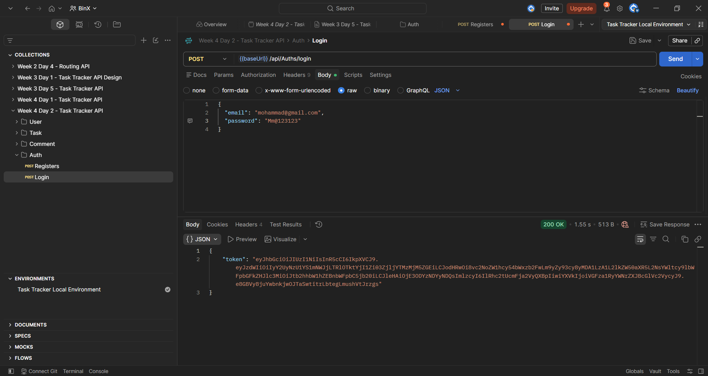
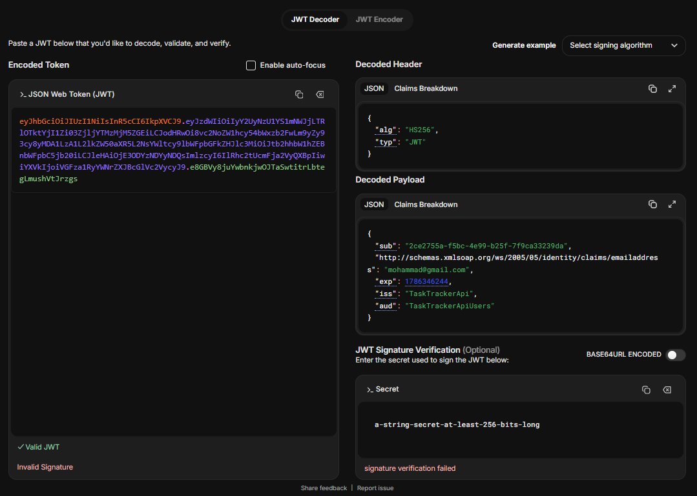
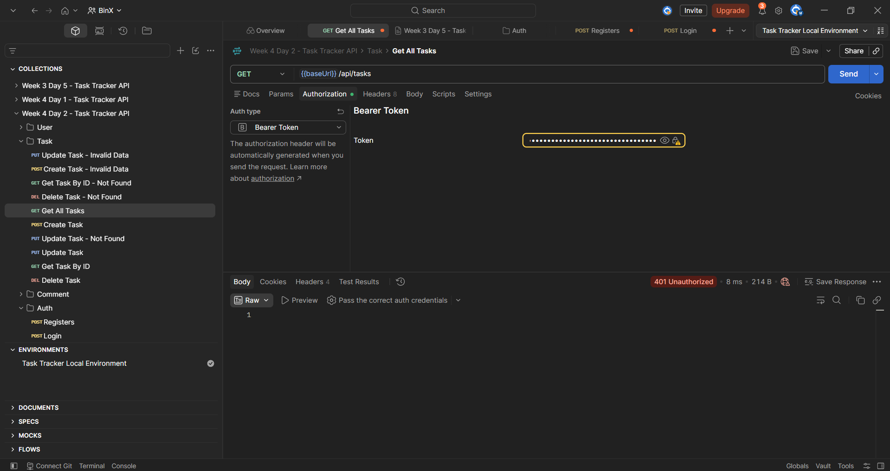

# Week 4 — Day 2: JWT Authentication & Token Issuance

## Overview

This exercise focused on implementing JWT-based authentication for the Task Tracker API.

A login endpoint was implemented using ASP.NET Core Identity to verify user credentials. After successful authentication, the API generates and returns a signed JWT containing the user's ID and email as claims.

JWT Bearer Authentication was also configured to validate incoming tokens, and a protected endpoint was used to verify that expired tokens are rejected.

## Learning Objectives

- Explain the structure of a JSON Web Token.
- Understand what JWT claims represent.
- Verify user credentials using ASP.NET Core Identity.
- Generate and return a signed JWT after successful login.
- Configure JWT Bearer Authentication.
- Validate JWT issuer, audience, signature, and expiration.
- Understand token expiration and the purpose of short-lived access tokens.

## JWT Structure

A JSON Web Token consists of three parts:

```text
Header.Payload.Signature
```

### Header

The header describes information about the token, including the signing algorithm.

The generated token uses:

```text
HS256
```

### Payload

The payload contains claims describing the authenticated user.

The generated token contains:

```text
sub
email
```

The `sub` claim contains the Identity user ID, while the `email` claim contains the user's email address.

The token also contains standard information such as:

```text
exp
iss
aud
```

These represent:

- `exp` — Token expiration time
- `iss` — Token issuer
- `aud` — Intended token audience

JWT payloads are encoded rather than encrypted, so sensitive information should not be stored inside claims.

### Signature

The signature is generated using the configured signing key and the HMAC SHA-256 algorithm.

It allows the API to verify that the token has not been modified after it was issued.

## Authentication Service

Authentication logic is implemented through the existing service-layer structure.

The following files were added or extended:

```text
Services/
├── Interfaces/
│   └── IAuthService.cs
└── Classes/
    └── AuthService.cs
```

`IAuthService` defines the authentication operations:

```csharp
Task<IdentityResult> RegisterAsync(RegisterRequest request);

Task<string?> LoginAsync(LoginRequest request);
```

`AuthService` uses:

```text
UserManager<IdentityUser>
SignInManager<IdentityUser>
IConfiguration
```

`UserManager` handles user registration, while `SignInManager` verifies login credentials.

## Login Endpoint

The authentication controller exposes:

```http
POST /api/Auths/login
```

The request contains:

```json
{
  "email": "mohammad@gmail.com",
  "password": "Test@12345"
}
```

The controller calls:

```csharp
_authService.LoginAsync(request);
```

If authentication fails, the endpoint returns:

```text
401 Unauthorized
```

If authentication succeeds, the endpoint returns:

```text
200 OK
```

with the generated JWT:

```json
{
  "token": "eyJhbGciOi..."
}
```

## Credential Verification

The submitted email is used to retrieve the Identity user:

```csharp
var user = await _userManager.FindByEmailAsync(request.Email);
```

The password is then verified using:

```csharp
var result = await _signInManager.CheckPasswordSignInAsync(
    user,
    request.Password,
    false);
```

Invalid credentials result in a failed login and the API returns:

```text
401 Unauthorized
```

## JWT Claims

After successful authentication, the token is created with the user's ID and email:

```csharp
var claims = new[]
{
    new Claim(JwtRegisteredClaimNames.Sub, user.Id),
    new Claim(ClaimTypes.Email, user.Email!)
};
```

The generated JWT therefore identifies the authenticated user without requiring the client to resend the email and password with every request.

## JWT Signing

The signing key is read from configuration:

```csharp
var key = new SymmetricSecurityKey(
    Encoding.UTF8.GetBytes(
        _configuration["Jwt:Key"]!));
```

Signing credentials are created using:

```csharp
var credentials = new SigningCredentials(
    key,
    SecurityAlgorithms.HmacSha256);
```

The token is generated with:

```csharp
var token = new JwtSecurityToken(
    issuer: _configuration["Jwt:Issuer"],
    audience: _configuration["Jwt:Audience"],
    claims: claims,
    expires: DateTime.UtcNow.AddMinutes(15),
    signingCredentials: credentials);
```

The final access token has a lifetime of:

```text
15 minutes
```

## JWT Configuration

The training project contains the following JWT configuration:

```json
"Jwt": {
  "Issuer": "TaskTrackerApi",
  "Audience": "TaskTrackerApiUsers",
  "Key": "<training-signing-key>"
}
```

The signing key used in this project is for training purposes.

In a real application, secret signing keys should not be committed to source control. Sensitive configuration should instead be stored outside tracked configuration files, such as in local development configuration or an appropriate secrets-management system.

## JWT Bearer Authentication

JWT Bearer Authentication was configured in `Program.cs`.

```csharp
builder.Services.AddAuthentication(options =>
{
    options.DefaultAuthenticateScheme =
        JwtBearerDefaults.AuthenticationScheme;

    options.DefaultChallengeScheme =
        JwtBearerDefaults.AuthenticationScheme;
})
.AddJwtBearer(options =>
{
    options.TokenValidationParameters =
        new TokenValidationParameters
        {
            ValidateIssuer = true,
            ValidateAudience = true,
            ValidateLifetime = true,
            ValidateIssuerSigningKey = true,

            ValidIssuer =
                builder.Configuration["Jwt:Issuer"],

            ValidAudience =
                builder.Configuration["Jwt:Audience"],

            IssuerSigningKey =
                new SymmetricSecurityKey(
                    Encoding.UTF8.GetBytes(
                        builder.Configuration["Jwt:Key"]!))
        };
});
```

The middleware pipeline includes:

```csharp
app.UseAuthentication();
app.UseAuthorization();
```

Incoming JWTs are therefore validated for:

- Issuer
- Audience
- Lifetime
- Signing key

## Protected Endpoint

The existing task endpoint was protected using:

```csharp
[Authorize]
```

The protected endpoint is:

```http
GET /api/Tasks
```

A valid Bearer token is required before the request can access the endpoint.

The client sends the token using:

```text
Authorization: Bearer <token>
```

## JWT Testing

### Successful Login and Token Issuance

A valid login request was sent using Postman.

The API returned:

```text
200 OK
```

along with a signed JWT.



### JWT Claims Verification

The issued token was decoded using `jwt.io`.

The decoded payload confirmed the presence of:

```text
sub
email
exp
iss
aud
```

The `sub` value matched the Identity user ID and the `email` claim matched the authenticated user's email.



### Token Expiration Test

The access-token lifetime was temporarily changed to:

```csharp
DateTime.UtcNow.AddMinutes(1)
```

to test token expiration without waiting for the final 15-minute lifetime.

After the token expired, it was sent to the protected endpoint:

```http
GET /api/Tasks
```

The API rejected the expired token with:

```text
401 Unauthorized
```



After completing the expiration test, the token lifetime was restored to:

```csharp
DateTime.UtcNow.AddMinutes(15)
```

## Authentication Flow

```text
Email + Password
       ↓
POST /api/Auths/login
       ↓
AuthsController
       ↓
IAuthService
       ↓
AuthService
       ↓
Find User with UserManager
       ↓
Verify Password with SignInManager
       ↓
Invalid ───────────────→ 401 Unauthorized
       ↓ Valid
Create User ID + Email Claims
       ↓
Sign JWT
       ↓
200 OK + JWT
       ↓
Client sends Bearer Token
       ↓
JWT Bearer Authentication
       ↓
Validate Issuer, Audience,
Signature, and Expiration
       ↓
Protected Endpoint
```

## Project Structure

```text
TaskTrackerApi
├── Controllers
│   ├── AuthsController.cs
│   └── TasksController.cs
├── Requests
│   ├── RegisterRequest.cs
│   └── LoginRequest.cs
├── Services
│   ├── Interfaces
│   │   └── IAuthService.cs
│   └── Classes
│       └── AuthService.cs
├── Data
│   └── AppDbContext.cs
├── Program.cs
└── appsettings.json
```

## Tools Used

- ASP.NET Core Web API
- ASP.NET Core Identity
- Entity Framework Core
- System.IdentityModel.Tokens.Jwt
- JWT Bearer Authentication
- SQL Server
- Postman
- jwt.io
- Visual Studio