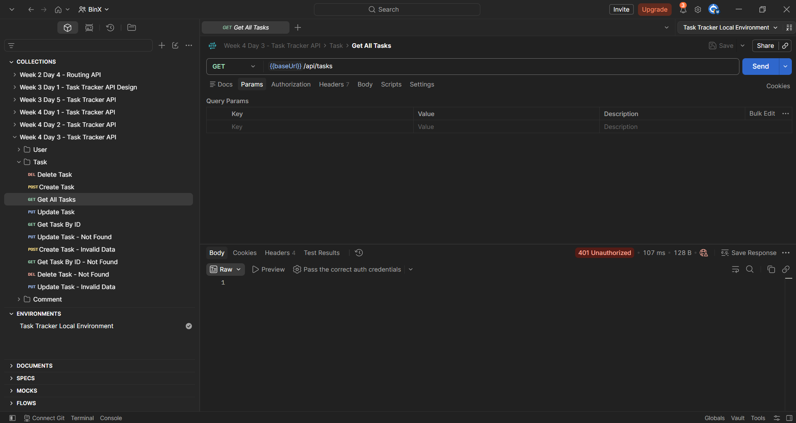
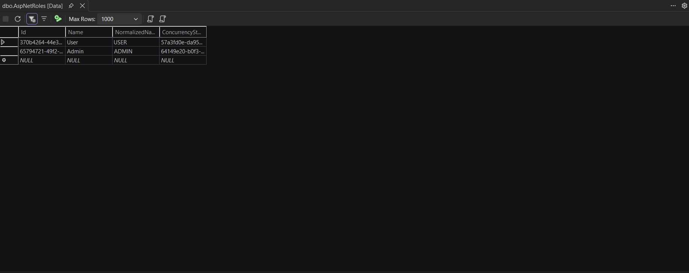
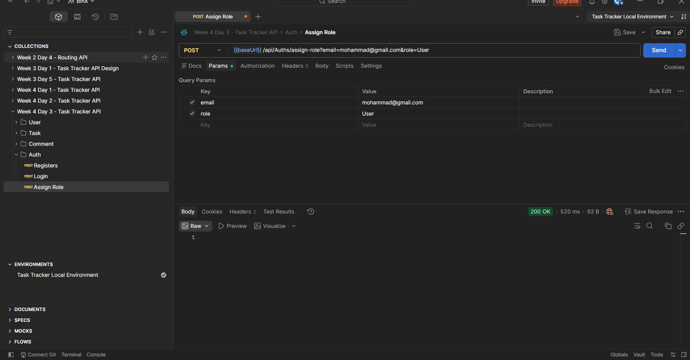
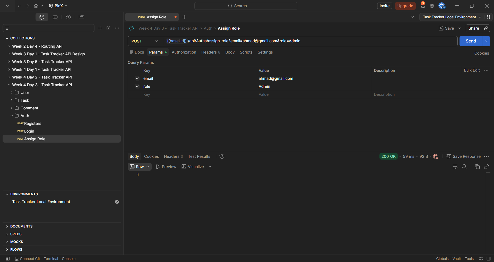
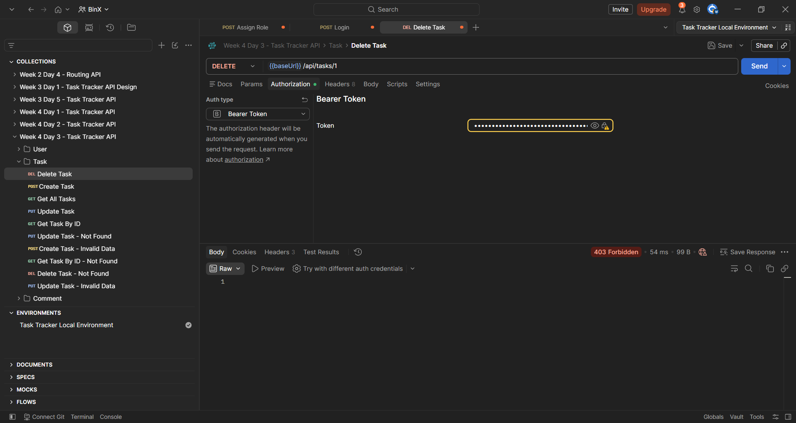
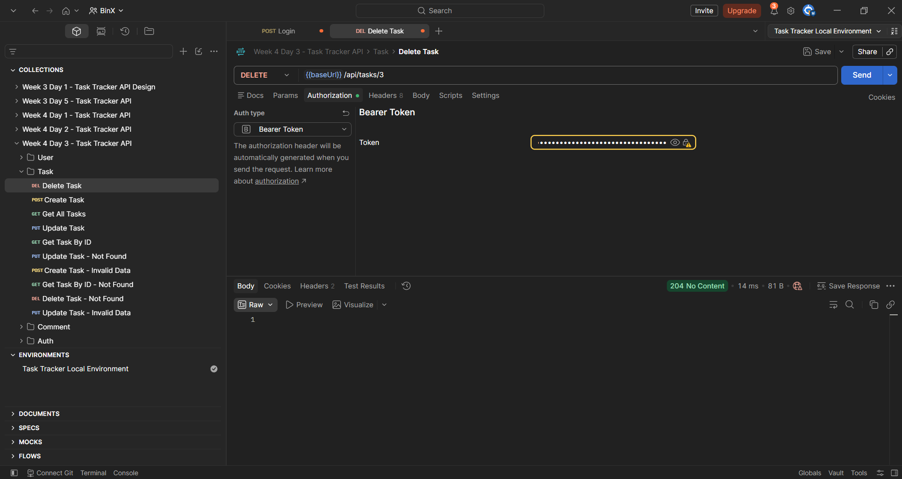
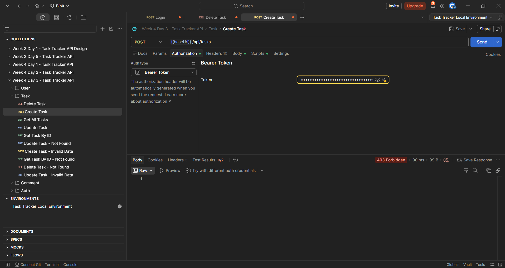
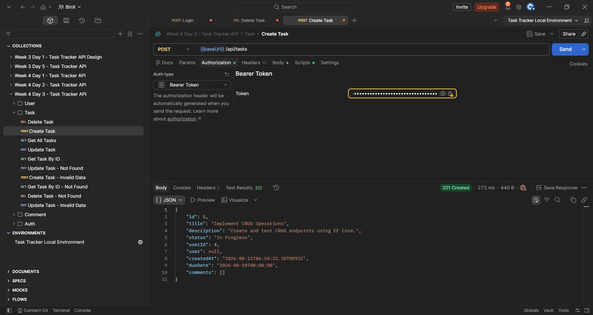
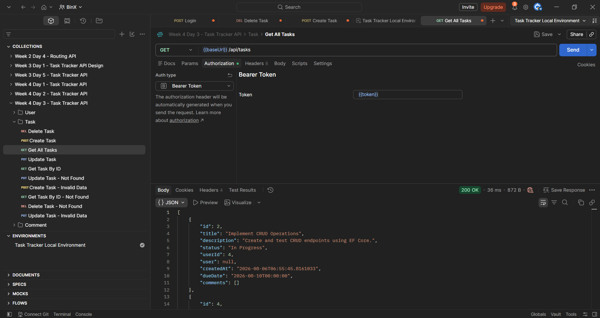

# Week 4 — Day 3: Protecting Routes with Authorization & Role-Based Access Control

## Overview

This exercise focused on securing API endpoints using ASP.NET Core Authorization.

The existing JWT authentication from Day 2 was extended with route protection, role-based access control, and policy-based authorization.

Two Identity roles, `User` and `Admin`, were created and assigned to different test users. Role information was then added to the JWT so ASP.NET Core could make authorization decisions based on the authenticated user's role.

A custom authorization policy was also created using a permission claim, and Postman was configured to automatically capture and reuse JWTs through environment variables.

## Learning Objectives

- Protect API endpoints using `[Authorize]`.
- Understand the difference between authentication and authorization.
- Create and manage Identity roles.
- Assign users to roles using `UserManager`.
- Implement role-based access control.
- Understand the difference between `401 Unauthorized` and `403 Forbidden`.
- Add role claims to JWTs.
- Implement claims-based authorization.
- Define and apply a named authorization policy.
- Test protected routes using Postman.
- Automatically capture and reuse JWTs using a Postman environment.

## Authentication vs Authorization

Authentication and authorization solve different problems.

```text
Authentication
    ↓
Who is the user?
    ↓
Validate JWT
    ↓
Authorization
    ↓
What is the authenticated user allowed to do?
```

Authentication was implemented in Day 2 using JWT Bearer Authentication.

Day 3 focused on authorization rules that run after the user has been authenticated.

## Protecting Routes with `[Authorize]`

The existing `TasksController` was protected using:

```csharp
[Authorize]
```

The attribute was placed on the controller:

```csharp
[Route("api/[controller]")]
[ApiController]
[Authorize]
public class TasksController : ControllerBase
{
}
```

Placing `[Authorize]` on the controller protects all of its endpoints.

This includes:

```text
GET    /api/Tasks
GET    /api/Tasks/{id}
POST   /api/Tasks
PUT    /api/Tasks/{id}
DELETE /api/Tasks/{id}
```

A request must contain a valid authenticated JWT before it can access these endpoints.

Requests with no token, an invalid token, or an expired token are rejected before the controller action executes.

## Testing a Protected Route Without a Token

The following endpoint was called without sending a JWT:

```http
GET /api/Tasks
```

The API returned:

```text
401 Unauthorized
```

This confirms that `[Authorize]` successfully prevents unauthenticated access.

### Protected Route Test



## `[AllowAnonymous]`

`[AllowAnonymous]` can be used when a controller is protected but a specific endpoint should remain publicly accessible.

For example:

```csharp
[AllowAnonymous]
[HttpGet("health")]
public IActionResult Health()
{
    return Ok();
}
```

This concept was covered as part of the lesson, but no anonymous endpoint was required for the completed lab.

## Role-Based Access Control

Role-Based Access Control allows authorization decisions to be based on the role assigned to an authenticated user.

Two roles were created for this exercise:

```text
User
Admin
```

The `User` role represents a normal application user.

The `Admin` role represents a user with additional administrative permissions.

## Creating Identity Roles

The roles were created at application startup using:

```csharp
RoleManager<IdentityRole>
```

The application creates a service scope and retrieves `RoleManager`:

```csharp
using (var scope = app.Services.CreateScope())
{
    var roleManager = scope.ServiceProvider
        .GetRequiredService<RoleManager<IdentityRole>>();

    string[] roles = { "User", "Admin" };

    foreach (var role in roles)
    {
        if (!await roleManager.RoleExistsAsync(role))
        {
            await roleManager.CreateAsync(
                new IdentityRole(role));
        }
    }
}
```

The application's `Main` method was changed to:

```csharp
public static async Task Main(string[] args)
```

because role creation uses asynchronous Identity operations.

### `RoleManager`

`RoleManager<IdentityRole>` provides operations for managing roles stored by ASP.NET Core Identity.

The following method checks whether a role already exists:

```csharp
RoleExistsAsync(role)
```

This prevents the application from attempting to create the same role every time it starts.

A missing role is created using:

```csharp
CreateAsync(new IdentityRole(role))
```

## Roles Stored in SQL Server

After running the application, the two roles were stored in the Identity `AspNetRoles` table:

```text
User
Admin
```

### Identity Roles Created



## Assigning Users to Roles

Two test users were used:

```text
mohammad@gmail.com → User
ahmad@gmail.com    → Admin
```

A service method was added to assign a user to a role:

```csharp
public async Task<IdentityResult> AddUserToRoleAsync(
    string email,
    string role)
{
    var user = await _userManager.FindByEmailAsync(email);

    if (user is null)
    {
        return IdentityResult.Failed(
            new IdentityError
            {
                Description = "User not found."
            });
    }

    return await _userManager.AddToRoleAsync(user, role);
}
```

The important Identity operation is:

```csharp
_userManager.AddToRoleAsync(user, role)
```

`AddToRoleAsync` creates the relationship between the Identity user and the selected role.

## Role Assignment Endpoint

For the training exercise, an endpoint was added to assign roles to the test users:

```http
POST /api/Auths/assign-role
```

The controller calls the authentication service:

```csharp
[HttpPost("assign-role")]
public async Task<IActionResult> AssignRole(
    string email,
    string role)
{
    var result = await _authService.AddUserToRoleAsync(
        email,
        role);

    if (!result.Succeeded)
    {
        return BadRequest(result.Errors);
    }

    return Ok();
}
```

This endpoint was used to prepare the two users required for the role-based authorization tests.

## Assigning the `User` Role

The first test user was assigned to:

```text
User
```

The API returned:

```text
200 OK
```

### User Role Assignment



## Assigning the `Admin` Role

The second test user was assigned to:

```text
Admin
```

The API returned:

```text
200 OK
```

### Admin Role Assignment



## Adding Roles to the JWT

The JWT created in Day 2 originally contained:

```text
sub
email
```

For role-based authorization, the authenticated user's roles must also be available as claims.

The user's roles are retrieved during login using:

```csharp
var roles = await _userManager.GetRolesAsync(user);
```

The claims collection was changed to:

```csharp
var claims = new List<Claim>
{
    new Claim(JwtRegisteredClaimNames.Sub, user.Id),
    new Claim(ClaimTypes.Email, user.Email!)
};
```

Each Identity role is then added to the JWT:

```csharp
foreach (var role in roles)
{
    claims.Add(new Claim(ClaimTypes.Role, role));
}
```

A JWT for the normal user therefore contains a role claim representing:

```text
User
```

while the administrator's JWT contains:

```text
Admin
```

ASP.NET Core can use these role claims when processing role-based authorization rules.

## Admin-Only Delete Endpoint

The existing Delete endpoint was restricted to the `Admin` role:

```csharp
[HttpDelete("{id}")]
[Authorize(Roles = "Admin")]
public async Task<IActionResult> Delete(int id)
{
    var deleted = await _taskService.DeleteAsync(id);

    if (!deleted)
    {
        return NotFound();
    }

    return NoContent();
}
```

Although the entire controller already requires authentication through `[Authorize]`, the Delete endpoint has an additional requirement:

```text
Authenticated User
        +
Admin Role
```

## `401 Unauthorized` vs `403 Forbidden`

These two HTTP responses represent different authorization situations.

```text
401 Unauthorized
→ Authentication failed.
→ The user does not have a valid authenticated identity.

403 Forbidden
→ Authentication succeeded.
→ The user is known, but does not have the required permission.
```

For example, a valid JWT belonging to a `User` can authenticate successfully but still receive `403 Forbidden` when attempting to access an Admin-only endpoint.

## User Attempting Admin-Only Delete

A JWT belonging to:

```text
mohammad@gmail.com → User
```

was sent to:

```http
DELETE /api/Tasks/{id}
```

The endpoint requires:

```csharp
[Authorize(Roles = "Admin")]
```

The API returned:

```text
403 Forbidden
```

This confirms that the user was authenticated successfully but did not have the required `Admin` role.

### User Role Rejected



## Admin Accessing Admin-Only Delete

The same endpoint was tested using:

```text
ahmad@gmail.com → Admin
```

A task without dependent comments was created for the authorization test.

The Admin JWT was then sent to:

```http
DELETE /api/Tasks/{id}
```

The API returned:

```text
204 No Content
```

This confirms that the `Admin` role successfully satisfies:

```csharp
[Authorize(Roles = "Admin")]
```

and allows the endpoint to execute.

### Admin Delete Success



## Claims-Based Authorization

Roles are one type of claim-based authorization.

Authorization rules can also use custom claims representing permissions or other information.

For this exercise, a custom permission claim was used:

```text
permission = create_task
```

This allows authorization to be based on a specific permission instead of only checking a role name.

## Policy-Based Authorization

A named authorization policy was configured in `Program.cs`:

```csharp
builder.Services.AddAuthorization(options =>
{
    options.AddPolicy("CanCreateTasks", policy =>
    {
        policy.RequireClaim(
            "permission",
            "create_task");
    });
});
```

The policy is named:

```text
CanCreateTasks
```

and requires:

```text
Claim Type  → permission
Claim Value → create_task
```

Centralizing the rule inside a named policy allows endpoints to reference the policy without repeating the authorization requirement.

## Adding the Permission Claim

For this exercise, the `create_task` permission is added to the JWT when the authenticated user has the `Admin` role:

```csharp
if (roles.Contains("Admin"))
{
    claims.Add(
        new Claim(
            "permission",
            "create_task"));
}
```

This creates the following authorization difference:

```text
User
→ role = User
→ No create_task permission

Admin
→ role = Admin
→ permission = create_task
```

## Applying the Policy

The Create Task endpoint was protected using:

```csharp
[Authorize(Policy = "CanCreateTasks")]
```

The endpoint became:

```csharp
[HttpPost]
[Authorize(Policy = "CanCreateTasks")]
public async Task<IActionResult> Create(
    CreateTaskRequest request)
{
    var task = await _taskService.CreateAsync(request);

    return CreatedAtAction(
        nameof(GetById),
        new { id = task.Id },
        task);
}
```

The endpoint now requires both successful authentication and the claim required by the `CanCreateTasks` policy.

## User Failing the Policy

The normal user's JWT does not contain:

```text
permission = create_task
```

When that user attempted:

```http
POST /api/Tasks
```

the API returned:

```text
403 Forbidden
```

This confirms that the user was authenticated but failed the authorization policy.

### User Policy Test



## Admin Passing the Policy

The Admin user's JWT contains:

```text
permission = create_task
```

When the Admin sent:

```http
POST /api/Tasks
```

the policy succeeded and the API created the task.

The API returned:

```text
201 Created
```

### Admin Policy Test



## Authorization Flow

```text
Client sends request with JWT
             ↓
JWT Bearer Authentication
             ↓
Validate token
             ↓
Authenticated?
   ├── No  → 401 Unauthorized
   │
   └── Yes
        ↓
Authorization
        ↓
Check Role / Policy
        ↓
Requirement satisfied?
   ├── No  → 403 Forbidden
   │
   └── Yes
        ↓
Execute Endpoint
```

## Postman Environment

Previously, the JWT returned by the login endpoint had to be manually copied and pasted into protected requests.

A Postman Environment was configured to automate this process.

The existing environment contains:

```text
baseUrl
token
```

The `token` variable is populated automatically after a successful login.

## Capturing the Login Token Automatically

A Post-response script was added to the Login request:

```javascript
const response = pm.response.json();

pm.environment.set("token", response.token);
```

The script reads:

```text
response.token
```

from the login response and stores it in the Postman environment as:

```text
token
```

The flow becomes:

```text
POST /api/Auths/login
        ↓
API returns JWT
        ↓
Post-response script
        ↓
pm.environment.set("token", response.token)
        ↓
Environment token variable updated
```

## Reusing the Token

Protected requests can now use:

```text
{{token}}
```

instead of manually pasting the JWT.

For example, the Authorization configuration for:

```http
GET /api/Tasks
```

uses:

```text
Bearer Token: {{token}}
```

The API returned:

```text
200 OK
```

confirming that the JWT captured from the login response was automatically reused.

### Automatic JWT Reuse



## Complete Authorization Flow

```text
User Login
    ↓
POST /api/Auths/login
    ↓
Verify Credentials
    ↓
Get Identity Roles
    ↓
Create JWT Claims
    ├── User ID
    ├── Email
    ├── Role
    └── Permission (when applicable)
    ↓
Sign JWT
    ↓
Return JWT
    ↓
Postman saves JWT in {{token}}
    ↓
Protected Request
    ↓
Bearer {{token}}
    ↓
Authentication Middleware
    ↓
Validate JWT
    ↓
Authorization
    ├── [Authorize]
    ├── Role Requirement
    └── Policy Requirement
    ↓
Authorized?
    ├── No authentication → 401
    ├── Missing permission → 403
    └── Authorized → Endpoint executes
```

## Hands-On Lab Completed

The following tasks were completed:

1. Added `[Authorize]` to the existing Week 3 CRUD controller and confirmed that a request without a JWT returns `401 Unauthorized`.
2. Created `User` and `Admin` Identity roles.
3. Assigned the `User` and `Admin` roles to two different test users using `UserManager.AddToRoleAsync`.
4. Added Identity roles to generated JWTs as role claims.
5. Restricted the Delete Task endpoint to the `Admin` role.
6. Confirmed that a `User` token receives `403 Forbidden` when attempting the Admin-only Delete operation.
7. Confirmed that an `Admin` token can successfully execute the Delete operation.
8. Defined the `CanCreateTasks` named authorization policy.
9. Added the custom `permission = create_task` claim for the Admin test user.
10. Applied the policy to the Create Task endpoint.
11. Confirmed that the normal user fails the policy with `403 Forbidden`.
12. Confirmed that the Admin satisfies the policy and receives `201 Created`.
13. Configured a Postman Environment to store the JWT.
14. Added a Post-response script to automatically capture the login token.
15. Reused `{{token}}` automatically when calling a protected route.

## Project Changes

The main files changed during this exercise were:

```text
TaskTrackerApi
├── Controllers
│   ├── AuthsController.cs
│   └── TasksController.cs
├── Services
│   ├── Interfaces
│   │   └── IAuthService.cs
│   └── Classes
│       └── AuthService.cs
└── Program.cs
```

The existing ASP.NET Core Identity and JWT infrastructure from Days 1 and 2 was reused and extended with authorization rules.

## Tools Used

- ASP.NET Core Web API
- ASP.NET Core Identity
- Entity Framework Core
- JWT Bearer Authentication
- SQL Server
- Visual Studio
- Postman
- Postman Environments
