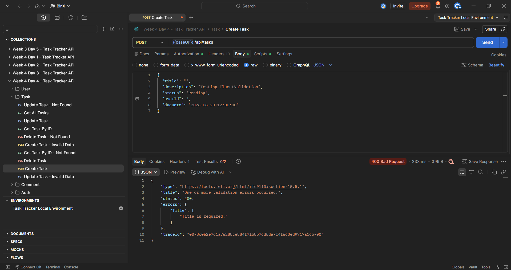
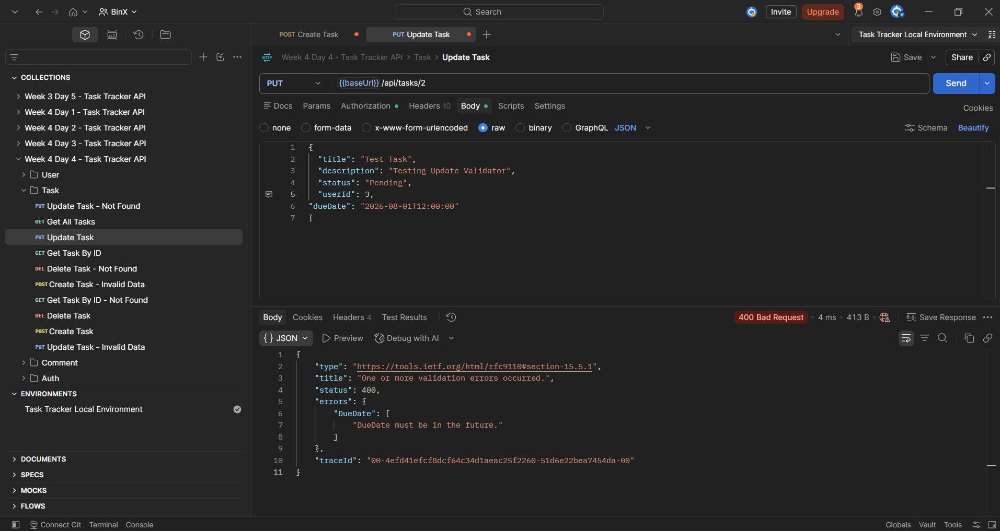

# Week 4 — Day 4: Input Validation with FluentValidation

## Overview

This exercise focused on improving request validation in the Task Tracker API using FluentValidation.

The existing validation approach based on DataAnnotations was replaced for the Task create and update request models with dedicated FluentValidation validator classes.

Validation rules were separated from the request models, integrated into the ASP.NET Core request pipeline, and tested using Postman.

Invalid requests now return structured `400 Bad Request` responses containing the specific field that failed validation and a clear error message.

## Learning Objectives

* Compare DataAnnotations and FluentValidation.
* Understand when FluentValidation is more suitable for complex validation rules.
* Create dedicated validator classes.
* Write validation rules using `RuleFor`.
* Express business-oriented validation rules.
* Add custom validation messages using `WithMessage`.
* Integrate FluentValidation into the ASP.NET Core validation pipeline.
* Return structured validation errors automatically.
* Test individual validation rules using Postman.

## DataAnnotations vs FluentValidation

### DataAnnotations

DataAnnotations place validation rules directly on request-model properties.

For example:

```csharp
[Required]
[MaxLength(200)]
public string Title { get; set; } = string.Empty;
```

This approach is simple and useful for basic validation requirements.

However, validation becomes harder to maintain when rules become more complex or depend on actual business requirements.

### FluentValidation

FluentValidation keeps validation logic inside separate validator classes.

Instead of placing validation rules directly on the request model, the application defines them using a fluent API.

Example:

```csharp
RuleFor(x => x.Title)
    .NotEmpty()
    .WithMessage("Title is required.");
```

This separates request data from validation logic and provides more flexibility for expressing complex rules.

## NuGet Packages

Two packages were added for this exercise:

```text
FluentValidation
FluentValidation.AspNetCore
```

### FluentValidation

The `FluentValidation` package provides the core validation API.

It includes components such as:

```text
AbstractValidator<T>
RuleFor
NotEmpty
MaximumLength
GreaterThan
When
WithMessage
```

These are used to define validation rules in dedicated validator classes.

### FluentValidation.AspNetCore

The `FluentValidation.AspNetCore` package provides integration between FluentValidation and ASP.NET Core.

It allows validators to participate in ASP.NET Core request validation so invalid requests can be rejected automatically before the controller action executes.

## Request Models

The existing request models used for Task creation and updating are:

```text
CreateTaskRequest
UpdateTaskRequest
```

The validation rules previously defined using DataAnnotations were removed from these request models after FluentValidation was introduced.

For example, `CreateTaskRequest` contains only request data:

```csharp
public class CreateTaskRequest
{
    public string Title { get; set; } = string.Empty;

    public string? Description { get; set; }

    public string Status { get; set; } = string.Empty;

    public int UserId { get; set; }

    public DateTime? DueDate { get; set; }
}
```

Validation responsibility is now handled by separate validator classes.

## Validator Structure

A FluentValidation validator inherits from:

```csharp
AbstractValidator<T>
```

where `T` is the request model being validated.

For example:

```csharp
public class CreateTaskRequestValidator
    : AbstractValidator<CreateTaskRequest>
{
}
```

The validator constructor contains the validation rules.

## `RuleFor`

`RuleFor` identifies the property that a validation rule applies to.

Example:

```csharp
RuleFor(x => x.UserId)
```

Additional validation methods can then be chained to define the requirement.

For example:

```csharp
RuleFor(x => x.UserId)
    .GreaterThan(0)
    .WithMessage("UserId must be greater than 0.");
```

## `WithMessage`

`WithMessage` provides a clear custom error message when a validation rule fails.

Example:

```csharp
.WithMessage("Title is required.");
```

This allows API clients to receive a meaningful explanation instead of a generic invalid-request message.

## Create Task Validator

A validator was created for:

```text
CreateTaskRequest
```

The validator contains the following rules:

```csharp
public class CreateTaskRequestValidator
    : AbstractValidator<CreateTaskRequest>
{
    public CreateTaskRequestValidator()
    {
        RuleFor(x => x.Title)
            .NotEmpty()
            .WithMessage("Title is required.")
            .MaximumLength(200)
            .WithMessage(
                "Title must not exceed 200 characters.");

        RuleFor(x => x.UserId)
            .GreaterThan(0)
            .WithMessage(
                "UserId must be greater than 0.");

        RuleFor(x => x.DueDate)
            .GreaterThan(DateTime.UtcNow)
            .When(x => x.DueDate.HasValue)
            .WithMessage(
                "DueDate must be in the future.");
    }
}
```

## Create Validation Rules

### Title Rule

The title must not be empty:

```csharp
.NotEmpty()
```

It also has a maximum length of:

```text
200 characters
```

The required-title error message is:

```text
Title is required.
```

### UserId Rule

`UserId` must represent a valid positive identifier.

The rule is:

```csharp
.GreaterThan(0)
```

This prevents values such as:

```text
0
-1
```

from being accepted as valid user identifiers.

The error message is:

```text
UserId must be greater than 0.
```

### DueDate Rule

`DueDate` is optional.

However, if it is supplied, it must represent a future date.

The rule is:

```csharp
RuleFor(x => x.DueDate)
    .GreaterThan(DateTime.UtcNow)
    .When(x => x.DueDate.HasValue)
```

`When` ensures that the future-date rule only runs when a DueDate has actually been provided.

The error message is:

```text
DueDate must be in the future.
```

## Update Task Validator

A separate validator was created for:

```text
UpdateTaskRequest
```

```csharp
public class UpdateTaskRequestValidator
    : AbstractValidator<UpdateTaskRequest>
{
    public UpdateTaskRequestValidator()
    {
        RuleFor(x => x.Title)
            .NotEmpty()
            .WithMessage("Title is required.")
            .MaximumLength(200)
            .WithMessage(
                "Title must not exceed 200 characters.");

        RuleFor(x => x.UserId)
            .GreaterThan(0)
            .WithMessage(
                "UserId must be greater than 0.");

        RuleFor(x => x.DueDate)
            .GreaterThan(DateTime.UtcNow)
            .When(x => x.DueDate.HasValue)
            .WithMessage(
                "DueDate must be in the future.");
    }
}
```

The Update validator applies the same validation requirements to requests that modify existing tasks.

## Validation Folder Structure

The validators were organized inside a dedicated folder:

```text
Validators/
├── CreateTaskRequestValidator.cs
└── UpdateTaskRequestValidator.cs
```

This keeps validation logic separated from controllers, services, and request models.

## FluentValidation Registration

FluentValidation was integrated into ASP.NET Core in `Program.cs`.

The required namespaces were added:

```csharp
using FluentValidation;
using FluentValidation.AspNetCore;
using TaskTrackerApi.Validators;
```

Automatic FluentValidation support was registered using:

```csharp
builder.Services.AddFluentValidationAutoValidation();
```

The validators were registered using:

```csharp
builder.Services
    .AddValidatorsFromAssemblyContaining<
        CreateTaskRequestValidator>();
```

Because both validators are located in the same assembly, this registration discovers and registers both the Create and Update validators.

## Automatic Validation Pipeline

After registration, validation runs automatically as part of request processing.

The flow is:

```text
Client Request
      ↓
Model Binding
      ↓
FluentValidation
      ↓
Validation Successful?
 ├── No
 │    ↓
 │  400 Bad Request
 │  Structured Validation Errors
 │
 └── Yes
      ↓
Controller Action
      ↓
Service Layer
```

This means invalid request data does not need to be manually checked inside every controller action.

## Structured Validation Errors

Invalid requests return a structured validation response.

For example:

```json
{
  "status": 400,
  "errors": {
    "Title": [
      "Title is required."
    ]
  }
}
```

The response identifies:

```text
Field → Title
Reason → Title is required.
```

This makes validation errors easier for clients and frontend applications to process and display.

## Removing Duplicate DataAnnotations Validation

During the first test, the Title validation returned two messages:

```text
The Title field is required.
Title is required.
```

This occurred because both validation systems were active:

```text
DataAnnotations
+
FluentValidation
```

The duplicate DataAnnotations rules were removed from the Task request models so FluentValidation became responsible for these validation rules.

After the change, the response contained only:

```text
Title is required.
```

## Postman Testing

Each validation rule was tested individually in Postman.

Testing one rule at a time makes it clear which validator rule produced the response.

# Create Task Validation Tests

## Create — Empty Title

The following request was sent with an empty title:

```json
{
  "title": "",
  "description": "Testing FluentValidation",
  "status": "Pending",
  "userId": 3,
  "dueDate": "2026-08-20T12:00:00"
}
```

The API returned:

```text
400 Bad Request
```

with:

```text
Title is required.
```

### Create Title Validation



## Create — Invalid UserId

A valid title was supplied while:

```json
"userId": 0
```

The API returned:

```text
400 Bad Request
```

with:

```text
UserId must be greater than 0.
```

### Create UserId Validation


## Create — DueDate in the Past

The request contained a DueDate in the past:

```json
"dueDate": "2026-08-01T12:00:00"
```

The API returned:

```text
400 Bad Request
```

with:

```text
DueDate must be in the future.
```

### Create DueDate Validation


# Update Task Validation Tests

## Update — Empty Title

The Update endpoint was tested with an empty title.

The API returned:

```text
400 Bad Request
```

with:

```text
Title is required.
```

### Update Title Validation


## Update — Invalid UserId

The Update request used:

```json
"userId": 0
```

The API returned:

```text
400 Bad Request
```

with:

```text
UserId must be greater than 0.
```

### Update UserId Validation


## Update — DueDate in the Past

The Update request contained:

```json
"dueDate": "2026-08-01T12:00:00"
```

The API returned:

```text
400 Bad Request
```

with:

```text
DueDate must be in the future.
```

### Update DueDate Validation



## Validation Flow

```text
Create / Update Request
        ↓
ASP.NET Core Model Binding
        ↓
FluentValidation Validator
        ↓
Validate Title
        ↓
Validate UserId
        ↓
Validate DueDate
        ↓
Any Rule Failed?
   ├── Yes
   │    ↓
   │  Structured 400 Response
   │
   └── No
        ↓
Controller Action Executes
```

## Hands-On Lab Completed

The following tasks were completed:

1. Installed `FluentValidation`.
2. Installed `FluentValidation.AspNetCore`.
3. Created `CreateTaskRequestValidator`.
4. Added business-oriented validation rules for the Create request.
5. Added validation for required Title.
6. Added validation requiring `UserId` to be greater than zero.
7. Added conditional validation requiring a supplied `DueDate` to be in the future.
8. Created `UpdateTaskRequestValidator`.
9. Applied the same request requirements to task updates.
10. Registered FluentValidation automatic validation.
11. Registered validators using assembly scanning.
12. Removed duplicate DataAnnotations validation from the Task request models.
13. Confirmed invalid requests automatically return `400 Bad Request`.
14. Confirmed validation errors use a structured response.
15. Tested each Create validation rule individually in Postman.
16. Tested each Update validation rule individually in Postman.
17. Confirmed the expected custom error message for every tested rule.

## Project Changes

The main additions and changes for this exercise were:

```text
TaskTrackerApi
├── Requests
│   ├── CreateTaskRequest.cs
│   └── UpdateTaskRequest.cs
├── Validators
│   ├── CreateTaskRequestValidator.cs
│   └── UpdateTaskRequestValidator.cs
└── Program.cs
```

The existing Task Tracker architecture, authentication, and authorization implementation from the previous days remained in place.

## Tools Used

* ASP.NET Core Web API
* FluentValidation
* FluentValidation.AspNetCore
* Visual Studio
* Postman
