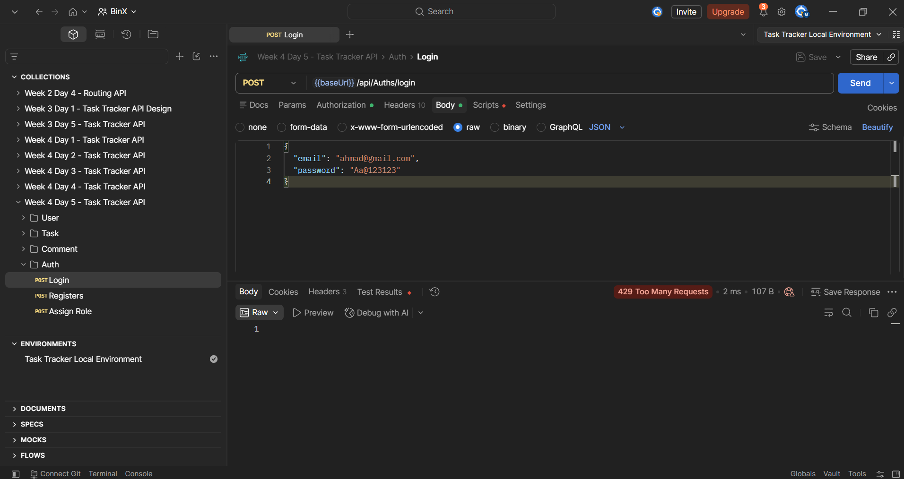
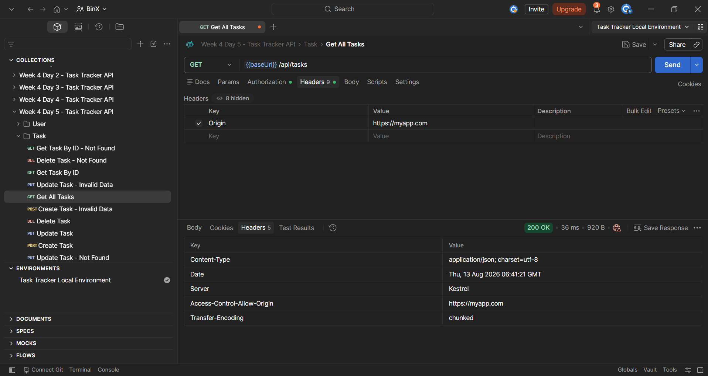
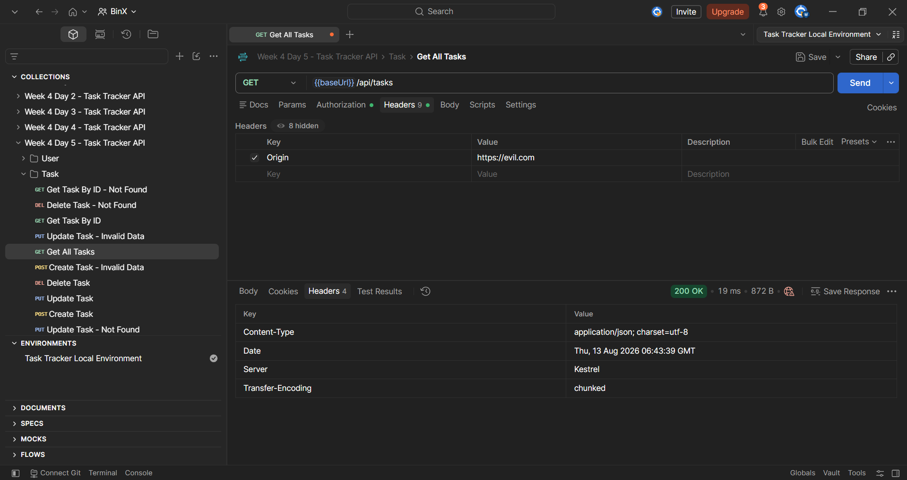
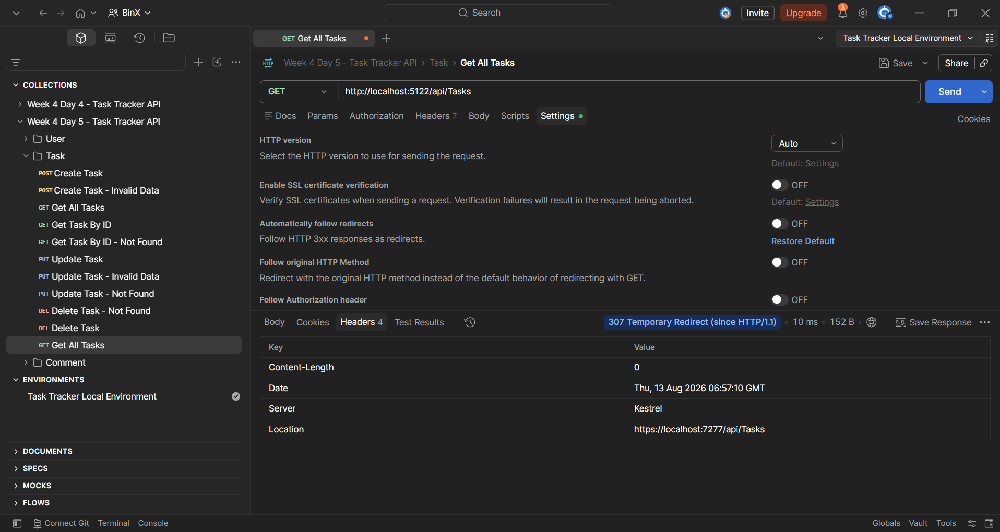

# Week 4 — Day 5: Securing the API with Rate Limiting, CORS & Security Hardening

## Overview

This exercise focused on hardening the Task Tracker API by adding additional security protections around request traffic, browser access, HTTPS usage, and database queries.

The API was extended with:

- Rate limiting for general API endpoints.
- A stricter rate limit for the login endpoint.
- A named CORS policy allowing only a specific frontend origin.
- HTTPS redirection.
- HSTS for non-development environments.
- A review of the codebase for unsafe raw SQL usage.

The implemented protections were tested using Postman.

The login endpoint was confirmed to reject excessive requests with:

```text
429 Too Many Requests
```

The CORS policy was tested using both an allowed and a disallowed origin.

HTTPS redirection was also tested and confirmed to redirect HTTP requests to HTTPS.

---

## Learning Objectives

The objectives of this exercise were to:

- Configure rate limiting to reduce brute-force and excessive-request patterns.
- Apply a stricter request limit to the login endpoint.
- Configure CORS for a specific known frontend origin.
- Understand why permissive CORS policies should be avoided in production.
- Enable HTTPS redirection.
- Enable HSTS outside the development environment.
- Understand the purpose of common security headers.
- Understand how Entity Framework Core helps prevent SQL injection.
- Review the project for unsafe raw SQL usage.
- Test the implemented hardening measures.

---

# Rate Limiting

Rate limiting controls how many requests a client can send during a defined time window.

It is useful for reducing excessive traffic and slowing down attack patterns such as repeated login attempts.

For example:

```text
Client
   ↓
Repeated Requests
   ↓
Rate Limiter
   ↓
Within Limit?
├── Yes → Continue Request
└── No  → Reject Request
```

ASP.NET Core's built-in rate limiting support was used for this exercise.

No external rate-limiting package was required.

---

## Why Rate Limit the Login Endpoint?

The login endpoint is particularly sensitive because repeated login attempts can indicate a brute-force password attack.

The login endpoint is:

```http
POST /api/Auths/login
```

A stricter rate limit was therefore applied to login than to general application endpoints.

The configured limits are:

```text
General Endpoints
→ 20 requests per minute

Login Endpoint
→ 5 requests per minute
```

This allows normal API traffic while limiting rapid authentication attempts.

---

## Rate Limiting Configuration

Rate limiting was configured in:

```text
Program.cs
```

Two fixed-window policies were created.

```csharp
builder.Services.AddRateLimiter(options =>
{
    options.RejectionStatusCode =
        StatusCodes.Status429TooManyRequests;

    options.AddFixedWindowLimiter(
        "GeneralPolicy",
        limiterOptions =>
        {
            limiterOptions.PermitLimit = 20;
            limiterOptions.Window =
                TimeSpan.FromMinutes(1);
            limiterOptions.QueueLimit = 0;
        });

    options.AddFixedWindowLimiter(
        "LoginPolicy",
        limiterOptions =>
        {
            limiterOptions.PermitLimit = 5;
            limiterOptions.Window =
                TimeSpan.FromMinutes(1);
            limiterOptions.QueueLimit = 0;
        });
});
```

The rejection status code was explicitly configured as:

```text
429 Too Many Requests
```

This clearly communicates that the request was rejected because the request-rate limit was exceeded.

---

## Fixed Window Rate Limiting

The policies use a fixed-window limiter.

A fixed window allows a defined number of requests during a specific period.

For the login policy:

```text
Window
→ 1 minute

Permit Limit
→ 5 requests
```

When the limit is exceeded within the same window, additional requests are rejected until the window resets.

---

## Rate Limiting Middleware

Rate limiting was added to the ASP.NET Core middleware pipeline:

```csharp
app.UseRateLimiter();
```

The request pipeline includes:

```csharp
app.UseHttpsRedirection();

app.UseCors("AllowFrontend");

app.UseRateLimiter();

app.UseAuthentication();
app.UseAuthorization();

app.MapControllers();
```

---

## General Rate Limiting Policy

The general policy was applied to the application's controllers using:

```csharp
[EnableRateLimiting("GeneralPolicy")]
```

For example:

```csharp
[EnableRateLimiting("GeneralPolicy")]
public class TasksController : ControllerBase
{
}
```

The same general policy was also applied to the other general API controllers.

The authentication controller uses the general policy by default:

```csharp
[EnableRateLimiting("GeneralPolicy")]
public class AuthsController : ControllerBase
{
}
```

---

## Stricter Login Policy

The login action uses a stricter policy:

```csharp
[HttpPost("login")]
[EnableRateLimiting("LoginPolicy")]
public async Task<IActionResult> Login(
    LoginRequest request)
{
    ...
}
```

This gives the login endpoint:

```text
5 requests per minute
```

instead of the general:

```text
20 requests per minute
```

---

# Rate Limiting Testing

The login endpoint was called repeatedly within the same one-minute window.

After the configured request limit was exceeded, the API returned:

```text
429 Too Many Requests
```

This confirms that the stricter login rate-limiting policy is active.

### Login Rate Limit Test



---

# CORS

CORS stands for:

```text
Cross-Origin Resource Sharing
```

CORS controls which browser-based origins are allowed to access the API.

An origin is based on values such as:

```text
Protocol
Domain
Port
```

For example:

```text
https://myapp.com
```

A restrictive CORS policy is preferred over allowing every origin in a production application.

---

## Named CORS Policy

A named policy was created:

```text
AllowFrontend
```

The policy allows only:

```text
https://myapp.com
```

The configuration is:

```csharp
builder.Services.AddCors(options =>
{
    options.AddPolicy("AllowFrontend", policy =>
    {
        policy.WithOrigins("https://myapp.com")
              .AllowAnyHeader()
              .AllowAnyMethod();
    });
});
```

---

## `WithOrigins`

The following configuration:

```csharp
.WithOrigins("https://myapp.com")
```

defines the frontend origin that is allowed by the policy.

Origins not included in the policy do not receive CORS permission.

---

## `AllowAnyHeader`

The policy uses:

```csharp
.AllowAnyHeader()
```

This allows the approved frontend origin to send the headers required by the API.

Examples include:

```text
Authorization
Content-Type
```

---

## `AllowAnyMethod`

The policy also uses:

```csharp
.AllowAnyMethod()
```

This allows the approved frontend to use HTTP methods such as:

```text
GET
POST
PUT
DELETE
```

---

## CORS Middleware

The named policy was enabled in the request pipeline:

```csharp
app.UseCors("AllowFrontend");
```

---

# CORS Testing

The CORS policy was tested using Postman by manually supplying an:

```text
Origin
```

request header.

---

## Allowed Origin Test

The following origin was sent:

```text
Origin: https://myapp.com
```

The response contained:

```text
Access-Control-Allow-Origin: https://myapp.com
```

This confirms that the configured frontend origin is allowed by the policy.

### Allowed Origin



---

## Disallowed Origin Test

The request was then sent using:

```text
Origin: https://evil.com
```

The API response did not contain:

```text
Access-Control-Allow-Origin
```

for that origin.

Postman can still display the HTTP response because it does not enforce browser CORS restrictions in the same way a browser does.

However, the missing CORS response header confirms that the origin is not approved by the configured policy.

### Disallowed Origin



---

# Security Headers and HTTPS

The lesson also covered security-related protections involving HTTPS and HTTP response headers.

Important protections include:

```text
HTTPS Redirection
HSTS
Content-Security-Policy
```

HTTPS redirection and HSTS were configured during the hands-on exercise.

Content-Security-Policy was covered as a security concept but was not required as an implementation step in the completed lab.

---

# HTTPS Redirection

HTTPS protects traffic between the client and server by using an encrypted connection.

ASP.NET Core HTTPS redirection was enabled using:

```csharp
app.UseHttpsRedirection();
```

When a request arrives using HTTP, the middleware redirects the request to the HTTPS endpoint.

---

## HTTPS Redirection Test

The application exposes:

```text
HTTP
http://localhost:5122
```

and:

```text
HTTPS
https://localhost:7277
```

The following request was sent:

```http
GET http://localhost:5122/api/Tasks
```

Automatic redirect following was disabled in Postman so the redirect response could be observed directly.

The API returned:

```text
307 Temporary Redirect
```

The response also contained:

```text
Location: https://localhost:7277/api/Tasks
```

This confirms that requests using HTTP are redirected to HTTPS.

### HTTPS Redirection



---

# HSTS

HSTS stands for:

```text
HTTP Strict Transport Security
```

HSTS tells supported browsers to use HTTPS for a domain in future requests.

It was configured outside the development environment:

```csharp
if (!app.Environment.IsDevelopment())
{
    app.UseHsts();
}
```

This prevents HSTS behavior from being unnecessarily applied during local development.

The application was running in:

```text
Development
```

during the exercise, so the HSTS middleware was configured but not directly tested in the local Postman session.

---

## HTTPS Redirection vs HSTS

The two protections have different responsibilities.

```text
HTTPS Redirection
→ Receives an HTTP request
→ Redirects it to HTTPS
```

while:

```text
HSTS
→ Instructs the browser to prefer HTTPS
→ Helps avoid future HTTP connections
```

Together they strengthen HTTPS usage in production environments.

---

# Content-Security-Policy

Content-Security-Policy, commonly called:

```text
CSP
```

is a security header that can restrict which sources a browser is allowed to load content from.

Examples include controlling sources for:

```text
Scripts
Styles
Images
```

A restrictive CSP can reduce the risk of certain browser-based attacks involving untrusted content.

CSP was discussed as part of the lesson content, but it was not added to the Task Tracker API during the completed hands-on lab.

---

# SQL Injection Prevention

SQL injection can occur when untrusted user input is directly combined with SQL command text.

An unsafe approach conceptually looks like:

```text
SQL Command
+
Direct User Input
```

This can allow malicious input to change the meaning of a SQL query.

---

## Entity Framework Core Parameterization

The Task Tracker API uses:

```text
Entity Framework Core
```

together with:

```text
LINQ
```

for database operations.

Entity Framework Core parameterizes values used in normal LINQ queries.

For example:

```csharp
var user = await _context.Users
    .FirstOrDefaultAsync(
        x => x.Email == email);
```

The value:

```text
email
```

is treated as a query parameter rather than being directly concatenated into SQL command text.

This helps protect normal EF Core queries from SQL injection.

---

## Raw SQL Risk

EF Core's normal parameterization can be bypassed if a developer manually creates unsafe raw SQL using direct user input.

Unsafe raw SQL construction should therefore be avoided.

When raw SQL is necessary, parameterized alternatives should be used.

Examples of APIs that require careful review include:

```text
FromSqlRaw
ExecuteSqlRaw
```

A parameterized approach such as:

```text
FromSqlInterpolated
```

or explicit query parameters should be preferred when user-supplied values are involved.

---

# SQL Injection Code Review

The project was reviewed using Visual Studio solution-wide search.

The following terms were checked:

```text
FromSqlRaw
ExecuteSqlRaw
FromSqlInterpolated
SELECT
```

No matches were found.

This confirmed that the current Task Tracker API does not contain manually written raw SQL queries.

The project currently relies on:

```text
Entity Framework Core
+
LINQ
```

for its database queries.

Therefore, the normal EF Core parameterization behavior remains in place.

---

# Security Hardening Flow

```text
Client Request
      ↓
HTTPS Redirection
      ↓
CORS Policy
      ↓
Rate Limiting
      ↓
Authentication
      ↓
Authorization
      ↓
Controller
      ↓
Service Layer
      ↓
Entity Framework Core
      ↓
Parameterized Database Query
      ↓
SQL Server
```

Different protections operate at different stages of the request.

```text
HTTPS
→ Protects the connection

CORS
→ Controls permitted browser origins

Rate Limiting
→ Controls request frequency

Authentication
→ Determines who the user is

Authorization
→ Determines what the user can do

EF Core Parameterization
→ Helps protect database queries from SQL injection
```

---

# Week 4 Security Progress

Week 4 progressively added multiple security layers to the Task Tracker API.

```text
Day 1
→ ASP.NET Core Identity
→ User Registration
→ Password Hashing

Day 2
→ JWT Authentication
→ Token Issuance
→ Protected Endpoints

Day 3
→ Authorization
→ Roles
→ Claims
→ Policies

Day 4
→ FluentValidation
→ Structured Request Validation

Day 5
→ Rate Limiting
→ CORS
→ HTTPS Redirection
→ HSTS
→ SQL Injection Review
```

Together, these exercises extended the existing Task Tracker API with authentication, authorization, validation, and security hardening.

---

# Hands-On Lab Completed

The following tasks were completed:

1. Configured ASP.NET Core built-in rate limiting.
2. Created a general fixed-window rate-limiting policy.
3. Configured the general limit to 20 requests per minute.
4. Created a stricter login rate-limiting policy.
5. Configured the login limit to 5 requests per minute.
6. Configured rate-limit rejection responses as `429 Too Many Requests`.
7. Enabled the rate-limiting middleware.
8. Applied the general policy to API controllers.
9. Applied the stricter policy to the login endpoint.
10. Confirmed that excessive login requests return `429 Too Many Requests`.
11. Created the named `AllowFrontend` CORS policy.
12. Restricted the CORS policy to `https://myapp.com`.
13. Enabled the CORS policy in the middleware pipeline.
14. Confirmed the allowed origin receives `Access-Control-Allow-Origin`.
15. Confirmed a disallowed origin does not receive CORS permission.
16. Confirmed HTTPS redirection is enabled.
17. Confirmed an HTTP request returns `307 Temporary Redirect`.
18. Confirmed the redirect targets the HTTPS endpoint.
19. Configured HSTS outside the development environment.
20. Reviewed the codebase for unsafe raw SQL usage.
21. Confirmed no `FromSqlRaw`, `ExecuteSqlRaw`, `FromSqlInterpolated`, or manually written `SELECT` queries exist in the project.
22. Confirmed the application currently uses EF Core and LINQ for database queries.

---

# Project Changes

The main project changes for this exercise were:

```text
TaskTrackerApi
├── Controllers
│   ├── AuthsController.cs
│   ├── UsersController.cs
│   ├── TasksController.cs
│   └── CommentsController.cs
└── Program.cs
```

`Program.cs` was updated with:

```text
Rate Limiting configuration
CORS configuration
Rate Limiting middleware
CORS middleware
HSTS configuration
HTTPS redirection
```

The controllers were updated with the appropriate:

```text
EnableRateLimiting
```

policies.

---

# Testing Evidence

The following screenshots document the completed security tests:

```text
login-rate-limit-429.png
cors-allowed-origin.png
cors-disallowed-origin.png
https-redirection-307.png
```

---

# Tools Used

- ASP.NET Core Web API
- ASP.NET Core built-in Rate Limiting
- ASP.NET Core CORS
- ASP.NET Core HTTPS Redirection
- HSTS
- Entity Framework Core
- LINQ
- SQL Server
- Visual Studio
- Postman
