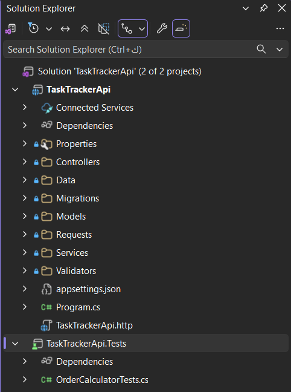
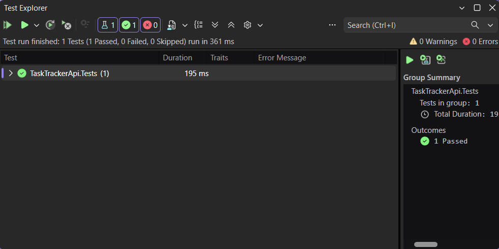
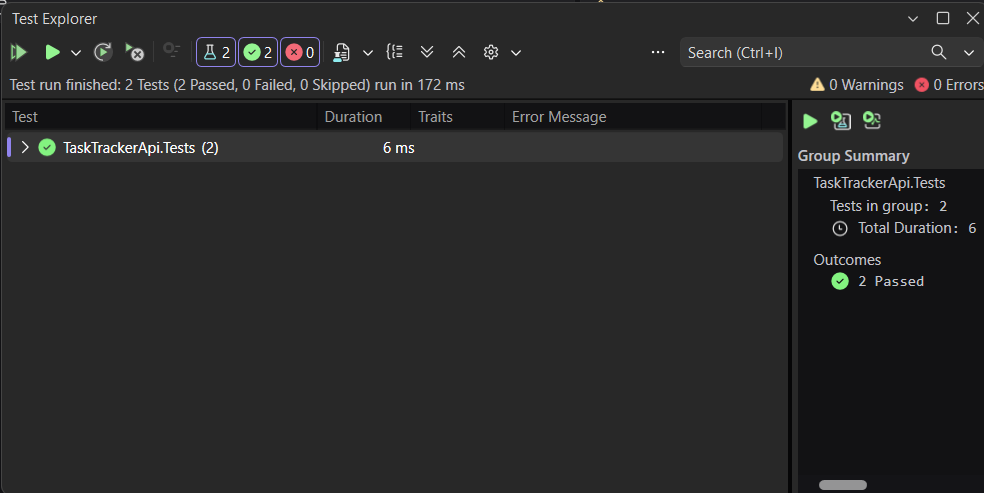
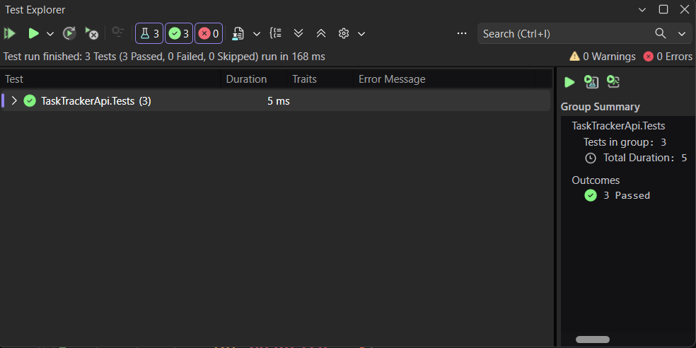
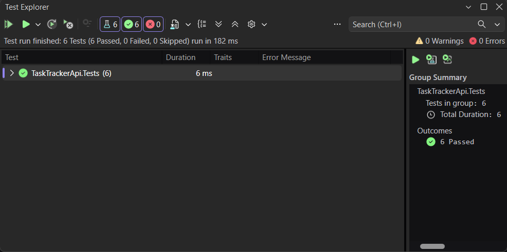

# Week 5 — Day 1: Choosing the Phase 3 Project & Unit Testing with xUnit

## Overview

Day 1 focused on selecting the Phase 3 capstone project and introducing unit testing with xUnit.

The selected capstone project is an **E-Commerce Backend**, which will be developed throughout Phase 3 using the backend concepts and patterns practiced during the previous weeks.

The hands-on work also introduced xUnit unit testing, including `[Fact]`, `[Theory]`, `[InlineData]`, and the Arrange-Act-Assert pattern.

---

## Learning Objectives

The objectives of this exercise were to:

- Select a Phase 3 capstone project based on current interests and backend development experience.
- Define a realistic project scope that can meet the required professional baseline by Week 9.
- Understand the purpose of unit testing.
- Create an xUnit test project.
- Reference the existing ASP.NET Core API project from the test project.
- Write unit tests using `[Fact]`.
- Write parameterized tests using `[Theory]` and `[InlineData]`.
- Structure unit tests using the Arrange-Act-Assert pattern.
- Run tests using Visual Studio Test Explorer and verify the results.

---

## Phase 3 Project Selection

The selected Phase 3 capstone project is:

```text
E-Commerce Backend
```

The project will focus on core e-commerce backend functionality such as:

```text
Product Catalog
Shopping Cart
Order Processing
```

The project will build on the ASP.NET Core, Entity Framework Core, authentication, authorization, validation, security, and testing concepts practiced during the internship.

The goal is to keep the project scope realistic while still delivering the professional backend requirements expected by Week 9.

---

## E-Commerce Backend Scope

The Phase 3 capstone will be an **E-Commerce Backend API** focused on core workflows including product catalog management, shopping cart operations, and order processing.

The project will apply the backend concepts practiced during the previous weeks, including REST API design, Entity Framework Core, authentication, authorization, validation, security, and automated testing.

The scope is designed to remain achievable by Week 9 while meeting the required professional baseline for a complete backend project.

---

## Professional Baseline

Regardless of the selected Phase 3 project, the final project is expected to meet a common professional baseline by Week 9.

The E-Commerce Backend will work toward including:

- A fully documented REST API.
- A complete Postman collection.
- A normalized relational database.
- Entity Framework Core migrations.
- A documented Entity Relationship Diagram (ERD).
- JWT-based authentication.
- Role-based access control.
- Unit tests for critical application logic.
- Integration tests for critical API routes.
- Deployment using Azure App Service or Railway.
- A passing CI/CD pipeline.
- Complete project documentation in the README.

The concepts practiced during Weeks 1–4 will therefore be reused and applied to the selected capstone project rather than starting with completely new backend patterns.

---

## Unit Testing with xUnit

Unit testing verifies small units of application logic independently from the rest of the application.

For this exercise, **xUnit** was used as the .NET testing framework.

A separate test project was created:

```text
TaskTrackerApi.Tests
```

The test project references the existing API project:

```text
TaskTrackerApi.Tests
        ↓
Project Reference
        ↓
TaskTrackerApi
```

This allows the test project to access and test classes from the main application while keeping production code and test code separated.

The first unit tests focus on a simple `OrderCalculator` service. The service contains pure calculation logic and does not depend on a database, HTTP requests, or other external resources.

This makes it suitable for demonstrating the fundamentals of isolated unit testing.


### xUnit Test Project Setup



The test project was created separately from the main API project and the tests were executed through Visual Studio Test Explorer.

---

## xUnit `Fact` and `Theory`

xUnit provides attributes that identify methods as tests.

### `[Fact]`

`[Fact]` is used when a test represents one specific scenario with a fixed set of values.

For example:

```text
Unit Price = 25
Quantity = 4
Expected Total = 100
```

A `[Fact]` test runs once and verifies that specific scenario.

### `[Theory]`

`[Theory]` is used when the same test logic should be executed with multiple sets of input data.

Test data can be supplied using `[InlineData]`:

```csharp
[Theory]
[InlineData(10, 2, 20)]
[InlineData(15, 3, 45)]
[InlineData(25, 0, 0)]
```

In this example, xUnit executes the same test method three times, once for each `[InlineData]` set.

This avoids creating multiple nearly identical test methods when only the input values and expected results change.

---

## Arrange-Act-Assert Pattern

The unit tests were organized using the **Arrange-Act-Assert (AAA)** pattern.

```text
Arrange
→ Prepare the object and input data.

Act
→ Execute the method being tested.

Assert
→ Verify that the actual result matches the expected result.
```

For example:

```csharp
// Arrange
var calculator = new OrderCalculator();
decimal unitPrice = 25m;
int quantity = 4;

// Act
decimal result =
    calculator.CalculateTotal(unitPrice, quantity);

// Assert
Assert.Equal(100m, result);
```

Using these three sections keeps each test easy to read and makes it clear what behavior is being verified.

---

## OrderCalculator Implementation

A simple `OrderCalculator` class was added to provide pure calculation logic that can be tested without external dependencies.

```csharp
namespace TaskTrackerApi.Services.Classes
{
    public class OrderCalculator
    {
        public decimal CalculateTotal(decimal unitPrice, int quantity)
        {
            return unitPrice * quantity;
        }
    }
}
```

The `CalculateTotal` method receives:

```text
unitPrice
→ The price of one item.

quantity
→ The number of items.
```

It calculates the order total using:

```text
Total = Unit Price × Quantity
```

The method is suitable for a basic unit-testing exercise because its result depends only on its input values and it does not interact with a database, HTTP request, file system, or external service.

---

## Fact Tests

Three `[Fact]` tests were created for `CalculateTotal`.

Each test covers one specific scenario and follows the Arrange-Act-Assert pattern.

### Valid Price and Quantity

The first test verifies a normal calculation:

```csharp
[Fact]
public void CalculateTotal_WithValidPriceAndQuantity_ReturnsCorrectTotal()
{
    // Arrange
    var calculator = new OrderCalculator();
    decimal unitPrice = 25m;
    int quantity = 4;

    // Act
    decimal result =
        calculator.CalculateTotal(unitPrice, quantity);

    // Assert
    Assert.Equal(100m, result);
}
```

The expected calculation is:

```text
25 × 4 = 100
```




### Zero Quantity

The second test verifies the behavior when the quantity is zero:

```csharp
[Fact]
public void CalculateTotal_WithZeroQuantity_ReturnsZero()
{
    // Arrange
    var calculator = new OrderCalculator();
    decimal unitPrice = 25m;
    int quantity = 0;

    // Act
    decimal result =
        calculator.CalculateTotal(unitPrice, quantity);

    // Assert
    Assert.Equal(0m, result);
}
```

The expected calculation is:

```text
25 × 0 = 0
```




This provides an additional edge case instead of testing only normal input values.

### Decimal Price

The third test verifies that the calculation works correctly with a decimal product price:

```csharp
[Fact]
public void CalculateTotal_WithDecimalPrice_ReturnsCorrectTotal()
{
    // Arrange
    var calculator = new OrderCalculator();
    decimal unitPrice = 19.99m;
    int quantity = 3;

    // Act
    decimal result =
        calculator.CalculateTotal(unitPrice, quantity);

    // Assert
    Assert.Equal(59.97m, result);
}
```

The expected calculation is:

```text
19.99 × 3 = 59.97
```

This scenario is relevant to an E-Commerce Backend because product prices commonly contain decimal values.


### Fact Test Results



---

## Theory Test

A `[Theory]` test was added to verify the same `CalculateTotal` logic using multiple sets of input values.

```csharp
[Theory]
[InlineData(10, 2, 20)]
[InlineData(15, 3, 45)]
[InlineData(25, 0, 0)]
public void CalculateTotal_WithDifferentInputs_ReturnsCorrectTotal(
    int unitPrice,
    int quantity,
    int expected)
{
    // Arrange
    var calculator = new OrderCalculator();

    // Act
    decimal result =
        calculator.CalculateTotal(unitPrice, quantity);

    // Assert
    Assert.Equal(expected, result);
}
```

Each `[InlineData]` attribute supplies a different set of values to the same test method:

```text
10 × 2 → Expected 20
15 × 3 → Expected 45
25 × 0 → Expected 0
```

Instead of creating three separate test methods with nearly identical logic, `[Theory]` allows the same test to be executed repeatedly with different inputs.

This makes parameterized tests useful when several related input cases need to verify the same behavior.

---

## Fact vs Theory

The exercise demonstrated the main difference between `[Fact]` and `[Theory]`:

```text
[Fact]
→ Tests one specific scenario.
→ Uses fixed values inside the test.
→ Runs once.

[Theory]
→ Tests the same behavior with multiple input sets.
→ Receives test data through parameters.
→ Runs once for each supplied data set.
```

`[InlineData]` provides the individual input sets used by the `[Theory]`.

---

## Running Tests with Test Explorer

The unit tests were executed using Visual Studio Test Explorer.

To run the tests:

1. Open **Test Explorer** from Visual Studio.
2. Build the solution if needed.
3. Select the test project or individual tests.
4. Click **Run All Tests** or run the selected test.
5. Review the results in Test Explorer.

Test Explorer displays the total number of tests together with the number of passed, failed, and skipped tests.

During the exercise, the tests were added and executed progressively:

```text
First Fact Test
→ 1 Passed

Second Fact Test
→ 2 Passed

Third Fact Test
→ 3 Passed

Theory with 3 InlineData cases
→ 6 Passed
```

This made it possible to verify each stage of the implementation before moving to the next test.

---

## Test Results

All unit tests were executed using Visual Studio Test Explorer.

The final result was:

```text
Tests:   6
Passed:  6
Failed:  0
Skipped: 0
```

Although the test class contains three `[Fact]` methods and one `[Theory]` method, the `[Theory]` contains three `[InlineData]` cases.

Therefore, xUnit executed:

```text
3 Fact tests
+
3 Theory data cases
=
6 executed tests
```

All six test executions passed successfully.

### Unit Test Result



---

## Hands-On Lab Completed

The following tasks were completed:

1. Reviewed the available Phase 3 capstone project options.
2. Selected **E-Commerce Backend** as the Phase 3 project.
3. Defined a three-sentence scope statement for the selected project.
4. Created an xUnit test project.
5. Added a project reference from the test project to the existing API project.
6. Created a simple `OrderCalculator` class with pure calculation logic.
7. Wrote three `[Fact]` unit tests.
8. Organized the tests using the Arrange-Act-Assert pattern.
9. Wrote one `[Theory]` test.
10. Added three test cases using `[InlineData]`.
11. Executed the tests using Visual Studio Test Explorer.
12. Confirmed that all six test executions passed successfully.

---

## Project Changes

The main files involved in this exercise were:

```text
TaskTrackerApi
└── Services
    └── Classes
        └── OrderCalculator.cs

TaskTrackerApi.Tests
└── OrderCalculatorTests.cs
```

The solution now contains both the application project and a dedicated unit test project:

```text
TaskTrackerApi
→ Application code

TaskTrackerApi.Tests
→ Unit test code
→ References TaskTrackerApi
```

This separation allows application logic to be tested independently while keeping test code outside the production API project.

---

## Tools Used

- C#
- .NET
- ASP.NET Core Web API
- xUnit
- `[Fact]`
- `[Theory]`
- `[InlineData]`
- Arrange-Act-Assert
- Visual Studio
- Visual Studio Test Explorer
