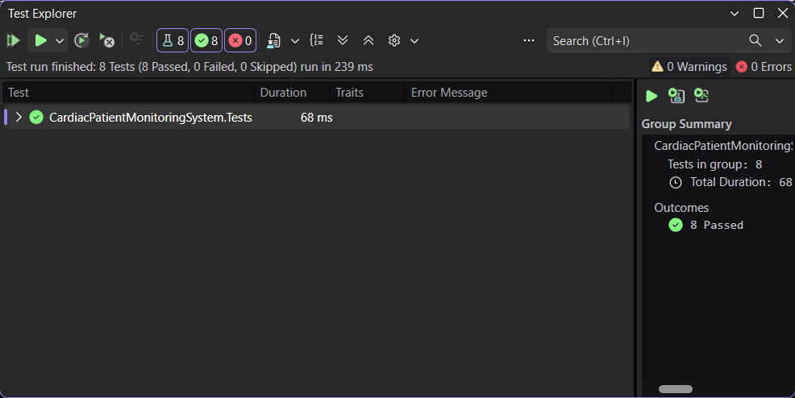

# Week 5 — Day 2: Mocking Dependencies with Moq

## Overview

Day 2 focused on mocking dependencies with Moq to isolate service-layer unit tests from real database dependencies.

The Cardiac Patient Monitoring System API was updated to introduce a repository abstraction for vital sign data access. The `VitalSignService` now depends on `IVitalSignRepository`, allowing the test project to replace the real repository with a controlled mock.

The tests demonstrated how to configure mocked return values, simulate exceptions, and verify repository interactions using Moq.

## Learning Objectives

- Explain why unit tests should isolate the service under test from real dependencies.
- Understand how repository abstractions improve testability.
- Create and configure mocks using Moq.
- Configure mocked return values using `ReturnsAsync`.
- Simulate dependency failures using `ThrowsAsync`.
- Verify mock interactions using `Verify`.
- Confirm that repository methods are called with the expected arguments and number of times.

## Why Mock Dependencies

Unit tests should focus on the behavior of the class being tested without depending on real external resources such as a database.

Originally, `VitalSignService` depended directly on `ApplicationDbContext`, which made isolated service testing more difficult because database access was part of the service dependency.

To improve testability, a repository abstraction was introduced:

```text
VitalSignService
        ↓
IVitalSignRepository
        ↓
VitalSignRepository
        ↓
ApplicationDbContext
        ↓
Database
```

During unit testing, the real `VitalSignRepository` is replaced with a mocked `IVitalSignRepository`:

```text
VitalSignService
        ↓
Mock<IVitalSignRepository>
```

This allows the tests to control exactly what the repository returns or throws without connecting to SQL Server.

Mocking keeps the test focused on the behavior of `VitalSignService` and makes success and failure scenarios easier to reproduce.

## Repository Abstraction

To make `VitalSignService` easier to unit test, a repository abstraction was introduced between the service and `ApplicationDbContext`.

### IVitalSignRepository

The `IVitalSignRepository` interface defines the data-access operations required by `VitalSignService`:

```csharp
public interface IVitalSignRepository
{
    Task<List<VitalSign>> GetAllAsync();
    Task<VitalSign?> GetByIdAsync(int id);
    Task<Patient?> GetPatientByUserIdAsync(string userId);
    Task AddAsync(VitalSign vitalSign);
    void Remove(VitalSign vitalSign);
    Task SaveChangesAsync();
}
```

### VitalSignRepository

`VitalSignRepository` implements `IVitalSignRepository` and uses `ApplicationDbContext` to perform the actual database operations.

This keeps Entity Framework Core and database access inside the repository while allowing `VitalSignService` to depend only on the repository interface.

### Dependency Injection

The repository was registered in `Program.cs`:

```csharp
builder.Services.AddScoped<IVitalSignRepository, VitalSignRepository>();
```

`VitalSignService` was then updated to receive `IVitalSignRepository` through constructor injection:

```csharp
private readonly IVitalSignRepository _repository;

public VitalSignService(IVitalSignRepository repository)
{
    _repository = repository;
}
```

This design allows the real repository to be used when the API runs and a mocked repository to be used during unit testing.

## Setting Up a Mock with Moq

Moq was added to the `CardiacPatientMonitoringSystem.Tests` project to create a controlled implementation of `IVitalSignRepository` during unit testing.

The test class creates a mock repository and passes the mocked object to `VitalSignService`:

```csharp
private readonly Mock<IVitalSignRepository> _mockRepository;
private readonly VitalSignService _service;

public VitalSignServiceTests()
{
    _mockRepository = new Mock<IVitalSignRepository>();
    _service = new VitalSignService(_mockRepository.Object);
}
```

`Mock<IVitalSignRepository>` creates the mock, while `.Object` provides the implementation that is injected into `VitalSignService`.

This replaces the real `VitalSignRepository` during testing and prevents the unit tests from connecting to the database.

## Mocking Return Values with `ReturnsAsync`

Moq can be configured to return a specific value when a mocked method is called.

For the `GetByIdAsync` test, a `VitalSign` object was created with known values:

```csharp
var vitalSign = new VitalSign
{
    Id = 1,
    PatientId = 1,
    HeartRate = 75,
    SystolicBloodPressure = 120,
    DiastolicBloodPressure = 80,
    OxygenSaturation = 98,
    RecordedAt = DateTime.Now
};
```

The mocked repository was then configured using `Setup` and `ReturnsAsync`:

```csharp
_mockRepository
    .Setup(r => r.GetByIdAsync(1))
    .ReturnsAsync(vitalSign);
```

This means that when `VitalSignService` calls:

```csharp
GetByIdAsync(1)
```

the mock returns the predefined `VitalSign` instead of accessing the real database.

The service result was then verified using xUnit assertions:

```csharp
Assert.NotNull(result);
Assert.Equal(1, result.Id);
Assert.Equal(75, result.HeartRate);
```

This allows the test to verify the behavior of `VitalSignService` using completely controlled repository data.

## Mocking Exceptions with `ThrowsAsync`

Moq can also simulate dependency failures by configuring a mocked method to throw an exception.

The mocked repository was configured to throw an `InvalidOperationException` when `GetByIdAsync(1)` is called:

```csharp
_mockRepository
    .Setup(r => r.GetByIdAsync(1))
    .ThrowsAsync(new InvalidOperationException("Database error"));
```

The test then verifies that the exception is propagated as expected:

```csharp
await Assert.ThrowsAsync<InvalidOperationException>(
    () => _service.GetByIdAsync(1));
```

This allows failure scenarios to be tested without causing a real database error.

The interaction with the mocked repository was also verified:

```csharp
_mockRepository.Verify(
    r => r.GetByIdAsync(1),
    Times.Once);
```

## Verifying Mock Interactions

Moq can verify whether a mocked dependency was called as expected during a test.

In the successful `GetByIdAsync` test, the repository call was verified using:

```csharp
_mockRepository.Verify(
    r => r.GetByIdAsync(1),
    Times.Once);
```

This confirms that `VitalSignService` called `GetByIdAsync(1)` exactly one time.

The same verification was also used in the exception test to confirm that the repository method was still called once before the mocked exception was thrown.

Using `Verify` allows the test to check not only the returned result, but also the interaction between `VitalSignService` and `IVitalSignRepository`.

## Unit Tests Implemented

Two Moq-based unit tests were added to `VitalSignServiceTests`.

### Successful Repository Return

The first test verifies that `VitalSignService.GetByIdAsync` correctly processes a `VitalSign` returned by the mocked repository:

```csharp
[Fact]
public async Task GetByIdAsync_WhenVitalSignExists_ReturnsVitalSignResponse()
{
    // Arrange
    var vitalSign = new VitalSign
    {
        Id = 1,
        PatientId = 1,
        HeartRate = 75,
        SystolicBloodPressure = 120,
        DiastolicBloodPressure = 80,
        OxygenSaturation = 98,
        RecordedAt = DateTime.Now
    };

    _mockRepository
        .Setup(r => r.GetByIdAsync(1))
        .ReturnsAsync(vitalSign);

    // Act
    var result = await _service.GetByIdAsync(1);

    // Assert
    Assert.NotNull(result);
    Assert.Equal(1, result.Id);
    Assert.Equal(75, result.HeartRate);

    _mockRepository.Verify(
        r => r.GetByIdAsync(1),
        Times.Once);
}
```

This test verifies the success scenario using a controlled repository return value.

### Repository Exception

The second test verifies the behavior when the mocked repository throws an exception:

```csharp
[Fact]
public async Task GetByIdAsync_WhenRepositoryThrowsException_ThrowsInvalidOperationException()
{
    // Arrange
    _mockRepository
        .Setup(r => r.GetByIdAsync(1))
        .ThrowsAsync(new InvalidOperationException("Database error"));

    // Act & Assert
    await Assert.ThrowsAsync<InvalidOperationException>(
        () => _service.GetByIdAsync(1));

    _mockRepository.Verify(
        r => r.GetByIdAsync(1),
        Times.Once);
}
```

This test simulates a repository failure and verifies both the expected exception and the repository interaction.

## Test Results

All unit tests were executed using Visual Studio Test Explorer.

The final test results were:

```text
Tests:   8
Passed:  8
Failed:  0
Skipped: 0
```

The test suite now includes the previous heart rate status tests from Day 1 together with the new Moq-based repository tests from Day 2.

The new Day 2 tests verified:

- Returning a controlled `VitalSign` from a mocked repository.
- Processing the mocked repository result inside `VitalSignService`.
- Throwing a controlled `InvalidOperationException` using `ThrowsAsync`.
- Verifying repository calls using `Verify`.
- Confirming `GetByIdAsync(1)` was called exactly once using `Times.Once`.

### Unit Test Result



## Hands-On Lab Completed

1. Identified `VitalSignService` as the service to test.
2. Introduced `IVitalSignRepository` as a repository abstraction.
3. Implemented `VitalSignRepository` using `ApplicationDbContext`.
4. Updated `VitalSignService` to depend on `IVitalSignRepository`.
5. Registered the repository using Dependency Injection.
6. Added Moq to the xUnit test project.
7. Created a mocked `IVitalSignRepository`.
8. Configured a mocked return value using `Setup` and `ReturnsAsync`.
9. Verified that `VitalSignService.GetByIdAsync` processed the mocked value correctly.
10. Configured the repository mock to throw an exception using `ThrowsAsync`.
11. Verified the expected `InvalidOperationException`.
12. Used `Verify` with `Times.Once` to confirm repository interactions.
13. Ran the complete test suite using Visual Studio Test Explorer.
14. Verified that all 8 tests passed successfully.

## Project Changes

The main files involved in this exercise were:

```text
CardiacPatientMonitoringSystem.API
├── Repositories
│   ├── Interfaces
│   │   └── IVitalSignRepository.cs
│   │
│   └── Classes
│       └── VitalSignRepository.cs
│
└── Services
    └── Classes
        └── VitalSignService.cs


CardiacPatientMonitoringSystem.Tests
└── VitalSignServiceTests.cs
```

The service layer was updated to depend on `IVitalSignRepository` instead of directly accessing `ApplicationDbContext`.

The repository abstraction keeps database operations separated from business logic and allows the test project to replace the real repository with a mocked dependency.

The test project now contains:

```text
CardiacPatientMonitoringSystem.Tests
→ Unit tests using xUnit
→ Mocked dependencies using Moq
→ References CardiacPatientMonitoringSystem.API
```

The API project contains:

```text
CardiacPatientMonitoringSystem.API
→ Repository abstraction
→ Repository implementation
→ Service layer using dependency injection
```

## Tools Used

- C#
- .NET
- ASP.NET Core Web API
- Repository Pattern
- Dependency Injection
- xUnit
- Moq
- `[Fact]`
- `[Theory]`
- `[InlineData]`
- `Setup`
- `ReturnsAsync`
- `ThrowsAsync`
- `Verify`
- Arrange-Act-Assert
- Visual Studio
- Visual Studio Test Explorer
- Git
- GitHub
