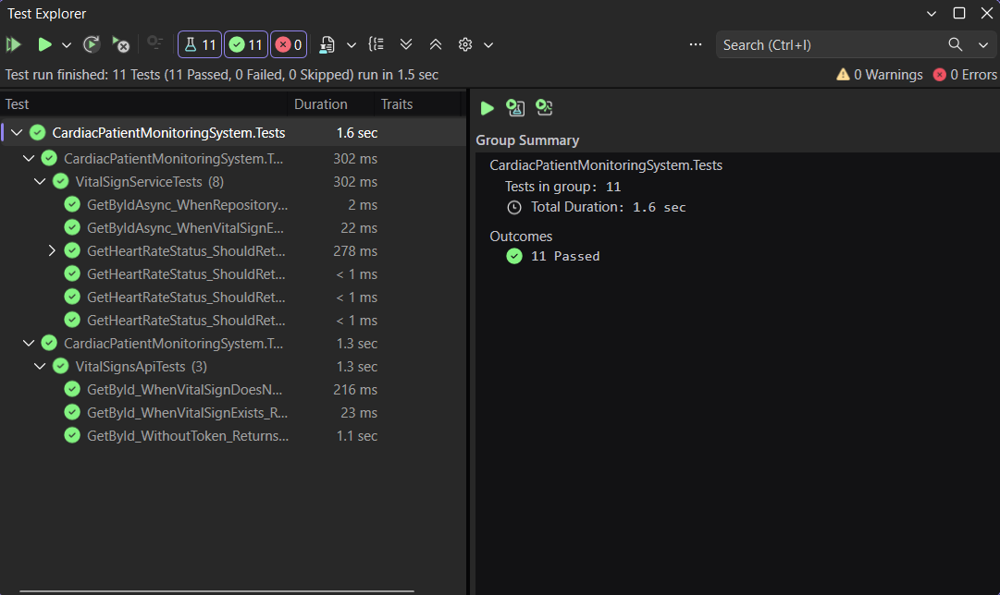

# Week 5 — Day 3: Integration Testing with WebApplicationFactory

## Overview

Day 3 focused on integration testing ASP.NET Core Web API endpoints using `WebApplicationFactory`.

The Cardiac Patient Monitoring System API was hosted in-memory during testing, allowing real HTTP requests to flow through the application's middleware pipeline, routing, dependency injection, controllers, services, repositories, authentication, and serialization.

A custom `WebApplicationFactory` was configured to use an Entity Framework Core InMemory database instead of the development SQL Server database.

Integration tests were then written for the protected `VitalSignsController` Get-by-id endpoint, covering successful responses, not-found responses, and unauthorized requests using JWT authentication.

## Learning Objectives

- Understand the difference between unit testing and integration testing.
- Set up `WebApplicationFactory<Program>` to host the ASP.NET Core API in-memory.
- Create an `HttpClient` for sending real HTTP requests to API endpoints during tests.
- Configure a separate Entity Framework Core InMemory database for integration testing.
- Test successful and not-found responses from a real API endpoint.
- Deserialize and verify the complete HTTP response body.
- Generate and attach a valid JWT to requests for protected endpoints.
- Verify that unauthorized requests return `401 Unauthorized`.

## WebApplicationFactory Setup

Integration testing was configured using `WebApplicationFactory<Program>` from the `Microsoft.AspNetCore.Mvc.Testing` package.

A custom factory was created to host the Cardiac Patient Monitoring System API in-memory during the test run:

```csharp
public class CustomWebApplicationFactory
    : WebApplicationFactory<Program>
{
    protected override void ConfigureWebHost(IWebHostBuilder builder)
    {
        builder.UseEnvironment("Testing");

        builder.ConfigureServices(services =>
        {
            var dbContextDescriptor = services.SingleOrDefault(
                d => d.ServiceType ==
                    typeof(IDbContextOptionsConfiguration<ApplicationDbContext>));

            if (dbContextDescriptor != null)
            {
                services.Remove(dbContextDescriptor);
            }

            services.AddDbContext<ApplicationDbContext>(options =>
            {
                options.UseInMemoryDatabase(
                    "CardiacPatientMonitoringTestDb");
            });
        });
    }
}
```

`WebApplicationFactory<Program>` starts the ASP.NET Core application inside the test process and allows the tests to interact with the real application pipeline without starting a separate web server.

The environment was set to `Testing` so test-specific behavior could be separated from normal application startup.

The original SQL Server `ApplicationDbContext` configuration was replaced with an Entity Framework Core InMemory database, preventing integration tests from modifying the development database.

The normal database seeding process was also disabled when the application runs in the `Testing` environment:

```csharp
if (!app.Environment.IsEnvironment("Testing"))
{
    using (var scope = app.Services.CreateScope())
    {
        await DbSeeder.SeedAsync(scope.ServiceProvider);
    }
}
```

This allows the integration tests to prepare their own controlled test data instead of using the normal application seed data.

## Creating the Integration Test Client and Test Data

The integration test class uses `IClassFixture<CustomWebApplicationFactory>` to reuse the custom application factory and create an `HttpClient` connected to the in-memory API.

```csharp
public class VitalSignsApiTests
    : IClassFixture<CustomWebApplicationFactory>
{
    private readonly HttpClient _client;
    private readonly CustomWebApplicationFactory _factory;

    public VitalSignsApiTests(CustomWebApplicationFactory factory)
    {
        _factory = factory;
        _client = factory.CreateClient();

        SeedTestData();
    }
}
```

`factory.CreateClient()` creates an `HttpClient` that sends requests directly to the application hosted by `WebApplicationFactory`.

Before each test class instance is used, controlled test data is prepared in the InMemory database:

```csharp
private void SeedTestData()
{
    using var scope = _factory.Services.CreateScope();

    var context = scope.ServiceProvider
        .GetRequiredService<ApplicationDbContext>();

    context.VitalSigns.RemoveRange(context.VitalSigns);

    context.VitalSigns.Add(new VitalSign
    {
        Id = 1,
        PatientId = 1,
        HeartRate = 75,
        SystolicBloodPressure = 120,
        DiastolicBloodPressure = 80,
        OxygenSaturation = 98,
        RecordedAt = new DateTime(2026, 8, 18, 10, 0, 0)
    });

    context.SaveChanges();
}
```

The test data is cleared and recreated with known values so the integration tests remain predictable and repeatable.

The seeded `VitalSign` with `Id = 1` is used for the successful Get-by-id test, while a non-existing ID is used to verify the `404 Not Found` path.

## Generating and Using a Test JWT

The `GetById` endpoint in `VitalSignsController` is protected with the `Admin` role:

```csharp
[HttpGet("{id}")]
[Authorize(Roles = "Admin")]
public async Task<IActionResult> GetById(int id)
```

Because the endpoint requires authentication and authorization, the integration tests generate a valid JWT containing the required `Admin` role.

```csharp
private string GenerateAdminToken()
{
    var claims = new[]
    {
        new Claim(ClaimTypes.NameIdentifier, "test-admin-id"),
        new Claim(ClaimTypes.Email, "admin@test.com"),
        new Claim(ClaimTypes.Role, "Admin")
    };

    var key = new SymmetricSecurityKey(
        Encoding.UTF8.GetBytes(
            "CardiacPatientMonitoringSystemSuperSecretKey2026"));

    var credentials = new SigningCredentials(
        key,
        SecurityAlgorithms.HmacSha256);

    var token = new JwtSecurityToken(
        issuer: "CardiacPatientMonitoringSystemAPI",
        audience: "CardiacPatientMonitoringSystemClient",
        claims: claims,
        expires: DateTime.UtcNow.AddMinutes(30),
        signingCredentials: credentials);

    return new JwtSecurityTokenHandler()
        .WriteToken(token);
}
```

The token uses the same issuer, audience, and signing key configuration expected by the API.

The `Admin` role claim allows the integration test request to pass the `[Authorize(Roles = "Admin")]` authorization requirement.

Before calling the protected endpoint, the generated token is attached to the `HttpClient` as a Bearer token:

```csharp
var token = GenerateAdminToken();

_client.DefaultRequestHeaders.Authorization =
    new AuthenticationHeaderValue("Bearer", token);
```

This allows the integration test to exercise the real JWT authentication and role-based authorization pipeline instead of bypassing authentication with a mocked handler.

## Integration Tests Implemented

Three integration tests were added to `VitalSignsApiTests`.

### Successful Get-by-Id Request

The first test verifies the happy path for a protected Get-by-id endpoint.

A valid `Admin` JWT is attached to the request, and the test sends:

```text
GET /api/VitalSigns/1
```

```csharp
[Fact]
public async Task GetById_WhenVitalSignExists_ReturnsOkWithVitalSign()
{
    // Arrange
    var token = GenerateAdminToken();

    _client.DefaultRequestHeaders.Authorization =
        new AuthenticationHeaderValue("Bearer", token);

    // Act
    var response = await _client.GetAsync("/api/VitalSigns/1");

    // Assert
    Assert.Equal(HttpStatusCode.OK, response.StatusCode);

    var vitalSign = await response.Content
        .ReadFromJsonAsync<VitalSignResponse>();

    Assert.NotNull(vitalSign);
    Assert.Equal(1, vitalSign.Id);
    Assert.Equal(1, vitalSign.PatientId);
    Assert.Equal(75, vitalSign.HeartRate);
    Assert.Equal(120, vitalSign.SystolicBloodPressure);
    Assert.Equal(80, vitalSign.DiastolicBloodPressure);
    Assert.Equal(98, vitalSign.OxygenSaturation);
    Assert.Equal(
        new DateTime(2026, 8, 18, 10, 0, 0),
        vitalSign.RecordedAt);
}
```

This test verifies both the `200 OK` status code and the complete deserialized `VitalSignResponse` body.

### Not-Found Request

The second test verifies the error path for a VitalSign that does not exist.

```csharp
[Fact]
public async Task GetById_WhenVitalSignDoesNotExist_ReturnsNotFound()
{
    // Arrange
    var token = GenerateAdminToken();

    _client.DefaultRequestHeaders.Authorization =
        new AuthenticationHeaderValue("Bearer", token);

    // Act
    var response = await _client.GetAsync("/api/VitalSigns/99999");

    // Assert
    Assert.Equal(HttpStatusCode.NotFound, response.StatusCode);
}
```

The request includes a valid `Admin` JWT, allowing the test to reach the controller action and verify the expected `404 Not Found` response.

### Unauthorized Request

The third test verifies that the protected endpoint rejects requests that do not include a JWT.

```csharp
[Fact]
public async Task GetById_WithoutToken_ReturnsUnauthorized()
{
    // Arrange
    _client.DefaultRequestHeaders.Authorization = null;

    // Act
    var response = await _client.GetAsync("/api/VitalSigns/1");

    // Assert
    Assert.Equal(HttpStatusCode.Unauthorized, response.StatusCode);
}
```

This confirms that the JWT authentication pipeline protects the endpoint and returns `401 Unauthorized` when authentication is missing.

## Test Results

The integration tests were executed using Visual Studio Test Explorer.

The Day 3 integration test results were:

```text
Tests:   3
Passed:  3
Failed:  0
Skipped: 0
```

The three integration tests verified:

- `200 OK` for an existing `VitalSign` using a valid `Admin` JWT.
- `404 Not Found` for a non-existing `VitalSign`.
- `401 Unauthorized` when the protected endpoint is called without a JWT.

The complete test suite was then executed, including the unit tests from Day 1 and Day 2 together with the new integration tests from Day 3.

The final test results were:

```text
Tests:   11
Passed:  11
Failed:  0
Skipped: 0
```

### Integration Test Result



## Hands-On Lab Completed

1. Set up `WebApplicationFactory<Program>` for the Cardiac Patient Monitoring System API.
2. Created `CustomWebApplicationFactory` to host the API in-memory during integration testing.
3. Configured the test environment using `builder.UseEnvironment("Testing")`.
4. Replaced the SQL Server `ApplicationDbContext` configuration with an Entity Framework Core InMemory database.
5. Disabled the normal application database seeding process while running in the `Testing` environment.
6. Created an `HttpClient` using `factory.CreateClient()`.
7. Seeded controlled `VitalSign` test data into the InMemory database.
8. Generated a valid JWT containing the `Admin` role for protected endpoint testing.
9. Attached the JWT to HTTP requests using the Bearer authentication scheme.
10. Wrote a successful Get-by-id integration test for `GET /api/VitalSigns/1`.
11. Verified the complete `VitalSignResponse` body for the successful request.
12. Wrote a not-found integration test for `GET /api/VitalSigns/99999`.
13. Verified the expected `404 Not Found` response.
14. Wrote an unauthorized integration test without a JWT.
15. Verified the expected `401 Unauthorized` response.
16. Ran all three Day 3 integration tests successfully.
17. Ran the complete test suite and verified that all 11 tests passed.

## Project Changes

The main files involved in the Day 3 integration testing work were:

```text
CardiacPatientMonitoringSystem.API
└── Program.cs


CardiacPatientMonitoringSystem.Tests
└── Integration
    ├── CustomWebApplicationFactory.cs
    └── VitalSignsApiTests.cs
```

`Program.cs` was updated to skip the normal database seeding process when the application runs in the `Testing` environment.

`CustomWebApplicationFactory.cs` hosts the API in-memory and replaces the normal SQL Server database configuration with an Entity Framework Core InMemory database.

`VitalSignsApiTests.cs` contains the integration test setup, controlled test data, test JWT generation, and the three HTTP endpoint tests.

The integration test flow is:

```text
xUnit Integration Test
        ↓
HttpClient
        ↓
WebApplicationFactory
        ↓
ASP.NET Core Middleware Pipeline
        ↓
JWT Authentication / Authorization
        ↓
VitalSignsController
        ↓
VitalSignService
        ↓
IVitalSignRepository
        ↓
VitalSignRepository
        ↓
InMemory Test Database
```

## Tools Used

- C#
- .NET
- ASP.NET Core Web API
- xUnit
- `Microsoft.AspNetCore.Mvc.Testing`
- `WebApplicationFactory<Program>`
- `HttpClient`
- Entity Framework Core InMemory
- JWT Authentication
- Role-Based Authorization
- Bearer Tokens
- Visual Studio
- Visual Studio Test Explorer
- Git
- GitHub