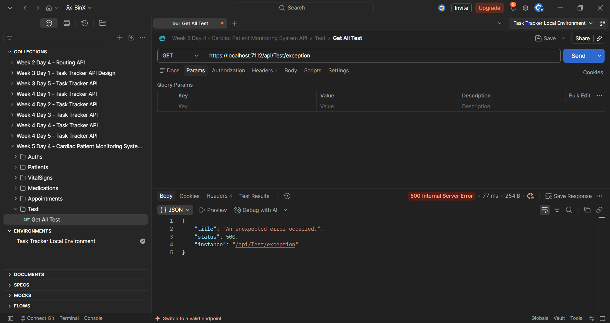
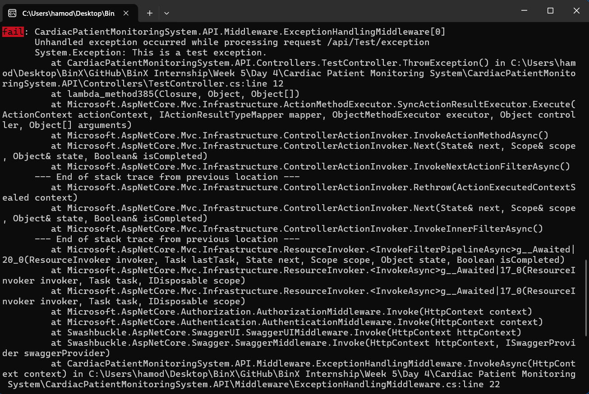

# Week 5 — Day 4: Centralized Error Handling & Global Exception Middleware

## Overview

Day 4 focused on centralized error handling in ASP.NET Core using custom global exception-handling middleware.

Instead of handling unexpected exceptions separately inside individual controllers or endpoints, a single middleware component was added early in the request pipeline to catch unhandled exceptions from downstream components.

The middleware logs the full exception details on the server using structured logging with `ILogger`, while returning a safe and standardized `ProblemDetails` response to the client.

The implementation also ensures that internal exception messages and stack traces are never exposed to external callers.

A dedicated test endpoint was added to deliberately trigger an unhandled exception and verify that the middleware correctly returns `500 Internal Server Error` with a consistent `ProblemDetails` response.

## Learning Objectives

- Understand the problems caused by repeating `try/catch` blocks across multiple controllers and endpoints.
- Implement centralized exception handling using custom ASP.NET Core middleware.
- Catch unhandled exceptions from downstream components in one central location.
- Return standardized API error responses using `ProblemDetails`.
- Prevent internal exception messages and stack traces from being exposed to clients.
- Use `ILogger` to log complete exception details on the server.
- Apply structured logging with contextual properties such as the request path.
- Verify global exception handling using a deliberately failing test endpoint.
- Keep controllers focused on expected application errors while allowing unexpected exceptions to reach the global handler.

## The Problem with Scattered Try/Catch

Handling unexpected exceptions separately inside every controller or endpoint can lead to duplicated code and inconsistent error responses.

For example, if each endpoint contains its own `try/catch` block, different endpoints may return different error formats for similar failures.

This also makes the code harder to maintain because the same exception-handling logic must be repeated in multiple places.

Centralized exception handling solves this problem by allowing unexpected exceptions to bubble up to one middleware component.

The global middleware can then:

- Catch unhandled exceptions in one place.
- Log the complete exception details on the server.
- Return one consistent error format to the client.
- Keep controllers focused on normal application logic and expected errors.
- Reduce repeated exception-handling boilerplate.

Expected errors that require specific handling, such as validation failures or a `404 Not Found` response, can still be handled explicitly when needed.

## Global Exception Handling Middleware

A custom `ExceptionHandlingMiddleware` was created to handle unexpected exceptions in one central location.

The middleware wraps the rest of the ASP.NET Core request pipeline inside a `try/catch` block.

```csharp
public async Task InvokeAsync(HttpContext context)
{
    try
    {
        await _next(context);
    }
    catch (Exception ex)
    {
        _logger.LogError(
            ex,
            "Unhandled exception occurred while processing request {RequestPath}",
            context.Request.Path);

        context.Response.StatusCode =
            StatusCodes.Status500InternalServerError;

        context.Response.ContentType =
            "application/problem+json";

        var problemDetails = new ProblemDetails
        {
            Title = "An unexpected error occurred.",
            Status = StatusCodes.Status500InternalServerError,
            Instance = context.Request.Path
        };

        await context.Response.WriteAsJsonAsync(problemDetails);
    }
}
```

`await _next(context)` passes the request to the next component in the pipeline.

If an unhandled exception occurs in any downstream middleware, controller, service, or repository, the exception bubbles back to `ExceptionHandlingMiddleware`.

The middleware then:

- Logs the full exception details on the server.
- Records the request path as structured logging context.
- Sets the response status code to `500 Internal Server Error`.
- Returns a standardized `ProblemDetails` response.
- Prevents the actual exception message and stack trace from being exposed to the client.

The middleware was registered early in the request pipeline:

```csharp
var app = builder.Build();

app.UseMiddleware<ExceptionHandlingMiddleware>();
```

Registering it early allows it to catch unhandled exceptions raised by components that execute after it in the pipeline.

## ProblemDetails Standard

`ProblemDetails` provides a standardized structure for API error responses.

Instead of returning different custom error formats from different endpoints, the API can use one consistent response shape for failures.

A `ProblemDetails` response can include fields such as:

- `title` — a short description of the error.
- `status` — the HTTP status code.
- `detail` — additional information about the problem when it is safe to expose.
- `instance` — identifies the specific request or occurrence related to the error.

For the global exception handler, the API returns a safe response such as:

```json
{
  "title": "An unexpected error occurred.",
  "status": 500,
  "instance": "/api/Test/exception"
}
```

The actual exception message and stack trace are intentionally excluded from the client response.

This keeps error responses consistent for API consumers while protecting internal implementation details.

ASP.NET Core also uses the same `ProblemDetails` style for other API errors, which helps provide a predictable error format across the application.

## Structured Logging

The global exception middleware uses `ILogger` to record complete exception details on the server.

Instead of building log messages using string interpolation, structured logging stores important values as separate properties.

The middleware uses:

```csharp
_logger.LogError(
    ex,
    "Unhandled exception occurred while processing request {RequestPath}",
    context.Request.Path);
```

`RequestPath` is stored as a structured property in the log entry rather than being merged into a plain text message.

This makes the logs easier to search, filter, and analyze when using centralized logging systems.

The exception object is also passed directly to `LogError`, allowing the server logs to contain:

- The exception type.
- The exception message.
- The complete stack trace.
- The request path where the error occurred.

These details are available only in the server logs and are not returned to the API client.

This provides useful diagnostic information for developers while keeping external error responses safe.

## Testing the Global Exception Handler

A dedicated test endpoint was created to deliberately throw an unhandled exception.

```csharp
[ApiController]
[Route("api/[controller]")]
public class TestController : ControllerBase
{
    [HttpGet("exception")]
    public IActionResult ThrowException()
    {
        throw new Exception("This is a test exception.");
    }
}
```

The endpoint was called using:

```text
GET /api/Test/exception
```

The global exception middleware caught the exception and returned:

```json
{
  "title": "An unexpected error occurred.",
  "status": 500,
  "instance": "/api/Test/exception"
}
```

The response correctly returned `500 Internal Server Error` without exposing the original exception message or stack trace.

At the same time, the complete exception details were written to the server logs, including:

- The exception message.
- The exception type.
- The complete stack trace.
- The request path `/api/Test/exception`.

This confirmed that the middleware correctly separates internal diagnostic information from the safe error response returned to the client.

## Test Evidence

### ProblemDetails Response

The deliberately failing endpoint was tested using Postman.

The response returned `500 Internal Server Error` with a safe `ProblemDetails` body and did not expose the original exception message or stack trace.



### Structured Logging Result

The same request was also verified in the Visual Studio server logs.

The full exception details, stack trace, and request path were logged on the server for diagnostics.



## Reviewing Redundant Try/Catch Blocks

After adding the global exception-handling middleware, the existing controllers were reviewed for unnecessary `try/catch` blocks.

No redundant general-purpose `try/catch` blocks were found in the current controllers.

This means unexpected exceptions can naturally propagate to the centralized middleware, while controllers remain focused on normal application logic and expected HTTP responses.

Expected application cases such as validation failures, `404 Not Found`, or authorization failures can still be handled explicitly when needed.

## Hands-On Lab Completed

1. Implemented custom global exception-handling middleware for unhandled exceptions.
2. Registered the middleware early in the ASP.NET Core request pipeline.
3. Returned standardized `ProblemDetails` responses for unexpected server errors.
4. Configured the middleware to return `500 Internal Server Error`.
5. Confirmed that the client response does not expose the original exception message.
6. Confirmed that stack traces are not returned to the API client.
7. Added structured logging using `ILogger`.
8. Included the request path as structured logging context.
9. Logged the complete exception details on the server for diagnostics.
10. Created a dedicated test endpoint that deliberately throws an unhandled exception.
11. Verified that the global middleware catches the exception correctly.
12. Verified that the test endpoint returns a safe and consistent `ProblemDetails` response.
13. Reviewed the existing controllers for redundant general-purpose `try/catch` blocks.
14. Confirmed that no redundant `try/catch` blocks needed to be removed from the current controllers.

## Project Changes

The main files involved in the Day 4 centralized error-handling work were:

```text
CardiacPatientMonitoringSystem.API
├── Controllers
│   └── TestController.cs
├── Middleware
│   └── ExceptionHandlingMiddleware.cs
└── Program.cs
```

`ExceptionHandlingMiddleware.cs` was added to provide centralized handling for unexpected exceptions across the API.

`Program.cs` was updated to register the custom exception-handling middleware early in the ASP.NET Core request pipeline.

`TestController.cs` was added with a dedicated endpoint that deliberately throws an exception so the middleware behavior could be verified.

The exception-handling flow is:

```text
HTTP Request
     ↓
ExceptionHandlingMiddleware
     ↓
Authentication / Authorization
     ↓
Controller
     ↓
Service
     ↓
Repository
     ↓
Unhandled Exception
     ↑
ExceptionHandlingMiddleware
     ↓
Structured Server Log
     ↓
ProblemDetails Response
     ↓
500 Internal Server Error
```

## Tools Used

- C#
- .NET
- ASP.NET Core Web API
- ASP.NET Core Middleware
- `ILogger`
- Structured Logging
- `ProblemDetails`
- `HttpContext`
- `RequestDelegate`
- Global Exception Handling
- Visual Studio
- Swagger
- Git
- GitHub
