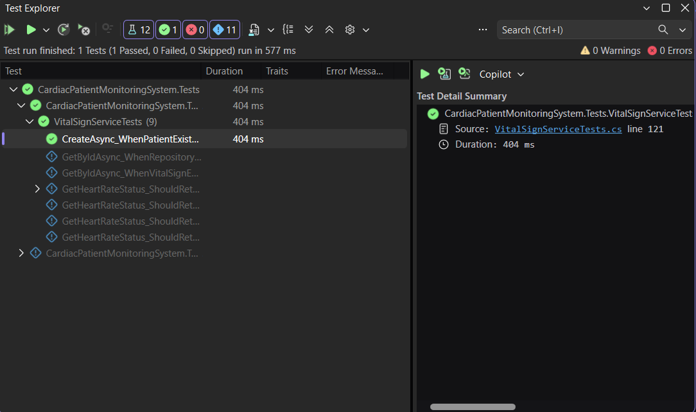
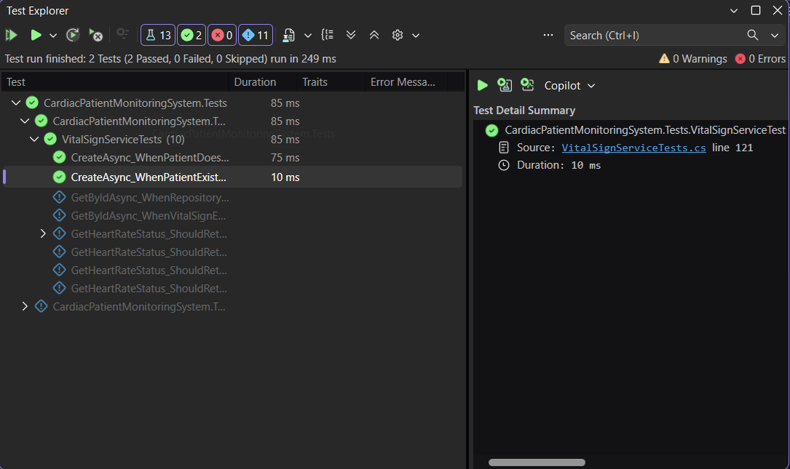
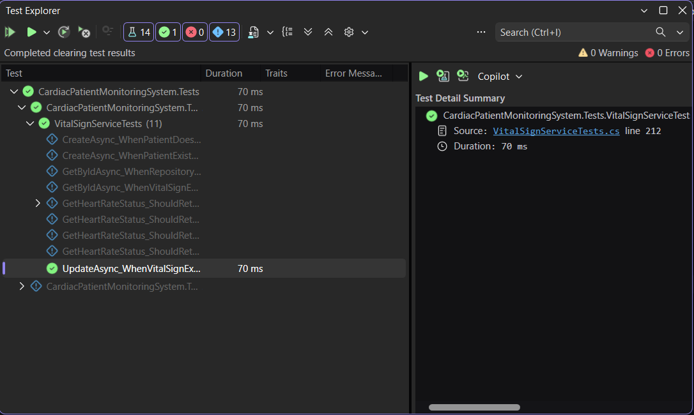
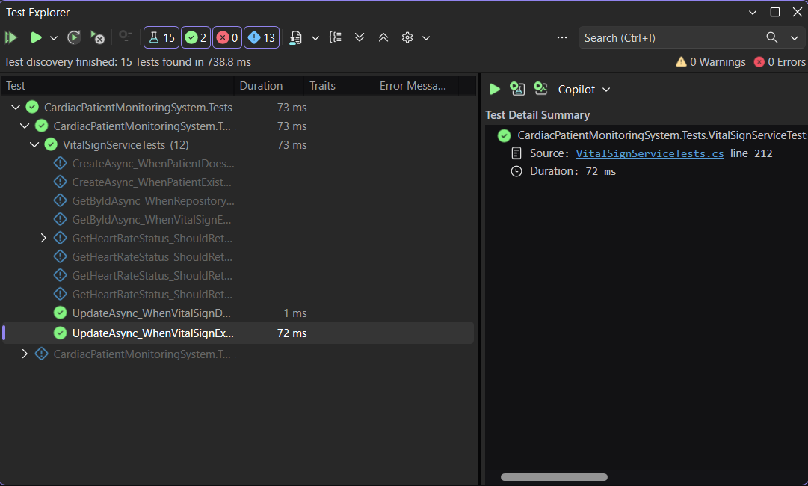
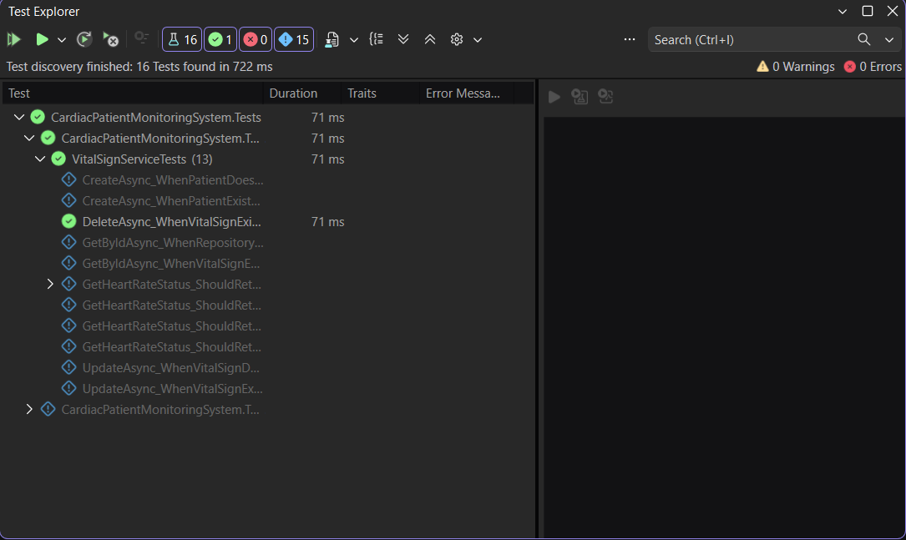
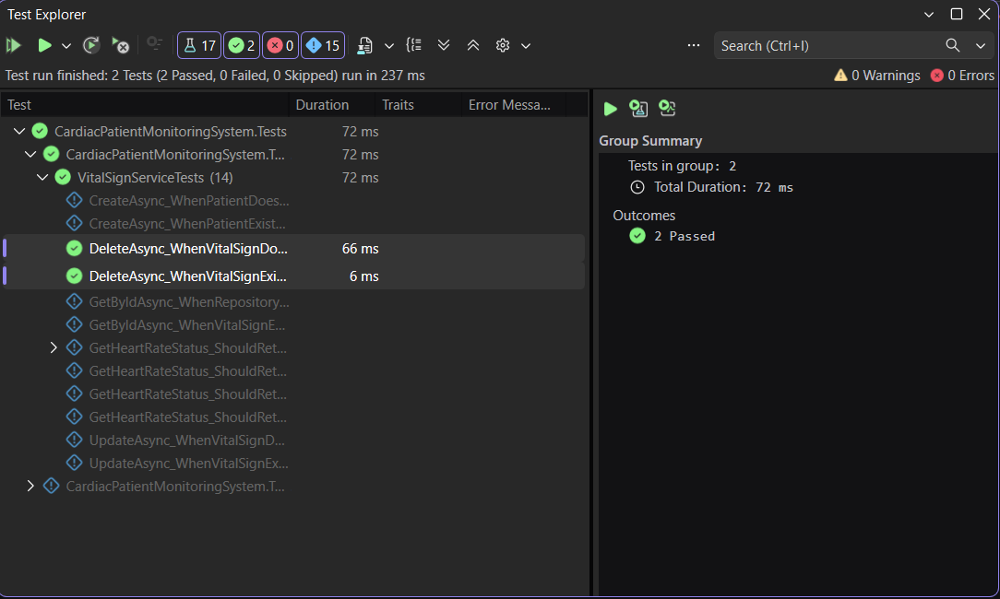
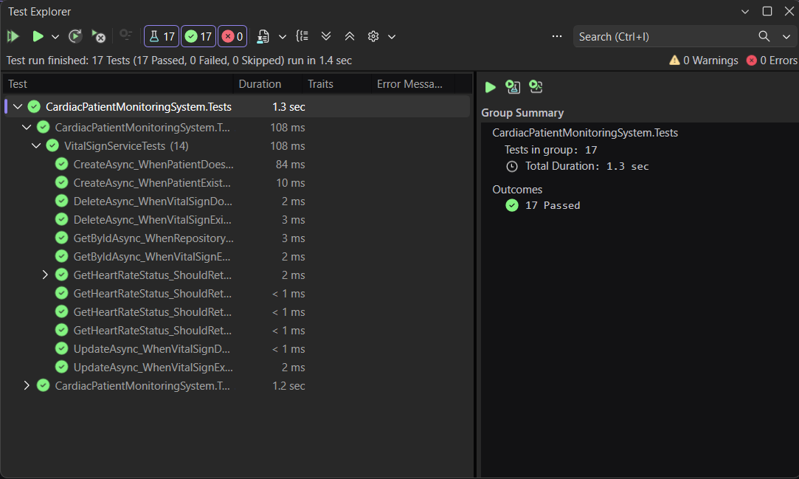
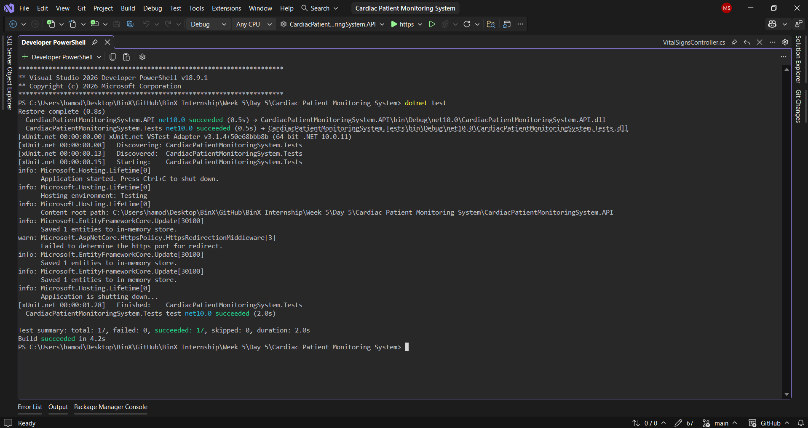

# Week 5 — Day 5: Applying Testing to the Cardiac Patient Monitoring System

## Overview

Day 5 focused on applying the testing practices developed throughout Week 5 to the existing **Cardiac Patient Monitoring System API** project.

The testing work was prioritized based on risk and complexity rather than attempting to test every method equally.

Three high-risk service operations were selected for additional unit testing:

```text
CreateAsync
UpdateAsync
DeleteAsync
```

Each operation contains meaningful business logic, conditional paths, and repository interactions, making it more valuable to test than simple pass-through methods.

The project already contained three integration tests for the important:

```text
GET /api/VitalSigns/{id}
```

endpoint. These tests covered successful, not-found, and unauthorized scenarios, exceeding the required minimum of two integration tests.

Finally, the complete test suite was executed using both Visual Studio Test Explorer and the `dotnet test` command.

The final result was:

```text
Tests:   17
Passed:  17
Failed:  0
Skipped: 0
```

---

## Learning Objectives

By the end of this exercise, the following objectives were completed:

- Prioritize testing based on risk and complexity.
- Identify high-risk business logic in an existing project.
- Write targeted unit tests for important service operations.
- Test both successful and failure paths.
- Review existing integration tests for an important API endpoint.
- Run the complete test suite using Visual Studio Test Explorer.
- Run the complete test suite using `dotnet test`.
- Interpret the complete test suite results.
- Prepare the testing foundation for Phase 3.

---

## What to Test First

Not every method in a codebase has the same testing priority.

Testing should focus first on code that contains:

- Meaningful business logic.
- Multiple conditional branches.
- Data modification.
- Important repository or database interactions.
- Higher risk if incorrect behavior reaches production.

Simple pass-through methods generally have a lower testing priority.

For the Cardiac Patient Monitoring System, the testing focus was placed on the `VitalSignService` operations responsible for creating, updating, and deleting patient vital sign data.

---

## Identifying the Three Highest-Risk Operations

Three high-risk operations were selected:

```text
1. CreateAsync
2. UpdateAsync
3. DeleteAsync
```

These operations were selected because they contain conditional logic and interact with the repository to modify data.

Each operation was tested through both its successful and failure paths.

```text
CreateAsync
├── Patient exists
└── Patient does not exist

UpdateAsync
├── VitalSign exists
└── VitalSign does not exist

DeleteAsync
├── VitalSign exists
└── VitalSign does not exist
```

This resulted in **six additional unit tests**.

---

# Unit Testing

## CreateAsync Tests

Two unit tests were added for `CreateAsync`.

### 1. Patient Exists

The first test verifies that a VitalSign is successfully created when the patient exists.

```csharp
[Fact]
public async Task CreateAsync_WhenPatientExists_CreatesVitalSignAndReturnsResponse()
{
    // Arrange
    var userId = "user-123";

    var patient = new Patient
    {
        Id = 1
    };

    var request = new CreateVitalSignRequest
    {
        HeartRate = 75,
        SystolicBloodPressure = 120,
        DiastolicBloodPressure = 80,
        OxygenSaturation = 98,
        RecordedAt = DateTime.Now
    };

    _mockRepository
        .Setup(r => r.GetPatientByUserIdAsync(userId))
        .ReturnsAsync(patient);

    _mockRepository
        .Setup(r => r.AddAsync(It.IsAny<VitalSign>()))
        .Returns(Task.CompletedTask);

    _mockRepository
        .Setup(r => r.SaveChangesAsync())
        .Returns(Task.CompletedTask);

    // Act
    var result = await _service.CreateAsync(userId, request);

    // Assert
    Assert.NotNull(result);
    Assert.Equal(1, result.PatientId);
    Assert.Equal(75, result.HeartRate);
    Assert.Equal(120, result.SystolicBloodPressure);
    Assert.Equal(80, result.DiastolicBloodPressure);
    Assert.Equal(98, result.OxygenSaturation);

    _mockRepository.Verify(
        r => r.AddAsync(It.Is<VitalSign>(v =>
            v.PatientId == 1 &&
            v.HeartRate == 75 &&
            v.SystolicBloodPressure == 120 &&
            v.DiastolicBloodPressure == 80 &&
            v.OxygenSaturation == 98)),
        Times.Once);

    _mockRepository.Verify(
        r => r.SaveChangesAsync(),
        Times.Once);
}
```

The test verifies that:

- The patient is found using the user ID.
- A `VitalSign` is created with the expected values.
- `AddAsync` is called once.
- `SaveChangesAsync` is called once.
- A valid `VitalSignResponse` is returned.

### Screenshot



---

### 2. Patient Does Not Exist

The second test verifies that the service does not create a VitalSign when the patient profile does not exist.

```csharp
[Fact]
public async Task CreateAsync_WhenPatientDoesNotExist_ReturnsNull()
{
    // Arrange
    var userId = "user-123";

    var request = new CreateVitalSignRequest
    {
        HeartRate = 75,
        SystolicBloodPressure = 120,
        DiastolicBloodPressure = 80,
        OxygenSaturation = 98,
        RecordedAt = DateTime.Now
    };

    _mockRepository
        .Setup(r => r.GetPatientByUserIdAsync(userId))
        .ReturnsAsync((Patient?)null);

    // Act
    var result = await _service.CreateAsync(userId, request);

    // Assert
    Assert.Null(result);

    _mockRepository.Verify(
        r => r.AddAsync(It.IsAny<VitalSign>()),
        Times.Never);

    _mockRepository.Verify(
        r => r.SaveChangesAsync(),
        Times.Never);
}
```

This confirms that the service returns `null` and does not modify the database when the patient profile cannot be found.

### Screenshot



---

# UpdateAsync Tests

Two unit tests were added for `UpdateAsync`.

## 1. VitalSign Exists

The first test verifies that an existing VitalSign is updated successfully.

```csharp
[Fact]
public async Task UpdateAsync_WhenVitalSignExists_UpdatesVitalSignAndReturnsTrue()
{
    // Arrange
    var vitalSign = new VitalSign
    {
        Id = 1,
        PatientId = 1,
        HeartRate = 70,
        SystolicBloodPressure = 110,
        DiastolicBloodPressure = 70,
        OxygenSaturation = 95,
        RecordedAt = DateTime.Now.AddMinutes(-10)
    };

    var request = new UpdateVitalSignRequest
    {
        HeartRate = 80,
        SystolicBloodPressure = 120,
        DiastolicBloodPressure = 80,
        OxygenSaturation = 98,
        RecordedAt = DateTime.Now
    };

    _mockRepository
        .Setup(r => r.GetByIdAsync(1))
        .ReturnsAsync(vitalSign);

    _mockRepository
        .Setup(r => r.SaveChangesAsync())
        .Returns(Task.CompletedTask);

    // Act
    var result = await _service.UpdateAsync(1, request);

    // Assert
    Assert.True(result);

    Assert.Equal(80, vitalSign.HeartRate);
    Assert.Equal(120, vitalSign.SystolicBloodPressure);
    Assert.Equal(80, vitalSign.DiastolicBloodPressure);
    Assert.Equal(98, vitalSign.OxygenSaturation);

    _mockRepository.Verify(
        r => r.GetByIdAsync(1),
        Times.Once);

    _mockRepository.Verify(
        r => r.SaveChangesAsync(),
        Times.Once);
}
```

The test confirms that the requested values are applied to the existing entity and that the changes are saved.

### Screenshot



---

## 2. VitalSign Does Not Exist

The second test verifies that the service returns `false` when the requested VitalSign does not exist.

```csharp
[Fact]
public async Task UpdateAsync_WhenVitalSignDoesNotExist_ReturnsFalse()
{
    // Arrange
    var request = new UpdateVitalSignRequest
    {
        HeartRate = 80,
        SystolicBloodPressure = 120,
        DiastolicBloodPressure = 80,
        OxygenSaturation = 98,
        RecordedAt = DateTime.Now
    };

    _mockRepository
        .Setup(r => r.GetByIdAsync(999))
        .ReturnsAsync((VitalSign?)null);

    // Act
    var result = await _service.UpdateAsync(999, request);

    // Assert
    Assert.False(result);

    _mockRepository.Verify(
        r => r.GetByIdAsync(999),
        Times.Once);

    _mockRepository.Verify(
        r => r.SaveChangesAsync(),
        Times.Never);
}
```

This confirms that no save operation occurs when the requested VitalSign does not exist.

### Screenshot



---

# DeleteAsync Tests

Two unit tests were added for `DeleteAsync`.

## 1. VitalSign Exists

The first test verifies that an existing VitalSign is removed successfully.

```csharp
[Fact]
public async Task DeleteAsync_WhenVitalSignExists_RemovesVitalSignAndReturnsTrue()
{
    // Arrange
    var vitalSign = new VitalSign
    {
        Id = 1,
        PatientId = 1,
        HeartRate = 75,
        SystolicBloodPressure = 120,
        DiastolicBloodPressure = 80,
        OxygenSaturation = 98,
        RecordedAt = DateTime.Now
    };

    _mockRepository
        .Setup(r => r.GetByIdAsync(1))
        .ReturnsAsync(vitalSign);

    _mockRepository
        .Setup(r => r.SaveChangesAsync())
        .Returns(Task.CompletedTask);

    // Act
    var result = await _service.DeleteAsync(1);

    // Assert
    Assert.True(result);

    _mockRepository.Verify(
        r => r.GetByIdAsync(1),
        Times.Once);

    _mockRepository.Verify(
        r => r.Remove(vitalSign),
        Times.Once);

    _mockRepository.Verify(
        r => r.SaveChangesAsync(),
        Times.Once);
}
```

The test confirms that:

- The VitalSign is found.
- `Remove` is called once.
- `SaveChangesAsync` is called once.
- The operation returns `true`.

### Screenshot



---

## 2. VitalSign Does Not Exist

The second test verifies that attempting to delete a non-existing VitalSign returns `false`.

```csharp
[Fact]
public async Task DeleteAsync_WhenVitalSignDoesNotExist_ReturnsFalse()
{
    // Arrange
    _mockRepository
        .Setup(r => r.GetByIdAsync(999))
        .ReturnsAsync((VitalSign?)null);

    // Act
    var result = await _service.DeleteAsync(999);

    // Assert
    Assert.False(result);

    _mockRepository.Verify(
        r => r.GetByIdAsync(999),
        Times.Once);

    _mockRepository.Verify(
        r => r.Remove(It.IsAny<VitalSign>()),
        Times.Never);

    _mockRepository.Verify(
        r => r.SaveChangesAsync(),
        Times.Never);
}
```

This confirms that the service does not attempt to remove or save anything when the requested VitalSign does not exist.

### Screenshot



---

# Integration Test Review

The Day 5 requirement was:

> Run at least 2 integration tests covering your project's most important endpoint.

The project already contained **three integration tests** for:

```text
GET /api/VitalSigns/{id}
```

These tests were implemented previously during the integration testing work.

During Day 5, they were reviewed as part of the testing scope.

**No additional integration tests were added on Day 5**, because the existing three tests already exceeded the required minimum.

The three existing tests cover:

```text
Existing VitalSign
→ 200 OK

Non-existing VitalSign
→ 404 Not Found

No authentication
→ 401 Unauthorized
```

### Integration Test Coverage

The successful test verifies:

```text
GET /api/VitalSigns/1
→ 200 OK
```

and validates the returned `VitalSignResponse`.

The not-found test verifies:

```text
GET /api/VitalSigns/99999
→ 404 Not Found
```

The unauthorized test verifies:

```text
GET /api/VitalSigns/1
without JWT
→ 401 Unauthorized
```

---

# Running the Full Test Suite

The complete test suite was executed using two different methods.

## Visual Studio Test Explorer

The complete suite was executed using **Run All Tests** in Visual Studio Test Explorer.

The result was:

```text
Tests:   17
Passed:  17
Failed:  0
Skipped: 0
```

### Screenshot



---

## Running `dotnet test`

The complete test suite was also executed from the Terminal using:

```bash
dotnet test
```

The command successfully executed the test project.

The result was:

```text
17 Tests
17 Passed
0 Failed
```

### Screenshot



---

# Final Test Result

The complete Week 5 test suite finished successfully:

```text
Tests:   17
Passed:  17
Failed:  0
Skipped: 0
```

Both execution methods confirmed the same successful result:

```text
Visual Studio Test Explorer
→ 17 Passed

dotnet test
→ 17 Passed
```

---

# Full Test Suite Summary

The Day 5 testing work added six targeted unit tests:

```text
CreateAsync
├── Patient exists
└── Patient does not exist

UpdateAsync
├── VitalSign exists
└── VitalSign does not exist

DeleteAsync
├── VitalSign exists
└── VitalSign does not exist
```

The project already contained three integration tests for the important:

```text
GET /api/VitalSigns/{id}
```

endpoint.

Therefore, the Day 5 work resulted in:

```text
6 new unit tests
+
3 existing integration tests reviewed
+
Full test suite execution
```

Final result:

```text
17 Tests
17 Passed
0 Failed
0 Skipped
```

---

# Week 5 Testing Approach

The testing approach developed throughout Week 5 can be summarized as:

```text
Identify Risk
      ↓
Prioritize Important Logic
      ↓
Unit Test Business Logic
      ↓
Mock External Dependencies
      ↓
Integration Test Important Endpoints
      ↓
Run Full Test Suite
      ↓
Interpret Results
```

The project now uses different testing levels for different purposes.

### Unit Tests

Test service logic in isolation.

### Moq

Replace repository dependencies during unit testing.

### Integration Tests

Test real HTTP requests through the ASP.NET Core application pipeline.

### Full Test Suite

Verify that all tests continue to pass together.

---

# Week 5 Synthesis

The testing practices developed throughout Week 5 establish a foundation for the next phase of the project.

Testing should focus first on areas where incorrect behavior creates the greatest risk.

For the Cardiac Patient Monitoring System, operations that modify patient VitalSign data were prioritized because they contain meaningful branching and repository interactions.

The project also has integration coverage for an important protected endpoint, including:

- Successful response.
- Not-found response.
- Unauthorized request.

The complete suite can be executed locally using:

```bash
dotnet test
```

and the results can also be reviewed through Visual Studio Test Explorer.

The goal is not to achieve 100% test coverage by testing every simple getter or pass-through method.

A smaller set of well-targeted tests that protects real application behavior provides more value than a large number of shallow tests.

The testing foundation established during Week 5 will carry forward into Phase 3 and the upcoming Sprint 1 work.

---

# Hands-On Lab Completed

The Day 5 hands-on work was completed as follows:

1. Reused the existing **Cardiac Patient Monitoring System** project.
2. Identified three high-risk service operations:
   - `CreateAsync`
   - `UpdateAsync`
   - `DeleteAsync`
3. Added two unit tests for `CreateAsync`.
4. Added two unit tests for `UpdateAsync`.
5. Added two unit tests for `DeleteAsync`.
6. Tested both success and failure paths for each selected operation.
7. Reviewed the existing integration tests for the project's most important endpoint.
8. Confirmed that three integration tests already existed for `GET /api/VitalSigns/{id}`.
9. Confirmed that the three existing integration tests exceeded the minimum requirement of two.
10. Ran the complete test suite using Visual Studio Test Explorer.
11. Ran the complete test suite using `dotnet test`.
12. Confirmed that all 17 tests passed successfully.

---

# Project Changes

The main testing work for Day 5 was performed in:

```text
CardiacPatientMonitoringSystem.Tests
├── VitalSignServiceTests.cs
│   ├── CreateAsync tests
│   ├── UpdateAsync tests
│   └── DeleteAsync tests
│
└── Integration
    └── VitalSignsApiTests.cs
```

The six new unit tests were added to:

```text
VitalSignServiceTests.cs
```

The existing integration tests remained in:

```text
Integration
└── VitalSignsApiTests.cs
```

The final testing structure is:

```text
CardiacPatientMonitoringSystem.Tests
│
├── Unit Tests
│   └── VitalSignServiceTests
│       ├── Heart Rate Status
│       ├── GetById
│       ├── CreateAsync
│       ├── UpdateAsync
│       └── DeleteAsync
│
└── Integration Tests
    └── VitalSignsApiTests
        └── GET /api/VitalSigns/{id}
```

# Tools Used

- C#
- .NET
- ASP.NET Core Web API
- xUnit
- Moq
- Unit Testing
- Integration Testing
- Repository Pattern
- Dependency Injection
- `WebApplicationFactory`
- `HttpClient`
- JWT Authentication
- Entity Framework Core InMemory
- Visual Studio
- Visual Studio Test Explorer
- Terminal
- `dotnet test`
- Git
- GitHub