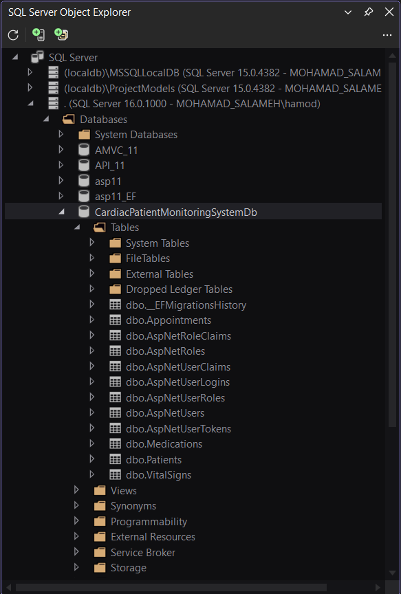
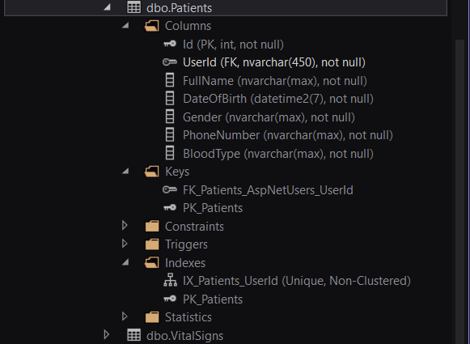
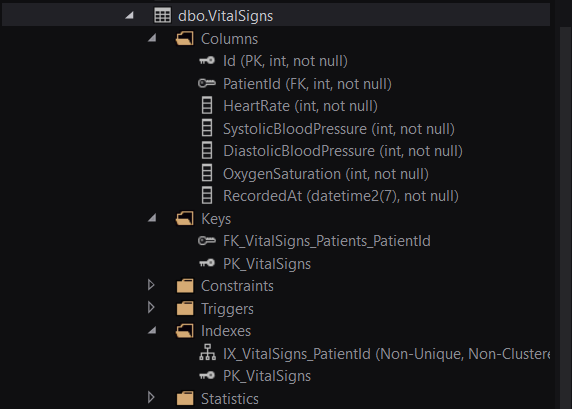
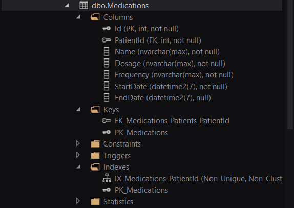
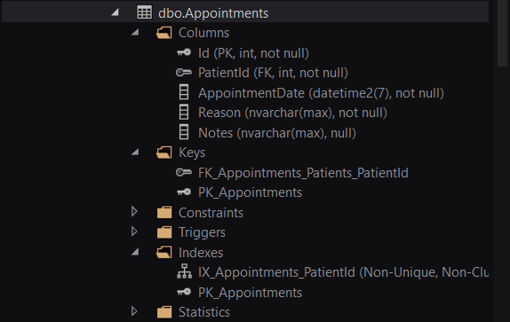

# Week 6 — Day 2: Building the EF Core Data Model & Migrations

## Overview

Day 2 focused on reviewing the complete EF Core data model of the existing **Cardiac Patient Monitoring System API**, verifying the configured relationships, reviewing the existing migrations, and confirming that the applied SQL Server schema matches the Day 1 ERD.

Because the project entities, Fluent API configuration, and migrations had already been implemented during previous work, the Day 2 exercise focused mainly on validation and verification instead of recreating the same database model.

---

## Learning Objectives

The objectives of this exercise were to:

- Review the complete domain model as EF Core entity classes.
- Verify navigation properties and foreign key relationships.
- Review explicit relationship configuration using Fluent API.
- Review delete behavior decisions.
- Understand the purpose of seed data and `HasData`.
- Review the existing EF Core migrations.
- Confirm the generated database schema matches the ERD.
- Verify the applied schema using SQL Server Object Explorer.

---

## EF Core Domain Model

The project currently contains the following main domain entities:

```text
Patient
VitalSign
Medication
Appointment
```

The application also uses ASP.NET Core Identity through:

```text
IdentityUser
AspNetUsers
```

The main domain relationships are:

```text
IdentityUser 1 → 1 Patient

Patient 1 → Many VitalSigns
Patient 1 → Many Medications
Patient 1 → Many Appointments
```

---

## Entity Classes Review

Each table from the Day 1 ERD is represented by an EF Core entity class.

The entities contain:

- Properties representing database columns.
- Foreign keys representing database relationships.
- Navigation properties representing related entities.

### Patient

`Patient` contains the main patient information and navigation collections for:

```text
VitalSigns
Medications
Appointments
```

The `UserId` property is used to associate the patient with an ASP.NET Core Identity user.

---

### VitalSign

`VitalSign` contains the recorded patient vital-sign measurements.

It includes:

```text
PatientId
HeartRate
SystolicBloodPressure
DiastolicBloodPressure
OxygenSaturation
RecordedAt
```

It also contains a `Patient` navigation property.

---

### Medication

`Medication` stores medication information associated with a patient.

It includes:

```text
PatientId
Name
Dosage
Frequency
StartDate
EndDate
```

It also contains a `Patient` navigation property.

---

### Appointment

`Appointment` stores patient appointment information.

It includes:

```text
PatientId
AppointmentDate
Reason
Notes
```

It also contains a `Patient` navigation property.

---

## Fluent API Relationship Configuration

The existing relationships were reviewed inside:

```csharp
ApplicationDbContext
```

The following one-to-many relationships are configured explicitly:

```text
Patient 1 → Many VitalSigns
Patient 1 → Many Medications
Patient 1 → Many Appointments
```

Example:

```csharp
modelBuilder.Entity<Patient>()
    .HasMany(p => p.VitalSigns)
    .WithOne(v => v.Patient)
    .HasForeignKey(v => v.PatientId);
```

The same pattern is used for medications and appointments.

---

## Patient and Identity Relationship

The project also contains a one-to-one relationship between:

```text
IdentityUser
and
Patient
```

The relationship is configured using:

```csharp
modelBuilder.Entity<Patient>()
    .HasOne<IdentityUser>()
    .WithOne()
    .HasForeignKey<Patient>(p => p.UserId)
    .OnDelete(DeleteBehavior.Cascade);
```

The foreign key is:

```text
Patient.UserId
→ AspNetUsers.Id
```

A unique index on `Patient.UserId` ensures that one Identity user cannot be linked to multiple Patient records.

---

## Delete Behavior Review

The Identity-to-Patient relationship explicitly uses:

```csharp
DeleteBehavior.Cascade
```

This means that deleting the related Identity user also deletes the associated Patient record.

The generated migration also showed cascade delete behavior for:

```text
Patient → VitalSigns
Patient → Medications
Patient → Appointments
```

This behavior was reviewed to ensure that the resulting database relationships were understood and expected.

---

## Seed Data Review

The lesson introduced the use of:

```csharp
HasData
```

for fixed reference data.

Typical examples include:

```text
Categories
Statuses
Roles
Lookup values
```

The current project domain contains only:

```text
Patient
VitalSign
Medication
Appointment
```

These entities represent operational data created during normal application usage rather than fixed reference data.

Therefore, no artificial reference entity or `HasData` configuration was added solely to satisfy the example.

The project already uses a startup seeding approach for initialization logic where needed.

---

## Existing Migrations

The following migrations were reviewed:

```text
20260813132908_InitialCreate
20260813144522_AddIdentity
20260813174126_AddPatientIdentityRelationship
```

### InitialCreate

The `InitialCreate` migration creates the main project tables:

```text
Patients
VitalSigns
Medications
Appointments
```

It also creates:

- Primary keys.
- Patient foreign keys.
- Indexes for relationship columns.
- A unique index for `Patients.UserId`.

---

### AddIdentity

The `AddIdentity` migration creates the ASP.NET Core Identity tables:

```text
AspNetUsers
AspNetRoles
AspNetUserClaims
AspNetUserLogins
AspNetUserRoles
AspNetUserTokens
AspNetRoleClaims
```

It also creates the required Identity indexes and relationships.

---

### AddPatientIdentityRelationship

The `AddPatientIdentityRelationship` migration adds the foreign key:

```text
Patients.UserId
→ AspNetUsers.Id
```

The relationship uses:

```text
Cascade Delete
```

---

## Migration Review Result

The existing migrations were reviewed before making any new database changes.

The migrations already contain the required:

```text
Tables
Columns
Primary Keys
Foreign Keys
Indexes
Nullable constraints
Delete behaviors
```

No new migration was required because the current EF Core model already matched the existing database schema and the Day 1 ERD.

---

## Database Schema Verification

The database was reviewed using SQL Server Object Explorer.

Database:

```text
CardiacPatientMonitoringSystemDb
```

The main application tables were confirmed:

```text
dbo.Patients
dbo.VitalSigns
dbo.Medications
dbo.Appointments
```

ASP.NET Core Identity tables were also confirmed.

---

## Database Tables Overview

The SQL Server database contains the expected application and Identity tables.



---

## Patients Table Verification

The `Patients` table was reviewed and confirmed to contain:

```text
Id
UserId
FullName
DateOfBirth
Gender
PhoneNumber
BloodType
```

The table also contains:

```text
PK_Patients
FK_Patients_AspNetUsers_UserId
IX_Patients_UserId
```

The `UserId` index is unique, supporting the one-to-one Identity relationship.



---

## VitalSigns Table Verification

The `VitalSigns` table was confirmed to contain:

```text
Id
PatientId
HeartRate
SystolicBloodPressure
DiastolicBloodPressure
OxygenSaturation
RecordedAt
```

The table includes:

```text
PK_VitalSigns
FK_VitalSigns_Patients_PatientId
IX_VitalSigns_PatientId
```



---

## Medications Table Verification

The `Medications` table was confirmed to contain:

```text
Id
PatientId
Name
Dosage
Frequency
StartDate
EndDate
```

`EndDate` is nullable, matching the entity definition.

The table includes:

```text
PK_Medications
FK_Medications_Patients_PatientId
IX_Medications_PatientId
```



---

## Appointments Table Verification

The `Appointments` table was confirmed to contain:

```text
Id
PatientId
AppointmentDate
Reason
Notes
```

`Notes` is nullable, matching the entity definition.

The table includes:

```text
PK_Appointments
FK_Appointments_Patients_PatientId
IX_Appointments_PatientId
```



---

## Schema Validation

The final database structure was verified through the full EF Core flow:

```text
Day 1 ERD
    ↓
Entity Classes
    ↓
Fluent API Configuration
    ↓
EF Core Migrations
    ↓
SQL Server Database Schema
```

The current project model, migrations, and SQL Server schema were confirmed to be aligned.

---

## Hands-On Lab Completed

The Day 2 hands-on work was completed as follows:

1. Reviewed the entity classes for every table in the Day 1 ERD.
2. Verified foreign keys and navigation properties.
3. Reviewed more than two relationships configured explicitly with Fluent API.
4. Reviewed the explicit cascade delete decision for the Identity-to-Patient relationship.
5. Reviewed the purpose of `HasData` and reference data seeding.
6. Confirmed that the current domain does not contain a suitable dedicated reference table for `HasData`.
7. Reviewed the existing EF Core migrations.
8. Verified the tables, columns, relationships, indexes, and delete behavior in the migration files.
9. Confirmed that no new migration was required.
10. Verified the applied database schema using SQL Server Object Explorer.
11. Confirmed that the SQL Server schema matches the Day 1 ERD.

---

## Tools Used

- C#
- Entity Framework Core
- SQL Server
- Fluent API
- ASP.NET Core Identity
- Visual Studio
- SQL Server Object Explorer
- Git
- GitHub