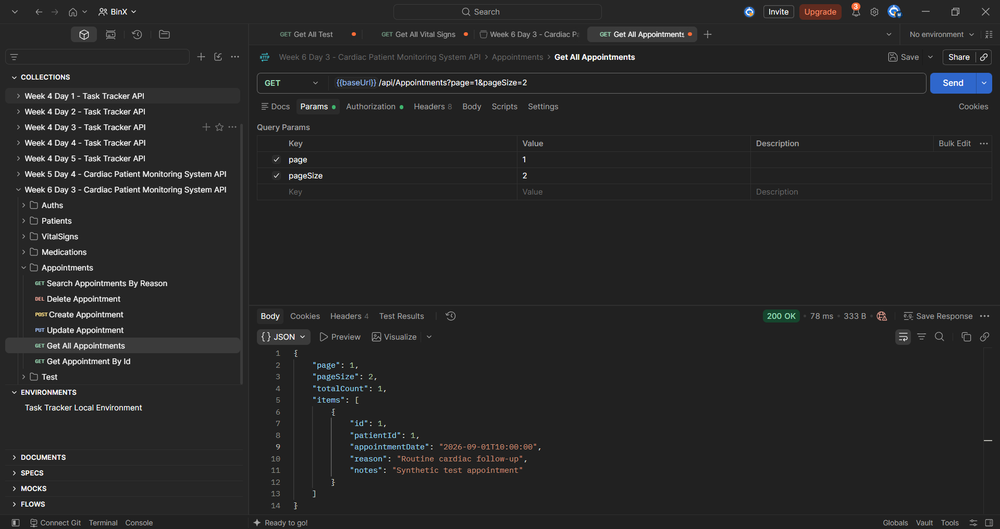
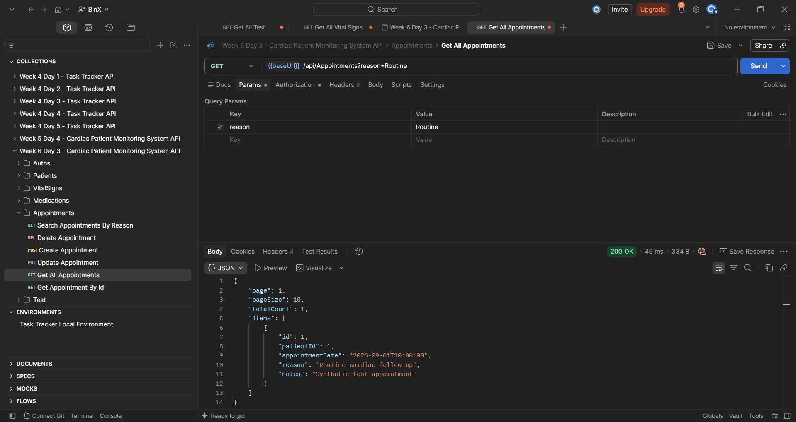
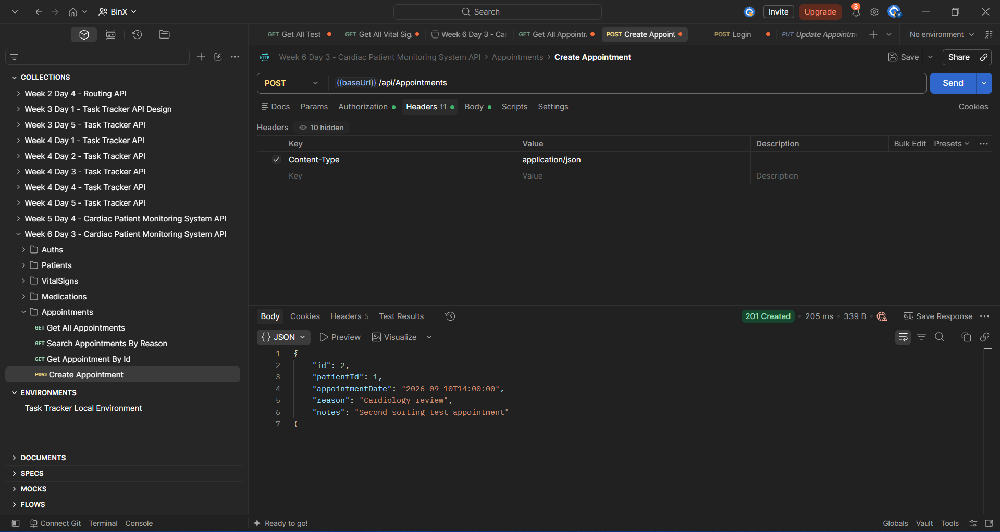
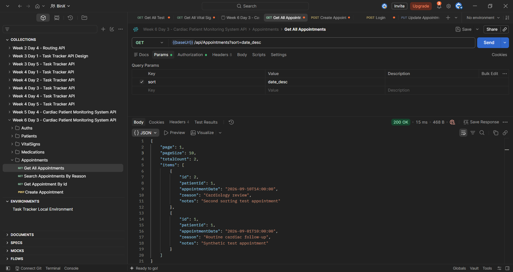
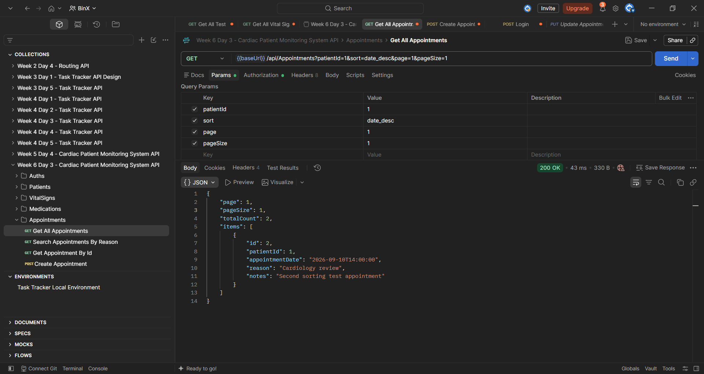

# Week 6 — Day 3: Implementing Core Routes I — Catalog & Read Operations

## Overview

Day 3 focused on improving read operations in the existing **Cardiac Patient Monitoring System API** by adding pagination, filtering, sorting, DTO projection, and efficient query execution.

The `Appointments` resource was selected for the hands-on implementation because it already had a GET list endpoint, a response DTO, query-level projection, and one existing filter. The existing functionality was reviewed first to avoid duplicating work, and only the missing Day 3 requirements were added.

---

## Learning Objectives

The objectives of this exercise were to:

- Implement a paginated GET list endpoint.
- Support optional filtering through query parameters.
- Support sorting through a query parameter.
- Return response DTOs instead of EF Core entities.
- Project query results to DTOs using `Select`.
- Avoid unnecessary over-fetching.
- Test different combinations of pagination, filtering, and sorting in Postman.

---

## Existing Read Operations Review

Before making changes, the existing list endpoints for:

```text
VitalSigns
Appointments
Medications
Patients
```

were reviewed to determine which resource already satisfied part of the Day 3 requirements.

The comparison showed that `Appointments` and `Medications` already supported:

- Response DTOs.
- Query-level projection using `Select`.
- One optional filter.

The `Appointments` resource was selected for the Day 3 implementation.

---

## Appointments GET Endpoint

The existing endpoint:

```text
GET /api/Appointments
```

already returned `AppointmentResponse` DTOs and supported filtering by:

```text
reason
```

The endpoint was extended to support:

```text
reason
patientId
sort
page
pageSize
```

Example:

```text
GET /api/Appointments?patientId=1&sort=date_desc&page=1&pageSize=10
```

---

## Pagination

Pagination was added using:

```csharp
Skip()
Take()
```

The endpoint accepts:

```text
page
pageSize
```

Example:

```text
GET /api/Appointments?page=1&pageSize=2
```

The number of skipped records is calculated using:

```text
(page - 1) * pageSize
```

The response also includes:

```text
Page
PageSize
TotalCount
Items
```

A reusable generic response model was created:

```csharp
public class PaginatedResponse<T>
{
    public int Page { get; set; }
    public int PageSize { get; set; }
    public int TotalCount { get; set; }
    public List<T> Items { get; set; } = new();
}
```

This allows paginated responses to be reused with different DTO types.

---

## Filtering

Two optional filters are now supported.

### Reason Filter

The existing `reason` filter was preserved.

```csharp
if (!string.IsNullOrWhiteSpace(reason))
{
    query = query.Where(a => a.Reason.Contains(reason));
}
```

Example:

```text
GET /api/Appointments?reason=Routine
```

---

### Patient Filter

A second optional filter was added using:

```text
patientId
```

Implementation:

```csharp
if (patientId.HasValue)
{
    query = query.Where(a => a.PatientId == patientId.Value);
}
```

Example:

```text
GET /api/Appointments?patientId=1
```

---

## Sorting

A `sort` query parameter was added with two supported options:

```text
date_asc
date_desc
```

Implementation:

```csharp
query = sort switch
{
    "date_desc" => query.OrderByDescending(a => a.AppointmentDate),
    "date_asc" => query.OrderBy(a => a.AppointmentDate),
    _ => query.OrderBy(a => a.AppointmentDate)
};
```

The default ordering is ascending by appointment date.

Examples:

```text
GET /api/Appointments?sort=date_asc
```

```text
GET /api/Appointments?sort=date_desc
```

---

## DTO Projection

The endpoint continues to return:

```text
AppointmentResponse
```

instead of exposing the `Appointment` entity directly.

The projection is performed inside the EF Core query:

```csharp
.Select(a => new AppointmentResponse
{
    Id = a.Id,
    PatientId = a.PatientId,
    AppointmentDate = a.AppointmentDate,
    Reason = a.Reason,
    Notes = a.Notes
})
```

The projection happens before:

```csharp
ToListAsync()
```

which keeps the public API contract separate from the database entity model.

---

## Avoiding Over-Fetching

The query projects only the fields required by `AppointmentResponse`.

The final query flow is:

```text
Appointments Query
        ↓
Optional Filters
        ↓
Sorting
        ↓
Total Count
        ↓
Skip
        ↓
Take
        ↓
Select AppointmentResponse
        ↓
ToListAsync
```

This avoids returning the full EF Core entity unnecessarily and keeps the database query focused on the fields required by the endpoint.

---

## Updated Service Contract

The `IAppointmentService` list method was updated to support the new query options:

```csharp
Task<PaginatedResponse<AppointmentResponse>> GetAllAsync(
    string? reason,
    int? patientId,
    string? sort,
    int page,
    int pageSize);
```

---

## Updated Appointments Service

The final list method supports:

```text
Pagination
2 Optional Filters
2 Sort Options
DTO Projection
Total Count
```

The query applies filters and sorting before pagination and projects directly to `AppointmentResponse`.

---

## Postman Testing

The updated endpoint was tested in Postman using an Admin JWT because the GET endpoint is protected with:

```csharp
[Authorize(Roles = "Admin")]
```

### Pagination Test

Request:

```text
GET /api/Appointments?page=1&pageSize=2
```

The response returned:

```text
200 OK
page = 1
pageSize = 2
totalCount = 1
```



---

### Reason Filter Test

Request:

```text
GET /api/Appointments?reason=Routine
```

The response returned the matching appointment with:

```text
Reason: Routine cardiac follow-up
```



---

### Patient Filter Test

Request:

```text
GET /api/Appointments?patientId=1
```

The response returned only appointments associated with:

```text
PatientId = 1
```


---

### Additional Appointment for Sorting Test

A second appointment was created so sorting could be verified using multiple records.

The request returned:

```text
201 Created
```

with a second appointment dated:

```text
2026-09-10T14:00:00
```



---

### Sort Ascending Test

Request:

```text
GET /api/Appointments?sort=date_asc
```

The response returned:

```text
2026-09-01T10:00:00
```

before:

```text
2026-09-10T14:00:00
```

confirming ascending ordering.


---

### Sort Descending Test

Request:

```text
GET /api/Appointments?sort=date_desc
```

The response returned:

```text
2026-09-10T14:00:00
```

before:

```text
2026-09-01T10:00:00
```

confirming descending ordering.



---

### Combined Query Test

Pagination, filtering, and sorting were also tested together.

Request:

```text
GET /api/Appointments?patientId=1&sort=date_desc&page=1&pageSize=1
```

The response returned:

```text
200 OK
page = 1
pageSize = 1
totalCount = 2
```

and returned only the newest matching appointment in `items`.



---

## Hands-On Lab Completed

The Day 3 hands-on work was completed as follows:

1. Reviewed the existing read endpoints before making changes.
2. Selected `Appointments` as the resource for the Day 3 implementation.
3. Added pagination using `page` and `pageSize`.
4. Added a reusable `PaginatedResponse<T>` DTO.
5. Added `TotalCount` to the paginated response.
6. Preserved the existing `reason` filter.
7. Added a second optional filter using `patientId`.
8. Added sorting using `date_asc` and `date_desc`.
9. Continued using `AppointmentResponse` instead of exposing EF Core entities.
10. Kept projection inside the EF Core query using `Select`.
11. Avoided unnecessary over-fetching.
12. Tested pagination in Postman.
13. Tested filtering by reason.
14. Tested filtering by patient ID.
15. Created an additional appointment for sorting verification.
16. Tested ascending date sorting.
17. Tested descending date sorting.
18. Tested pagination, filtering, and sorting together.

---

## Tools Used

- C#
- ASP.NET Core Web API
- Entity Framework Core
- LINQ
- DTOs
- Postman
- Visual Studio
- Git
- GitHub