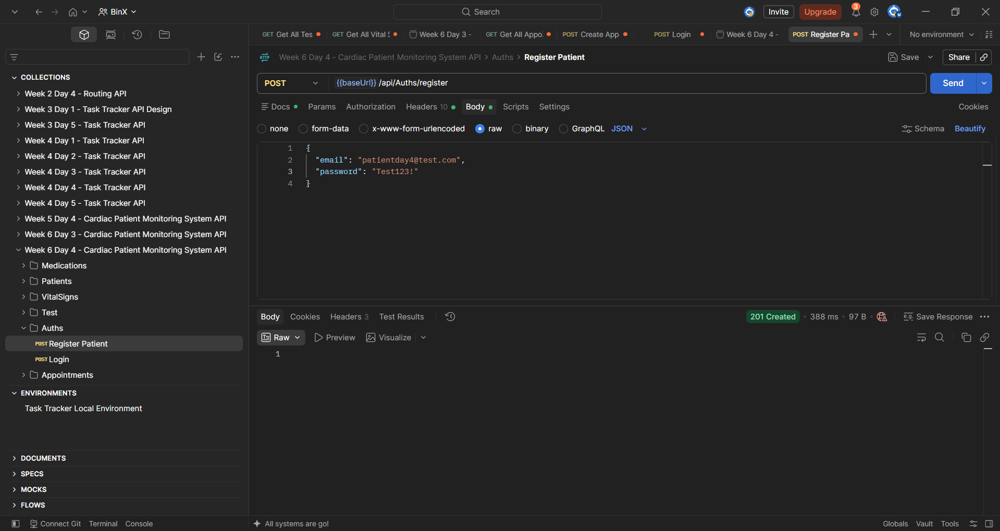
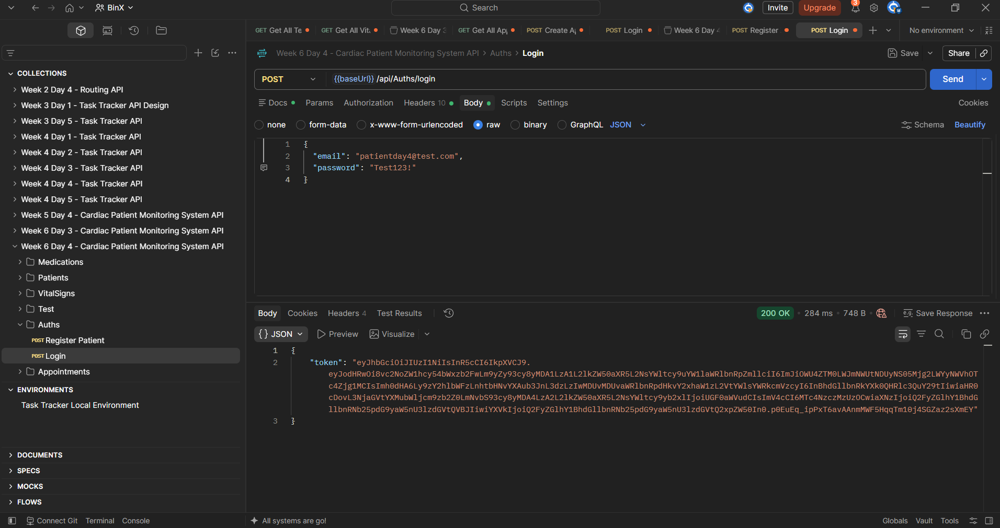
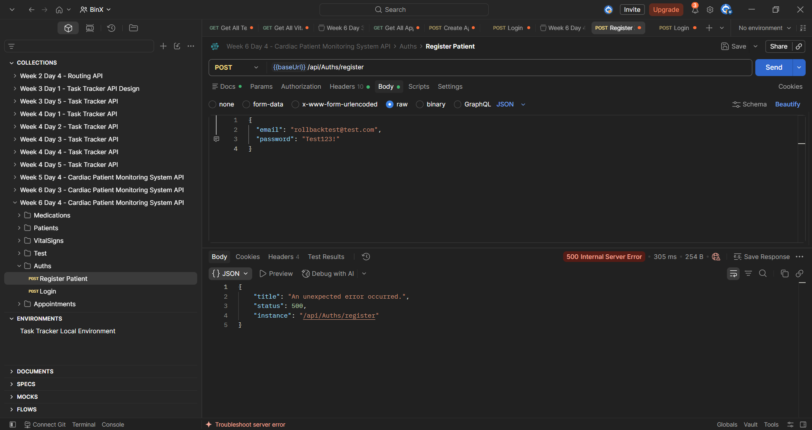
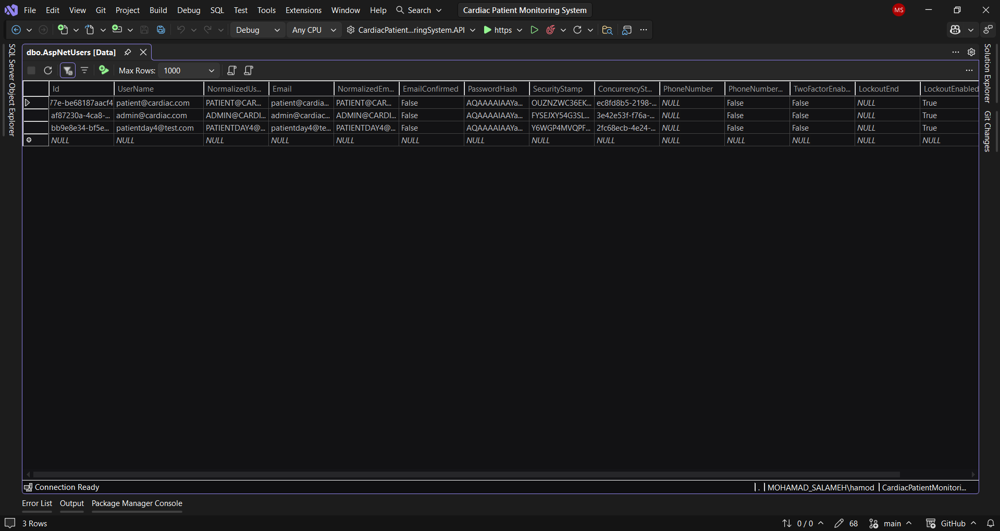

# Week 6 — Day 4: Implementing Core Routes II — Write Operations & Business Logic; Mentor Code Review

## Overview

Day 4 focused on write operations that contain real business logic rather than simple CRUD behavior, using database transactions for multi-step operations, and preparing the work for mentor code review.

The existing patient registration flow was selected for the hands-on implementation because it already performed more than one related write operation:

- Creating an ASP.NET Core Identity user.
- Assigning the new user to the `Patient` role.

The existing logic used manual cleanup when role assignment failed. This was replaced with an EF Core database transaction so the full registration operation now follows all-or-nothing behavior.

---

## Learning Objectives

The objectives of this exercise were to:

- Understand business logic beyond simple CRUD.
- Identify a real multi-step write operation in the existing project.
- Wrap related database writes in a single transaction.
- Understand transaction commit and rollback behavior.
- Verify transaction behavior in success and failure scenarios.
- Prepare the work on a dedicated feature branch for pull request review.

---

## Business Logic Beyond Simple CRUD

Simple CRUD operations perform direct create, read, update, or delete actions.

Real business logic usually includes additional rules or steps that must be applied as part of the operation.

The registration process in the project already contains business logic because registration is not limited to creating a user.

The process must also:

1. Create the ASP.NET Core Identity user.
2. Assign the new user to the `Patient` role.
3. Ensure both steps are treated as one complete operation.

The business logic remains inside `AuthService` rather than being placed directly in the controller.

This keeps HTTP handling separated from application logic.

---

## Existing Registration Flow

Before the Day 4 update, the registration logic followed this flow:

```text
Create Identity User
        ↓
Assign Patient Role
        ↓
Role assignment failed?
        ↓
Delete the created user manually
```

The existing implementation used:

```csharp
await _userManager.DeleteAsync(user);
```

to manually clean up the created user when role assignment failed.

This approach was replaced with a real database transaction.

---

## Database Transaction

The registration process now starts a database transaction using:

```csharp
await using var transaction =
    await _context.Database.BeginTransactionAsync();
```

The transaction wraps the related write operations:

```text
Begin Transaction
        ↓
Create Identity User
        ↓
Assign Patient Role
        ↓
Commit
```

If any part of the operation fails:

```text
Failure
   ↓
Rollback
```

This ensures that the database is not left in a partially completed state.

---

## ApplicationDbContext Integration

`ApplicationDbContext` was injected into `AuthService` so the registration service can create and control the EF Core transaction.

The service constructor now includes:

```csharp
public AuthService(
    UserManager<IdentityUser> userManager,
    IConfiguration configuration,
    ApplicationDbContext context)
{
    _userManager = userManager;
    _configuration = configuration;
    _context = context;
}
```

The project already uses:

```csharp
IdentityDbContext<IdentityUser>
```

and ASP.NET Core Identity is configured with:

```csharp
.AddEntityFrameworkStores<ApplicationDbContext>();
```

This allows the Identity write operations and the transaction to use the same EF Core database context.

---

## Updated Registration Logic

The updated registration method now uses transaction handling.

```csharp
public async Task<IdentityResult> RegisterAsync(RegisterRequest request)
{
    await using var transaction =
        await _context.Database.BeginTransactionAsync();

    try
    {
        var user = new IdentityUser
        {
            UserName = request.Email,
            Email = request.Email
        };

        var result = await _userManager.CreateAsync(
            user,
            request.Password);

        if (!result.Succeeded)
        {
            await transaction.RollbackAsync();
            return result;
        }

        var roleResult = await _userManager.AddToRoleAsync(
            user,
            "Patient");

        if (!roleResult.Succeeded)
        {
            await transaction.RollbackAsync();
            return roleResult;
        }

        await transaction.CommitAsync();

        return result;
    }
    catch
    {
        await transaction.RollbackAsync();
        throw;
    }
}
```

---

## Commit Behavior

The transaction is committed only after both registration steps succeed:

```csharp
await transaction.CommitAsync();
```

This means:

```text
User Creation ✅
Role Assignment ✅
        ↓
Commit ✅
```

The changes are then persisted as one successful operation.

---

## Rollback Behavior

If one step fails, the transaction is rolled back:

```csharp
await transaction.RollbackAsync();
```

This gives the registration process all-or-nothing behavior.

For example:

```text
User Creation ✅
Role Assignment ❌
        ↓
Rollback
        ↓
User is not persisted
```

This prevents incomplete registration data from remaining in the database.

---

## Transaction Failure Test

To verify the rollback behavior, the role name was temporarily changed from:

```text
Patient
```

to:

```text
InvalidRole
```

This intentionally caused the role-assignment step to fail.

The registration request returned:

```text
500 Internal Server Error
```

The global exception-handling middleware returned the standardized error response.

After the test, the role name was restored to:

```text
Patient
```

so no test-only change remained in the final implementation.

---

## Postman Testing

### Successful Registration

A new user was registered using:

```text
POST /api/Auths/register
```

The response returned:

```text
201 Created
```

This confirmed that:

```text
Create User
    ↓
Assign Patient Role
    ↓
Commit
```

completed successfully.



---

### Successful Login

The newly registered user was tested using:

```text
POST /api/Auths/login
```

The response returned:

```text
200 OK
```

with a JWT token.

This confirmed that the user was successfully persisted and could authenticate after the transaction committed.



---

### Rollback Failure Test

The registration process was intentionally forced to fail during role assignment by temporarily using a non-existing role.

The request returned:

```text
500 Internal Server Error
```

This triggered the rollback path.



---

### Database Rollback Verification

After the failed registration attempt, the `AspNetUsers` table was checked using SQL Server Object Explorer.

The test user:

```text
rollbacktest@test.com
```

was not present in the table.

This confirmed that the transaction rollback successfully prevented the partially created user from remaining in the database.



---

## Preparing a Clean Pull Request

The Day 4 work was prepared on a dedicated feature branch:

```text
feature/week6-day4-transactions
```

The implementation was built successfully in Visual Studio before preparing the pull request.

The goal is to keep the pull request focused on the registration transaction change and make the code easy for the mentor to review.

---

## Pull Request

The Day 4 implementation was pushed to the dedicated feature branch:

`feature/week6-day4-transactions`

A pull request was opened into `main` for mentor review.

Pull Request:

https://github.com/MohammadSalameh10/Mohammad-Salameh-BinX-Backend-Internship/pull/2

The mentor review is pending.

---

## Mentor Code Review Focus

The main points prepared for mentor review are:

- Whether the transaction boundary correctly covers both user creation and role assignment.
- Whether the rollback behavior prevents incomplete registration data.
- Whether business logic remains inside the service layer.
- Whether the final implementation is clean and does not contain temporary test values.
- Whether the project builds successfully before review.

---

## Hands-On Lab Completed

The Day 4 hands-on work was completed as follows:

1. Reviewed the existing write operations in the project.
2. Selected patient registration as the multi-step write operation.
3. Reviewed the existing business logic in `AuthService`.
4. Identified manual cleanup after failed role assignment.
5. Injected `ApplicationDbContext` into `AuthService`.
6. Added an EF Core database transaction to registration.
7. Wrapped user creation and role assignment in the transaction.
8. Added commit behavior for successful registration.
9. Added rollback behavior for failed registration.
10. Removed the previous manual user deletion cleanup.
11. Built the project successfully using Visual Studio.
12. Tested successful registration in Postman.
13. Tested successful login after registration.
14. Intentionally forced role assignment to fail.
15. Verified the rollback path.
16. Verified that the failed registration user was not stored in `AspNetUsers`.
17. Restored the correct `Patient` role after testing.
18. Prepared the work on a dedicated feature branch.
19. Pushed the feature branch to GitHub.
20. Opened a pull request into `main`.
21. Added the pull request link for mentor review.
22. Mentor review is pending.

---

## Tools Used

- C#
- ASP.NET Core Web API
- ASP.NET Core Identity
- Entity Framework Core
- SQL Server
- Postman
- Visual Studio
- Git
- GitHub
