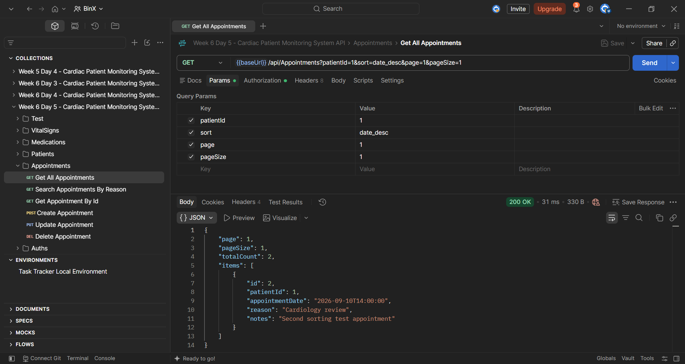
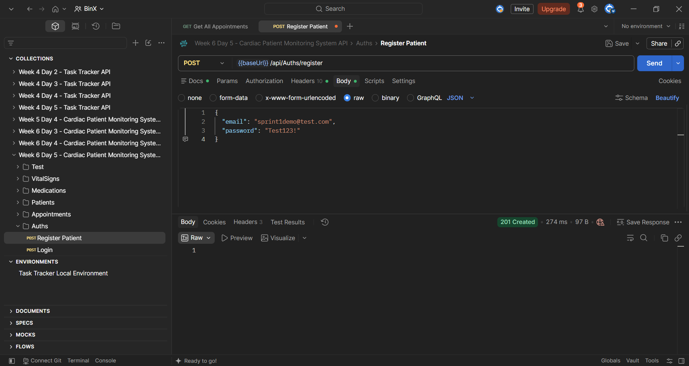
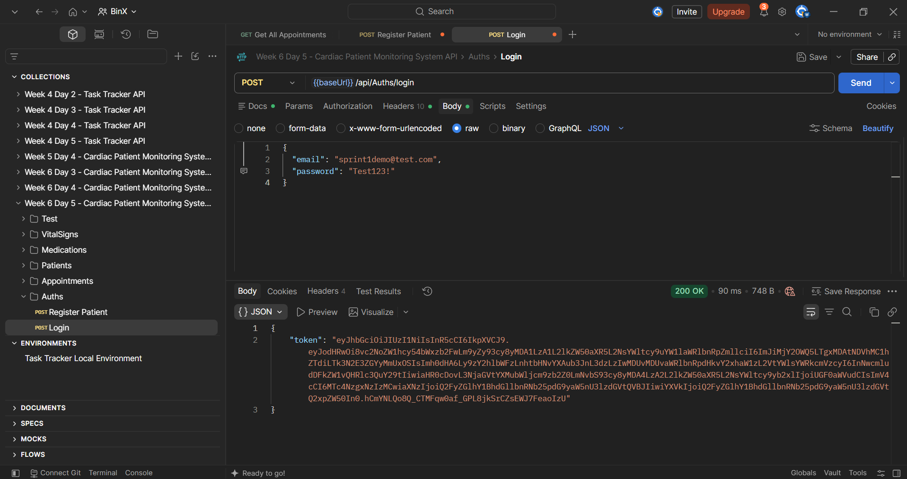
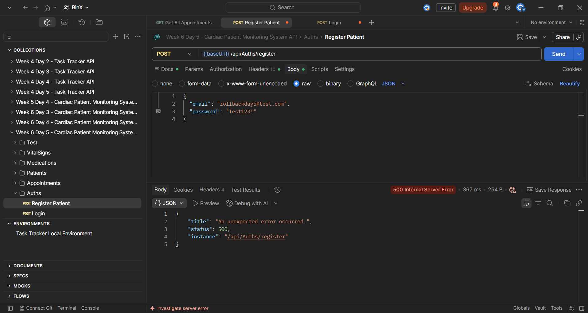
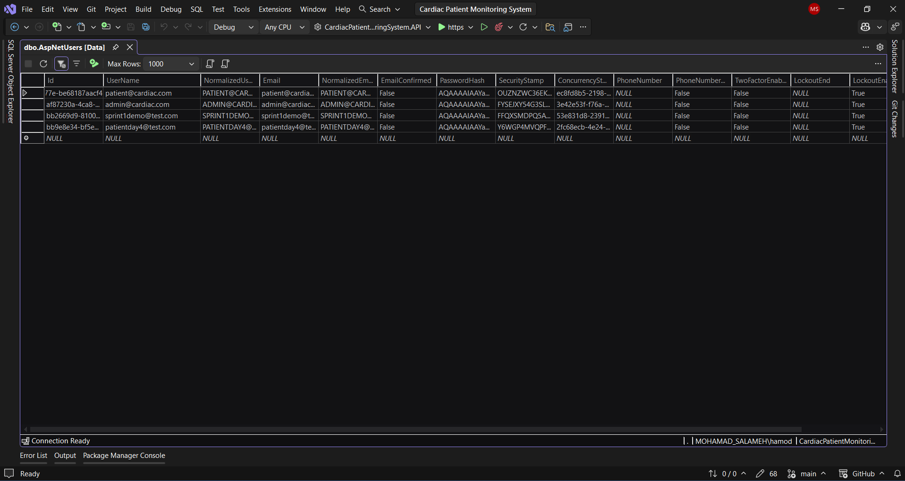

# Day 5 — Sprint Review, Postman Demo & Retrospective

## Overview

Day 5 focused on closing Sprint 1 by demonstrating the completed API features through Postman, reviewing the Sprint 1 backlog, documenting unresolved review items, and writing a retrospective with a concrete improvement action for Sprint 2.

The day also included preparing a Sprint 1 summary covering the main database design work, EF Core migrations, API improvements, transaction handling, Postman demo results, backlog status, and pull request history.

---

## Learning Objectives

- Demonstrate completed Sprint 1 API features clearly using Postman.
- Review Sprint 1 work against the required acceptance criteria.
- Identify any incomplete or unresolved items that should move to Sprint 2.
- Write a short Sprint 1 retrospective.
- Define one concrete improvement action for Sprint 2.
- Prepare a complete Sprint 1 summary for documentation and mentor follow-up.

---

## Sprint 1 API Demo Evidence

### 1) Appointments Read Endpoint Demo

The `Appointments` endpoint was demonstrated using pagination, filtering, and sorting together.

**Request:**
```http
GET /api/Appointments?patientId=1&sort=date_desc&page=1&pageSize=1
```

**Verified behavior:**
- `200 OK`
- Pagination using `page` and `pageSize`
- Filtering by `patientId`
- Sorting by `AppointmentDate` in descending order
- Returning `TotalCount` and paginated `Items`



---

### 2) Successful Patient Registration

A new patient user was registered successfully using:

```http
POST /api/Auths/register
```

The request returned:

```text
201 Created
```



---

### 3) Successful Login After Registration

The newly registered user was then tested using:

```http
POST /api/Auths/login
```

The request returned:

```text
200 OK
```

with a JWT token, confirming that the registration transaction was committed successfully.



---

### 4) Rollback Failure Scenario

To verify rollback behavior, the role assignment step was intentionally forced to fail.

The registration request returned:

```text
500 Internal Server Error
```

This triggered the rollback path.



---

### 5) Database Verification After Rollback

After the failed registration attempt, the `AspNetUsers` table was checked.

The rollback test user was **not persisted** in the database, confirming that the transaction rollback worked correctly.



---

## Postman Collection

The Postman collection used for the Sprint 1 API demo is included with the Day 5 files:

`Week 6 Day 5 - Cardiac Patient Monitoring System API.postman_collection.json`

---

## Sprint 1 Backlog Review

The Sprint 1 backlog was reviewed during the close-out process.

| Backlog Item | Status |
|---|---|
| Finalize complete database schema and relationships | Done |
| Finalize ERD | Done |
| Review existing EF Core entity configurations | Done |
| Verify existing migrations and database schema | Done |
| Review core API routes | Done |
| Confirm Sprint 1 baseline is working | Done |

All current Sprint 1 backlog items were confirmed as completed.

No backlog item required moving to Sprint 2 during this review.

---

## Sprint 1 Retrospective

### What Went Well

- The Sprint 1 database design and ERD were reviewed and finalized successfully.
- The EF Core model, migrations, and SQL Server schema were verified and found to be aligned.
- Pagination, filtering, sorting, and DTO projection were implemented successfully for the Appointments endpoint.
- The patient registration flow was improved using an EF Core transaction.
- Transaction commit and rollback behavior were verified successfully.
- The main Sprint 1 API features were demonstrated using Postman.

### What Could Be Improved

- The mentor code review was not completed before merging the Day 4 pull request.
- Review and validation activities should be completed earlier before the sprint close-out.

### Concrete Action for Sprint 2

Complete the pull request review before merging any Sprint 2 feature into `main`.

---

## Sprint 1 Summary

Sprint 1 focused on reviewing and strengthening the existing Cardiac Patient Monitoring System API baseline rather than rebuilding previously completed functionality.

### Database Design and ERD

- Reviewed the main domain entities: `Patient`, `VitalSign`, `Medication`, and `Appointment`.
- Reviewed the relationship between ASP.NET Core Identity and `Patient`.
- Finalized the project ERD.
- Verified that the ERD matches the current EF Core model and SQL Server schema.

### Migration History

The existing EF Core migrations reviewed during Sprint 1 were:

- `InitialCreate`
- `AddIdentity`
- `AddPatientIdentityRelationship`

No new migration was required because the existing model already matched the current database schema.

### API Improvements

- Added pagination to the `Appointments` read endpoint.
- Added filtering using `reason` and `patientId`.
- Added sorting using `date_asc` and `date_desc`.
- Used DTO projection with `Select`.
- Reduced unnecessary over-fetching.

### Write Operation and Transaction Handling

- Updated patient registration as a multi-step write operation.
- Wrapped Identity user creation and Patient role assignment in an EF Core transaction.
- Used `CommitAsync` when all steps succeeded.
- Used `RollbackAsync` when a step failed.
- Verified rollback behavior directly against the `AspNetUsers` table.

### Sprint 1 Demo

The Sprint 1 API was demonstrated using Postman.

The demo included:

- Appointments pagination, filtering, and sorting
- Successful patient registration
- Successful login and JWT token generation
- Forced transaction failure
- Database verification after rollback

### Sprint 1 Backlog Status

All current Sprint 1 backlog items were reviewed and confirmed as completed.

No review-related backlog items were added to Sprint 2 during the Sprint 1 close-out.

### Pull Request

The Day 4 implementation was completed on the following feature branch:

`feature/week6-day4-transactions`

Pull Request #2 was opened and merged into `main`.

Pull Request:

https://github.com/MohammadSalameh10/Mohammad-Salameh-BinX-Backend-Internship/pull/2

The mentor code review was not completed before the merge.

---

## Tools Used

- Postman
- Visual Studio
- ASP.NET Core Web API
- ASP.NET Core Identity
- Entity Framework Core
- SQL Server
- SQL Server Object Explorer
- Git
- GitHub