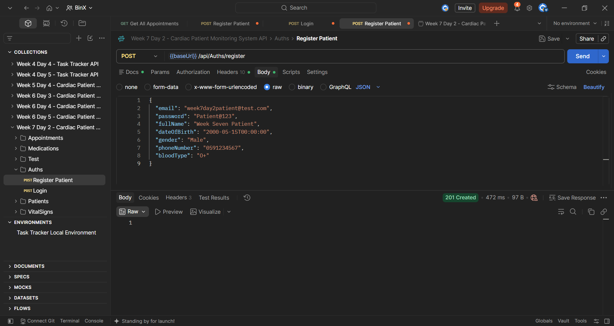
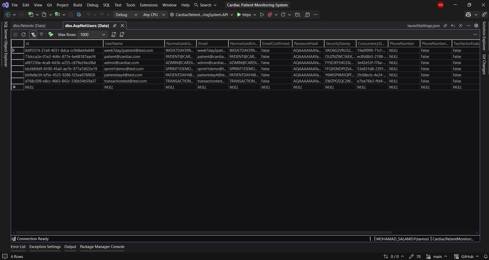
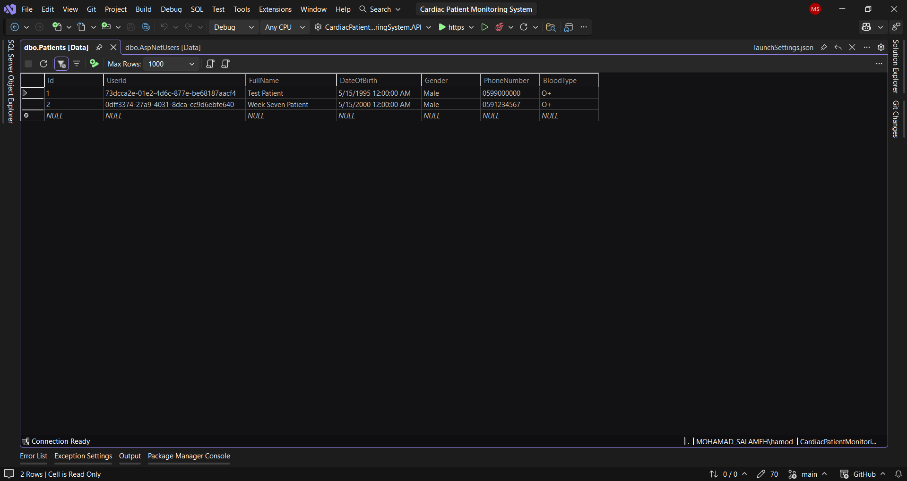
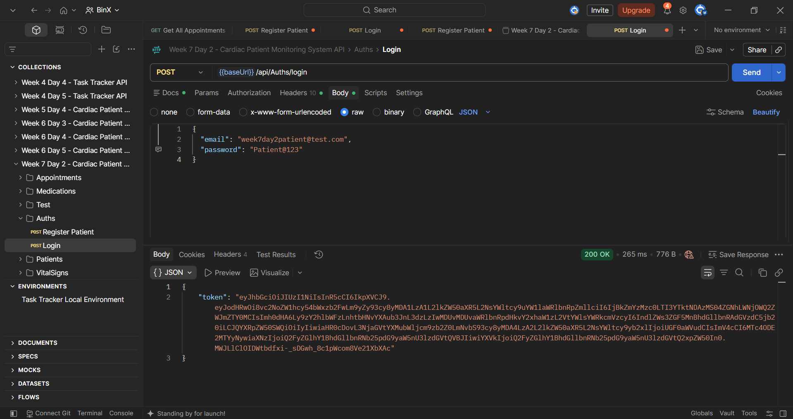
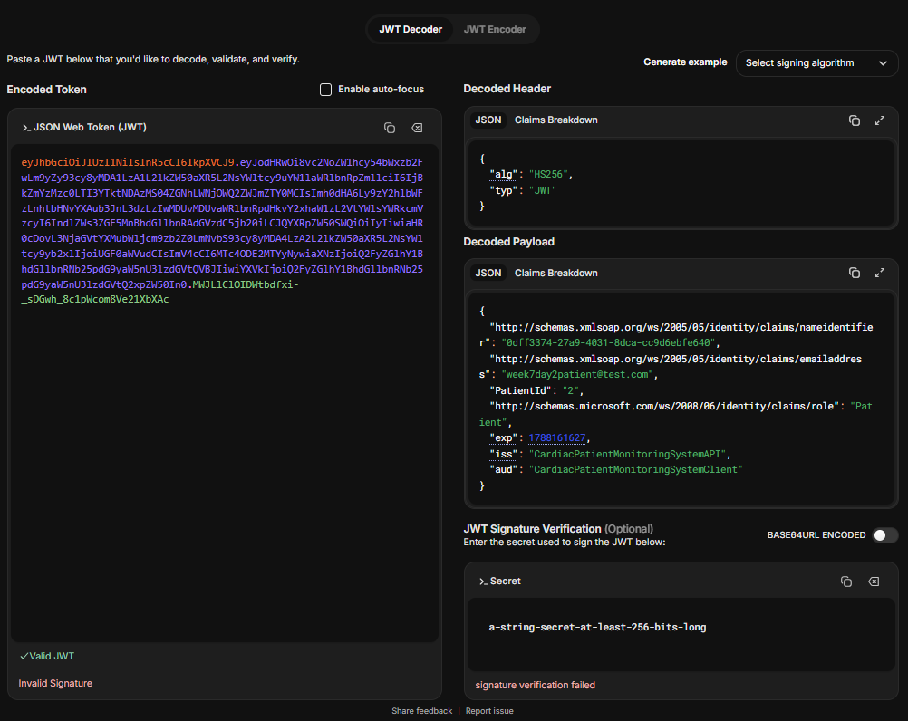

# Week 7 — Day 2: JWT Login & Registration for the Capstone Project

## Overview

Day 2 focused on connecting ASP.NET Core Identity with the project domain during registration and login.

The existing authentication flow was extended so that registering a new patient now creates both the `IdentityUser` account and the corresponding `Patient` record within the same database transaction.

The login flow was also updated to include the linked `PatientId` as a domain-specific claim inside the generated JWT.

The complete registration-to-login flow was then tested using Postman, SQL Server Object Explorer, and JWT decoding to verify that the Identity user, Patient record, relationship, and JWT claims were all created correctly.

## Learning Objectives

The objectives of this exercise were to:

- Link the project domain entity to its corresponding ASP.NET Core Identity user.
- Extend the registration flow to create both the `IdentityUser` and the linked `Patient` record.
- Keep the complete registration process consistent using a database transaction.
- Add a domain-specific `PatientId` claim to the generated JWT.
- Test the complete registration-to-login flow.
- Verify that the Identity user and Patient record are both created successfully.
- Confirm that the generated JWT contains the expected `PatientId` claim.

## Registration Flow Implementation

The existing registration flow was extended so that a new patient registration creates both the ASP.NET Core Identity account and the corresponding `Patient` domain record in the same operation.

The registration request was updated to include the patient information required by the `Patient` entity:

```text
Email
Password
FullName
DateOfBirth
Gender
PhoneNumber
BloodType
```

The registration flow now follows these steps:

```text
Begin Transaction
      ↓
Create IdentityUser
      ↓
Assign Patient Role
      ↓
Create Patient Record
      ↓
Save Changes
      ↓
Commit Transaction
```

The new `Patient` record is linked to the created Identity user using:

```text
Patient.UserId
→ IdentityUser.Id
```

The patient is created using the data received from the registration request:

```csharp
var patient = new Patient
{
    UserId = user.Id,
    FullName = request.FullName,
    DateOfBirth = request.DateOfBirth,
    Gender = request.Gender,
    PhoneNumber = request.PhoneNumber,
    BloodType = request.BloodType
};
```

The record is then saved using Entity Framework Core:

```csharp
await _context.Patients.AddAsync(patient);
await _context.SaveChangesAsync();
```

The complete registration process remains inside the existing EF Core transaction.

If any step fails, the transaction is rolled back:

```csharp
await transaction.RollbackAsync();
```

This prevents an `IdentityUser` account from being created without a corresponding `Patient` record.

## JWT PatientId Claim Implementation

The login flow was extended to include the linked `PatientId` as a domain-specific claim inside the generated JWT.

After validating the user's email and password, the application retrieves the `Patient` record linked to the authenticated Identity user:

```csharp
var patient = await _context.Patients
    .AsNoTracking()
    .FirstOrDefaultAsync(p => p.UserId == user.Id);
```

The existing JWT claims include:

```text
NameIdentifier
Email
Role
```

A new domain-specific claim was added when a linked patient record exists:

```csharp
if (patient != null)
{
    claims.Add(new Claim("PatientId", patient.Id.ToString()));
}
```

The generated JWT can now contain:

```text
Identity User Id
Email
Role
PatientId
```

This allows authenticated requests to identify the related patient directly from the token without performing an additional lookup by email.

The `PatientId` value is retrieved from the `Patients` table using the relationship:

```text
Patient.UserId
→ IdentityUser.Id
```

## Full Registration-to-Login Flow Testing

The complete registration-to-login flow was tested end-to-end using Postman, SQL Server Object Explorer, and JWT decoding.

### 1. Register Patient

A new patient account was registered using:

```http
POST /api/Auths/register
```

The request included both authentication data and patient domain data.

The API returned:

```text
201 Created
```

This confirmed that the registration endpoint completed successfully.



### 2. Verify Identity User

SQL Server Object Explorer was used to verify that the new user was created in the ASP.NET Core Identity table.

The registered email was confirmed in:

```text
AspNetUsers
```



### 3. Verify Patient Record

The linked patient record was also verified in the `Patients` table.

The new patient was created with:

```text
Id = 2
FullName = Week Seven Patient
```

The `UserId` value matched the corresponding Identity user's ID, confirming that the two records were linked correctly.



### 4. Login

The newly registered account was then used to log in through:

```http
POST /api/Auths/login
```

The API returned:

```text
200 OK
```

along with a JWT token.



### 5. Verify JWT Claims

The returned JWT was decoded and its payload was inspected.

The token contained the expected authentication and domain claims, including:

```text
NameIdentifier
Email
Role
PatientId
```

The domain-specific claim was confirmed as:

```text
PatientId = 2
```

This value matched the ID of the newly created patient record in the database.



### Test Result

The complete flow was verified successfully:

```text
Register
   ↓
IdentityUser Created
   ↓
Patient Created
   ↓
IdentityUser and Patient Linked
   ↓
Login Successful
   ↓
JWT Generated
   ↓
PatientId Claim Verified
```

This confirmed that registration, database persistence, domain linking, login, and JWT claim generation work together correctly.

## Hands-On Lab Completed

The Day 2 hands-on work was completed as follows:

1. Reviewed the existing relationship between `Patient` and `IdentityUser`.
2. Confirmed that `Patient.UserId` links the domain entity to the Identity user.
3. Extended `RegisterRequest` to include the patient domain information required during registration.
4. Updated `RegisterAsync` to create the corresponding `Patient` record after creating the Identity user.
5. Kept Identity user creation, role assignment, and Patient creation inside the same database transaction.
6. Saved the new Patient record using Entity Framework Core.
7. Confirmed that transaction rollback protects against incomplete registration if any step fails.
8. Updated `LoginAsync` to retrieve the Patient linked to the authenticated Identity user.
9. Added the domain-specific `PatientId` claim to the generated JWT.
10. Registered a new patient account using Postman.
11. Verified the new Identity user in the `AspNetUsers` table.
12. Verified the linked Patient record in the `Patients` table.
13. Confirmed that the Patient `UserId` matches the Identity user's ID.
14. Logged in using the newly registered account.
15. Confirmed that the login endpoint returned a JWT successfully.
16. Decoded the JWT and verified the `PatientId` claim.
17. Confirmed that the `PatientId` claim matches the linked Patient record in the database.
18. Completed the full registration-to-login flow successfully.

## Tools Used

- C#
- ASP.NET Core Web API
- ASP.NET Core Identity
- Entity Framework Core
- JWT Authentication
- SQL Server
- SQL Server Object Explorer
- Postman
- jwt.io
- Visual Studio
- Git
- GitHub