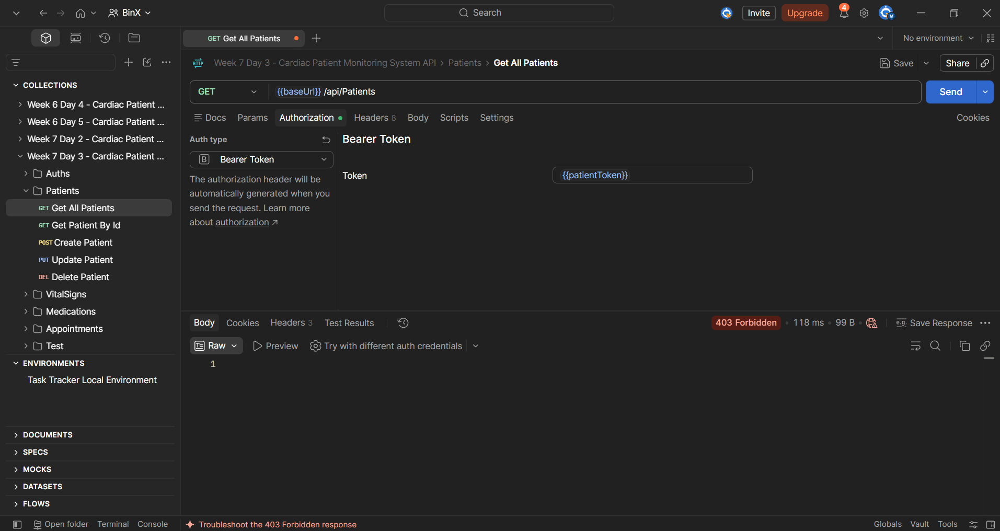
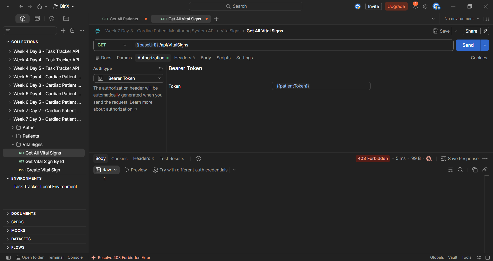
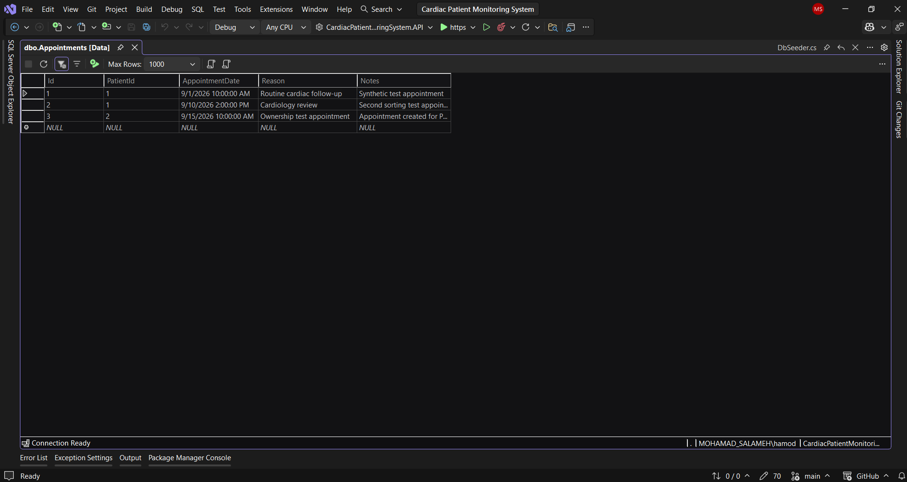
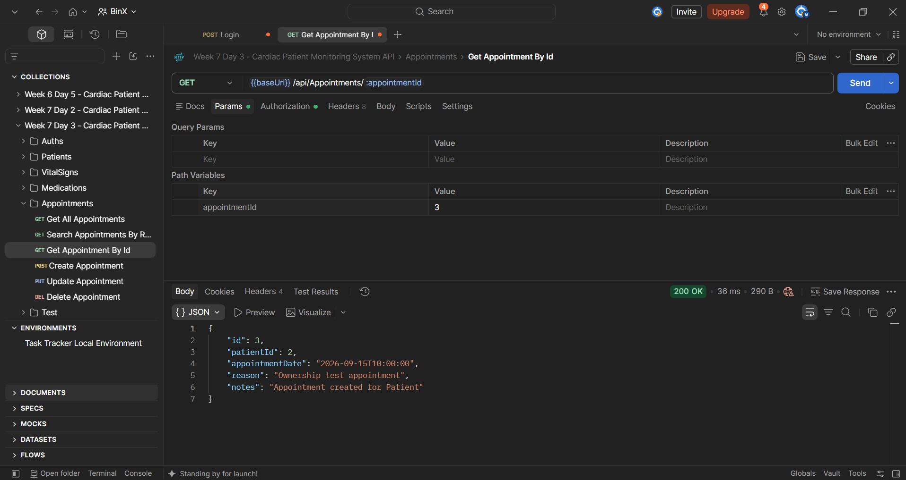
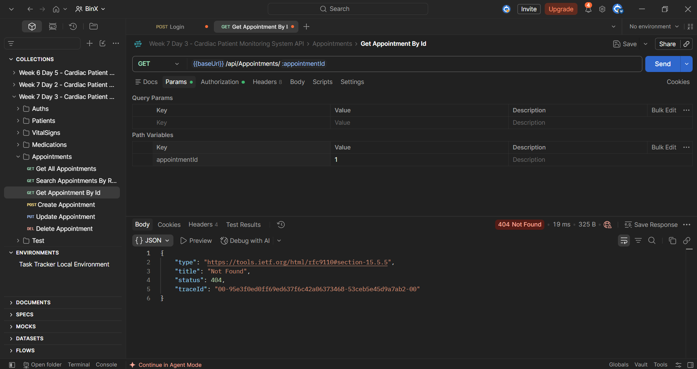

# Week 7 — Day 3: Role-Based Access Control and Ownership Checks

## Overview

Day 3 focused on applying role-based access control and resource ownership checks across the Cardiac Patient Monitoring System API.

The existing `Admin` and `Patient` roles were reviewed across the project endpoints to confirm that each endpoint has the appropriate access requirement.

The `Appointments` resource was then extended with an ownership check so that a Patient can retrieve only an appointment that belongs to their own `PatientId`, while Admin users can continue accessing any appointment.

The authorization behavior was tested using Postman by verifying that Patient users are rejected from Admin-only endpoints and cannot access another Patient's appointment.

## Learning Objectives

The objectives of this exercise were to:

- Review how `Admin` and `Patient` roles are assigned in the project.
- Confirm that public registration assigns the `Patient` role only.
- Verify that the initial `Admin` account is created through secure seeding.
- Review each API endpoint and confirm the correct access requirement.
- Apply role-based authorization using `Admin` and `Patient`.
- Implement an ownership check for patient-specific appointment access.
- Prevent one Patient from accessing another Patient's appointment.
- Test RBAC using negative authorization scenarios.
- Verify that Patient users are rejected from Admin-only endpoints.
- Verify that a Patient can access their own appointment but not another Patient's appointment.

## Role Assignment Review

The existing role assignment strategy was reviewed to confirm that roles are assigned securely.

Public registration assigns the standard project role:

```text
Patient
```

The `Admin` role is not selectable through the public registration endpoint.

Instead, the initial Admin account is created through the existing database seeding process.

This prevents users from assigning themselves administrative privileges during registration.

The reviewed role strategy is:

```text
Public Registration
        ↓
Patient Role

Initial Administrative Account
        ↓
Admin Role through DbSeeder
```

This confirms that the application follows the intended RBAC model and keeps administrative role assignment outside the public registration flow.

## Endpoint Access Review

The existing API endpoints were reviewed to confirm that each endpoint uses the correct access requirement.

### Authentication Endpoints

The authentication endpoints remain public because users need to access them before receiving a JWT.

```text
POST /api/Auths/register
→ Public

POST /api/Auths/login
→ Public
```

### Patients Endpoints

```text
GET /api/Patients
→ Admin

GET /api/Patients/{id}
→ Admin

POST /api/Patients
→ Patient

PUT /api/Patients/{id}
→ Admin

DELETE /api/Patients/{id}
→ Admin
```

### VitalSigns Endpoints

```text
GET /api/VitalSigns
→ Admin

GET /api/VitalSigns/{id}
→ Admin

POST /api/VitalSigns
→ Patient

PUT /api/VitalSigns/{id}
→ Admin

DELETE /api/VitalSigns/{id}
→ Admin
```

### Medications Endpoints

```text
GET /api/Medications
→ Admin

GET /api/Medications/{id}
→ Admin

POST /api/Medications
→ Patient

PUT /api/Medications/{id}
→ Admin

DELETE /api/Medications/{id}
→ Admin
```

### Appointments Endpoints

```text
GET /api/Appointments
→ Admin

GET /api/Appointments/{id}
→ Admin or Patient

POST /api/Appointments
→ Patient

PUT /api/Appointments/{id}
→ Admin

DELETE /api/Appointments/{id}
→ Admin
```

The `GET /api/Appointments/{id}` endpoint was intentionally opened to both `Admin` and `Patient` roles so that ownership-based authorization could be applied.

An Admin can access any appointment, while a Patient can only access an appointment that belongs to their own `PatientId`.

## Ownership Check Implementation

The `GET /api/Appointments/{id}` endpoint was updated so that both `Admin` and `Patient` roles can access it.

The authorization requirement was changed to:

```csharp
[Authorize(Roles = "Admin,Patient")]
```

The endpoint first retrieves the requested appointment.

If the authenticated user has the `Patient` role, the API reads the domain-specific `PatientId` claim from the JWT:

```csharp
var patientIdClaim = User.FindFirstValue("PatientId");
```

The claim is converted to an integer and compared with the `PatientId` of the requested appointment.

```csharp
if (!int.TryParse(patientIdClaim, out var patientId))
    return Forbid();

if (appointment.PatientId != patientId)
    return NotFound();
```

The resulting access behavior is:

```text
Admin
→ Can access any appointment

Patient
→ Can access only appointments where:
   Appointment.PatientId == JWT PatientId
```

If a Patient attempts to access another Patient's appointment, the API returns:

```text
404 Not Found
```

Returning `404 Not Found` avoids revealing whether another Patient's appointment exists.

This ownership check adds resource-level authorization on top of role-based authorization and helps prevent insecure direct object reference access.

## RBAC and Ownership Testing

Role-based access control and ownership behavior were tested using Postman and SQL Server data.

### 1. Patient Rejected from Patients Admin Endpoint

A Patient token was used to call:

```http
GET /api/Patients
```

The endpoint is restricted to the `Admin` role.

The API returned:

```text
403 Forbidden
```

This confirmed that a Patient cannot access an Admin-only endpoint.



### 2. Patient Rejected from VitalSigns Admin Endpoint

The same Patient token was used to call:

```http
GET /api/VitalSigns
```

This endpoint is also restricted to the `Admin` role.

The API returned:

```text
403 Forbidden
```

This confirmed that the role restriction was enforced correctly on a second Admin-only endpoint.



### 3. Verify Appointment Ownership Test Data

The `Appointments` table was reviewed to identify records belonging to different patients.

The test data included appointments associated with:

```text
PatientId = 1
PatientId = 2
```

This provided the data required to test ownership authorization between different patients.



### 4. Patient Accesses Own Appointment

A Patient token containing:

```text
PatientId = 2
```

was used to request an appointment belonging to the same patient:

```http
GET /api/Appointments/3
```

The appointment also had:

```text
PatientId = 2
```

The API returned:

```text
200 OK
```

This confirmed that a Patient can successfully access their own appointment.



### 5. Patient Cannot Access Another Patient's Appointment

The same Patient token with:

```text
PatientId = 2
```

was used to request:

```http
GET /api/Appointments/1
```

The requested appointment belonged to:

```text
PatientId = 1
```

The ownership check rejected the request and returned:

```text
404 Not Found
```

This confirmed that one Patient cannot access another Patient's appointment by changing the resource ID.



### Test Result

The RBAC and ownership checks were verified successfully:

```text
Patient → Admin-only Patients endpoint
→ 403 Forbidden ✅

Patient → Admin-only VitalSigns endpoint
→ 403 Forbidden ✅

Patient → Own Appointment
→ 200 OK ✅

Patient → Another Patient's Appointment
→ 404 Not Found ✅
```

This confirmed that both role-based authorization and resource ownership protection are working as intended.

## Hands-On Lab Completed

The Day 3 hands-on work was completed as follows:

1. Reviewed the existing role assignment strategy.
2. Confirmed that public registration assigns the `Patient` role by default.
3. Confirmed that the initial `Admin` account is created through the existing database seeding process.
4. Reviewed the access requirements for all main API endpoints.
5. Confirmed which endpoints are public, Patient-only, Admin-only, or shared between Admin and Patient.
6. Updated `GET /api/Appointments/{id}` to allow both `Admin` and `Patient` roles.
7. Added an ownership check for Patient access to specific appointments.
8. Read the domain-specific `PatientId` claim from the authenticated user's JWT.
9. Compared the JWT `PatientId` with the requested appointment's `PatientId`.
10. Allowed Patients to access their own appointments.
11. Returned `404 Not Found` when a Patient attempted to access another Patient's appointment.
12. Tested a Patient token against `GET /api/Patients` and confirmed `403 Forbidden`.
13. Tested a Patient token against `GET /api/VitalSigns` and confirmed `403 Forbidden`.
14. Verified appointment ownership test data in SQL Server.
15. Tested access to the Patient's own appointment and confirmed `200 OK`.
16. Tested access to another Patient's appointment and confirmed `404 Not Found`.
17. Verified that both role-based authorization and resource ownership protection work correctly.

## Tools Used

- C#
- ASP.NET Core Web API
- ASP.NET Core Identity
- JWT Authentication
- Role-Based Authorization
- Resource Ownership Checks
- Entity Framework Core
- SQL Server
- SQL Server Object Explorer
- Postman
- Visual Studio
- Git
- GitHub