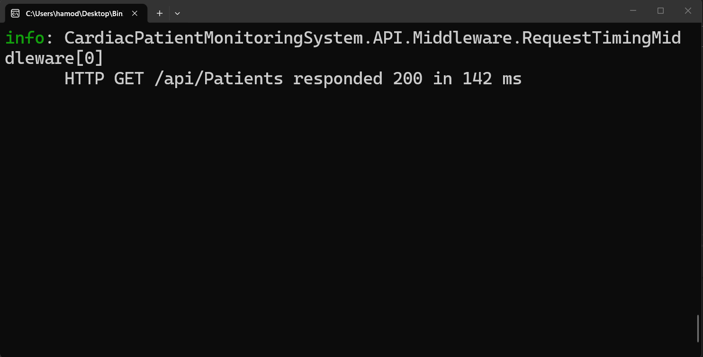
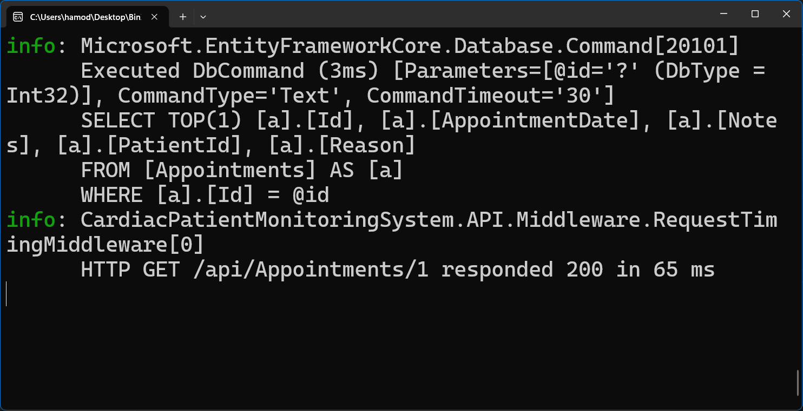

# Week 7 — Day 4: Custom Middleware & Cross-Cutting Concerns

## Overview

Day 4 focused on identifying and implementing a genuine cross-cutting concern in the Cardiac Patient Monitoring System API.

A custom `RequestTimingMiddleware` was added to measure the execution time of HTTP requests across the application without adding repeated timing logic inside individual controllers.

The middleware records the HTTP method, request path, response status code, and elapsed execution time for each request.

It was registered in the ASP.NET Core request pipeline and tested across multiple endpoints to confirm that it applies consistently without requiring per-endpoint changes.

## Learning Objectives

The objectives of this exercise were to:

- Identify a genuine cross-cutting concern in the Cardiac Patient Monitoring System API.
- Implement a custom middleware to handle request timing consistently.
- Avoid duplicating timing logic inside individual controllers.
- Register the custom middleware correctly in the ASP.NET Core request pipeline.
- Measure the HTTP method, request path, response status code, and execution time.
- Verify that the middleware applies across multiple API endpoints.
- Review when middleware is more appropriate than an action filter.

## Cross-Cutting Concern Selection

A genuine cross-cutting concern was identified in the project:

```text
Request Timing
```

The goal was to measure how long HTTP requests take to execute across the API.

This concern applies broadly across multiple endpoints and is not specific to the business logic of any single controller.

Implementing the timing logic separately inside each controller would cause repeated code and make maintenance harder.

For that reason, custom middleware was selected as the appropriate solution.

The middleware approach provides:

```text
One implementation
        ↓
Registered once in the pipeline
        ↓
Applied automatically to multiple endpoints
```

The project already included custom global exception handling, so request timing was selected as a separate concern that was not already handled by the existing middleware.

## RequestTimingMiddleware Implementation

A custom `RequestTimingMiddleware` was added to the project to measure the execution time of HTTP requests.

The middleware uses `Stopwatch` to measure how long each request takes to complete.

```csharp
using System.Diagnostics;

namespace CardiacPatientMonitoringSystem.API.Middleware
{
    public class RequestTimingMiddleware
    {
        private readonly RequestDelegate _next;
        private readonly ILogger<RequestTimingMiddleware> _logger;

        public RequestTimingMiddleware(
            RequestDelegate next,
            ILogger<RequestTimingMiddleware> logger)
        {
            _next = next;
            _logger = logger;
        }

        public async Task InvokeAsync(HttpContext context)
        {
            var stopwatch = Stopwatch.StartNew();

            await _next(context);

            stopwatch.Stop();

            _logger.LogInformation(
                "HTTP {Method} {Path} responded {StatusCode} in {ElapsedMilliseconds} ms",
                context.Request.Method,
                context.Request.Path,
                context.Response.StatusCode,
                stopwatch.ElapsedMilliseconds);
        }
    }
}
```

The middleware records:

```text
HTTP Method
Request Path
Response Status Code
Elapsed Time
```

For example:

```text
HTTP GET /api/Patients responded 200 in 142 ms
```

The call to:

```csharp
await _next(context);
```

passes the request to the next component in the ASP.NET Core request pipeline.

After the request completes and the response returns, the middleware records the total elapsed execution time.

## Middleware Registration

The custom `RequestTimingMiddleware` was registered in the ASP.NET Core request pipeline inside `Program.cs`.

The middleware was added after the existing global exception-handling middleware:

```csharp
app.UseMiddleware<ExceptionHandlingMiddleware>();
app.UseMiddleware<RequestTimingMiddleware>();
```

The relevant request pipeline order is:

```text
ExceptionHandlingMiddleware
        ↓
RequestTimingMiddleware
        ↓
HTTPS Redirection
        ↓
Authentication
        ↓
Authorization
        ↓
Controllers
```

Registering the middleware once in the pipeline allows it to measure request execution time across the API without modifying individual controllers or actions.

The existing `ExceptionHandlingMiddleware` remains responsible for centralized exception handling, while `RequestTimingMiddleware` handles request performance timing as a separate cross-cutting concern.

## Middleware Testing

The custom `RequestTimingMiddleware` was tested across multiple API endpoints to confirm that it applies consistently without requiring any changes inside individual controllers.

### 1. Patients Endpoint

An authenticated request was sent to:

```http
GET /api/Patients
```

The API returned:

```text
200 OK
```

The middleware logged the request execution details:

```text
HTTP GET /api/Patients responded 200 in 142 ms
```

This confirmed that the middleware captured:

```text
HTTP Method
Request Path
Response Status Code
Elapsed Time
```



### 2. Appointments Endpoint

A second authenticated request was sent to:

```http
GET /api/Appointments/1
```

The API returned:

```text
200 OK
```

The middleware also logged:

```text
HTTP GET /api/Appointments/1 responded 200 in 65 ms
```

This confirmed that the same middleware automatically applied to another endpoint without adding timing logic to the `AppointmentsController`.



### Test Result

The middleware was verified successfully across multiple endpoints:

```text
GET /api/Patients
→ 200 OK
→ Request timing logged ✅

GET /api/Appointments/1
→ 200 OK
→ Request timing logged ✅
```

This confirms that request timing is handled centrally as a cross-cutting concern through the ASP.NET Core middleware pipeline.

## Hands-On Lab Completed

The Day 4 hands-on work was completed as follows:

1. Identified request timing as a genuine cross-cutting concern.
2. Confirmed that the concern was not already handled by existing built-in middleware.
3. Implemented a custom `RequestTimingMiddleware`.
4. Used `Stopwatch` to measure request execution time.
5. Logged the HTTP method, request path, response status code, and elapsed time.
6. Registered the middleware in `Program.cs`.
7. Positioned it after the existing `ExceptionHandlingMiddleware`.
8. Verified that the middleware runs without modifying individual controllers.
9. Tested `GET /api/Patients` successfully.
10. Confirmed that request timing was logged for the Patients endpoint.
11. Tested `GET /api/Appointments/1` successfully.
12. Confirmed that request timing was logged for the Appointments endpoint.
13. Verified that the middleware applies consistently across multiple endpoints.

## Tools Used

- C#
- ASP.NET Core Web API
- Custom Middleware
- `RequestDelegate`
- `HttpContext`
- `ILogger`
- `Stopwatch`
- Visual Studio
- Postman
- Git
- GitHub