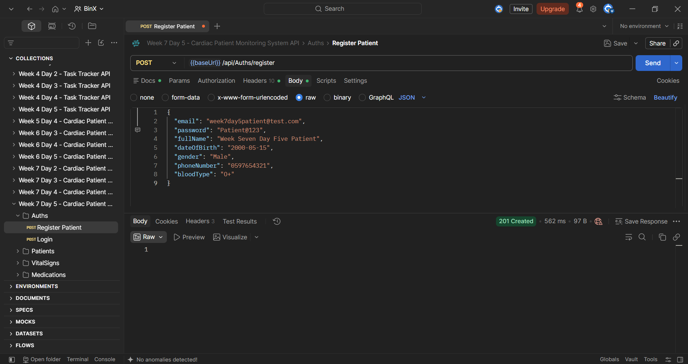
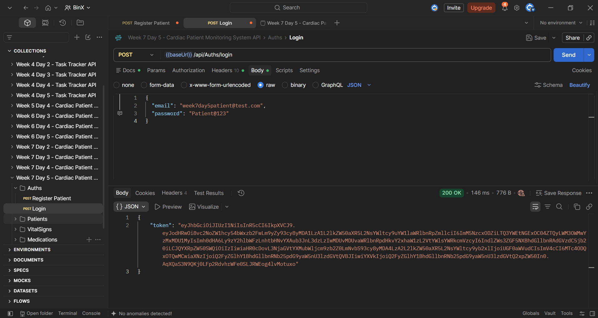
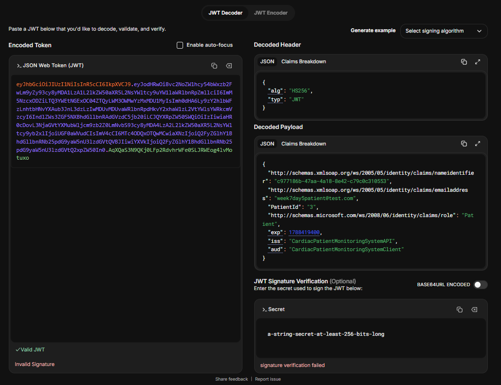
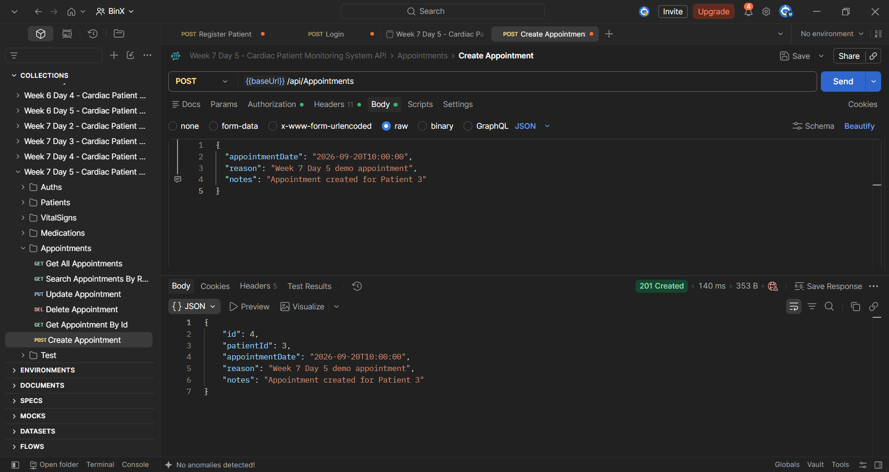
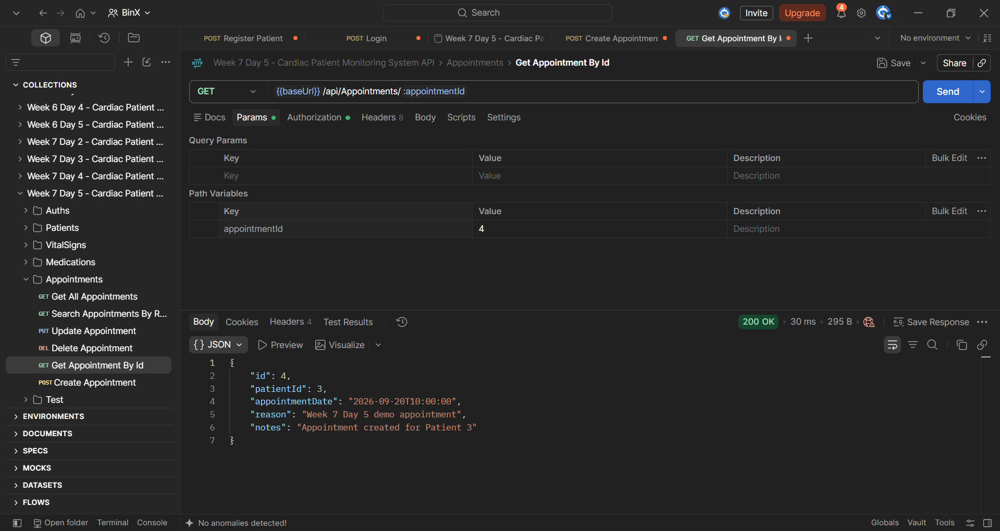
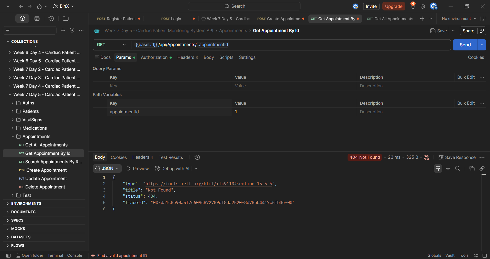
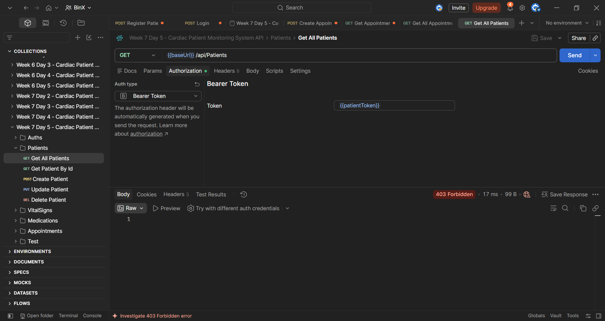

# Week 7 — Day 5: Sprint Review, Postman Demo & Retrospective

## Overview

Day 5 focused on closing Sprint 2 by demonstrating the complete authentication and authorization flow, reviewing the Sprint 2 backlog, documenting unresolved authorization items, and writing a Sprint Retrospective.

The Cardiac Patient Monitoring System API was demonstrated using Postman with both successful and rejected requests to verify that authentication, role-based authorization, and appointment ownership protection work correctly.

The Sprint 2 backlog was reviewed against the completed implementation, and a concrete improvement action was defined for Sprint 3.

## Learning Objectives

The objectives of Day 5 were to:

- Demonstrate the complete authentication and authorization flow using Postman.
- Verify successful Patient registration and login.
- Verify that the generated JWT contains the expected domain-specific claims.
- Demonstrate successful access to a Patient-owned resource.
- Demonstrate deliberate rejection of cross-patient resource access.
- Demonstrate deliberate rejection of a Patient token on an Admin-only endpoint.
- Review Sprint 2 backlog tasks against the completed implementation.
- Document unresolved authorization items for Sprint 3 when necessary.
- Write a Sprint 2 Retrospective.
- Define one concrete improvement action for Sprint 3.

## Authentication and RBAC Postman Demo

The complete Sprint 2 authentication and authorization flow was demonstrated using Postman.

The demo included successful authentication scenarios and deliberate rejection cases to verify that both role-based access control and ownership protection work correctly.

### 1. Patient Registration

A new Patient account was registered using:

```http
POST /api/Auths/register
```

The API returned:

```text
201 Created
```

This confirmed that the registration flow completed successfully.



### 2. Patient Login

The newly registered Patient logged in using:

```http
POST /api/Auths/login
```

The API returned:

```text
200 OK
```

along with a valid JWT.



### 3. JWT Domain Claim Verification

The generated JWT was decoded to verify the domain-specific claims.

The token contained:

```text
Role = Patient
PatientId = 3
```

This confirmed that the authenticated Identity user was correctly linked to the Patient domain record.



### 4. Create Appointment

The authenticated Patient created a new appointment using:

```http
POST /api/Appointments
```

The API returned:

```text
201 Created
```

The created appointment contained:

```text
AppointmentId = 4
PatientId = 3
```



### 5. Own Resource Access

The same Patient requested their own appointment:

```http
GET /api/Appointments/4
```

The API returned:

```text
200 OK
```

This confirmed that a Patient can access a resource that belongs to them.



### 6. Cross-Patient Access Rejection

The Patient attempted to access an appointment belonging to another Patient:

```http
GET /api/Appointments/1
```

The API returned:

```text
404 Not Found
```

This confirmed that the ownership check prevents a Patient from accessing another Patient's appointment.



### 7. Admin-Only Endpoint Rejection

The Patient token was used to access:

```http
GET /api/Patients
```

The API returned:

```text
403 Forbidden
```

This confirmed that the Patient role cannot access an Admin-only endpoint.



### Demo Result

The complete Postman demo verified:

```text
Authentication ✅
Role-Based Access Control ✅
Ownership Protection ✅
```

Both required deliberate rejection cases were demonstrated successfully.

## Sprint 2 Backlog Review

The Sprint 2 backlog was reviewed during the close-out process.

| Backlog Item                                                   | Status |
| -------------------------------------------------------------- | ------ |
| Review existing ASP.NET Core Identity integration              | Done   |
| Verify `ApplicationDbContext` Identity configuration           | Done   |
| Review existing Identity migrations                            | Done   |
| Verify Identity tables in SQL Server                           | Done   |
| Verify `Admin` and `Patient` roles                              | Done   |
| Document role permissions for project endpoints                | Done   |
| Review existing authorization attributes                       | Done   |
| Verify authentication and authorization wiring                 | Done   |
| Apply Sprint 1 retrospective action before merging Sprint 2 changes | Done   |

All current Sprint 2 backlog items were confirmed as completed.

No backlog item required moving to Sprint 3 during this review.

No unresolved authorization edge cases were identified during the Sprint 2 close-out.

## Sprint 2 Retrospective

### What Went Well

- ASP.NET Core Identity integration was reviewed and verified successfully.
- Patient registration was extended to create both the `IdentityUser` and the linked `Patient` record.
- Registration remained protected by an EF Core transaction.
- The JWT login flow was extended with the domain-specific `PatientId` claim.
- Role-based access control was verified across the main API endpoints.
- Appointment ownership protection was implemented and tested successfully.
- Patient access to Admin-only endpoints was correctly rejected.
- Cross-patient appointment access was correctly rejected.
- The full authentication and authorization flow was demonstrated successfully using Postman.
- A custom `RequestTimingMiddleware` was implemented and verified across multiple endpoints.

### What Could Be Improved

- Ownership and authorization checks should be covered more systematically with automated tests.
- Future patient-specific endpoints should include explicit ownership tests from the beginning.
- Security-related negative test cases should remain part of the regular testing workflow.

### Sprint 3 Action

The following concrete improvement action will be carried into Sprint 3:

```text
Write an explicit ownership-check test for every new patient-specific resource endpoint.
```

## Sprint 2 Summary

Sprint 2 focused on reviewing and strengthening authentication, authorization, and access control in the Cardiac Patient Monitoring System API.

### Authentication and Identity

- Reviewed the existing ASP.NET Core Identity integration.
- Verified the Identity configuration inside `ApplicationDbContext`.
- Reviewed the existing Identity-related migrations.
- Verified the Identity tables in SQL Server.
- Confirmed the `Admin` and `Patient` roles.
- Reviewed authentication and authorization middleware wiring.

### Registration and JWT

- Extended Patient registration to create both the `IdentityUser` and linked `Patient` record.
- Kept the registration flow inside an EF Core transaction.
- Added the domain-specific `PatientId` claim to the JWT.
- Verified successful Patient registration and login using Postman.
- Confirmed the `PatientId` and `Patient` role inside the generated JWT.

### Role-Based Authorization

- Reviewed endpoint access requirements across the API.
- Verified Admin-only and Patient-accessible endpoints.
- Confirmed that public registration assigns the `Patient` role only.
- Verified that a Patient token is rejected from Admin-only endpoints.

### Ownership Protection

- Added ownership protection to individual appointment access.
- Allowed Patients to access their own appointments.
- Prevented Patients from accessing appointments owned by another Patient.
- Returned `404 Not Found` for cross-patient appointment access.

### Cross-Cutting Concern

- Identified request timing as a genuine cross-cutting concern.
- Implemented a custom `RequestTimingMiddleware`.
- Used `Stopwatch` to measure request execution time.
- Logged the HTTP method, request path, response status code, and elapsed time.
- Verified the middleware across multiple API endpoints.

### Sprint 2 Demo

The complete authentication and authorization flow was demonstrated using Postman:

```text
Register Patient
→ 201 Created

Login
→ 200 OK + JWT

Create Own Appointment
→ 201 Created

Access Own Appointment
→ 200 OK

Access Another Patient's Appointment
→ 404 Not Found

Access Admin-only Endpoint as Patient
→ 403 Forbidden
```

The demo confirmed that authentication, role-based authorization, and resource ownership protection were working as expected.

### Sprint 3 Improvement Action

The following improvement action was defined for Sprint 3:

```text
Write an explicit ownership-check test for every new patient-specific resource endpoint.
```

## Tools Used

- Postman
- ASP.NET Core Web API
- ASP.NET Core Identity
- JWT Authentication
- Role-Based Authorization
- Resource Ownership Checks
- Entity Framework Core
- SQL Server
- Visual Studio
- jwt.io
- Git
- GitHub