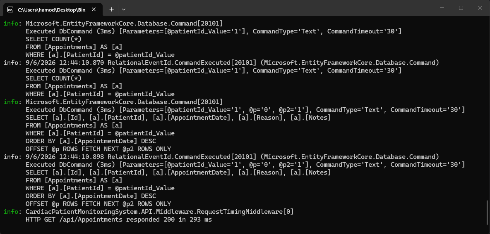
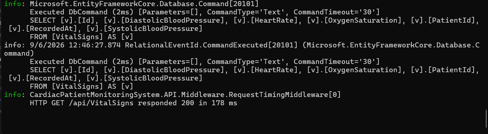
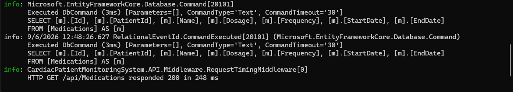
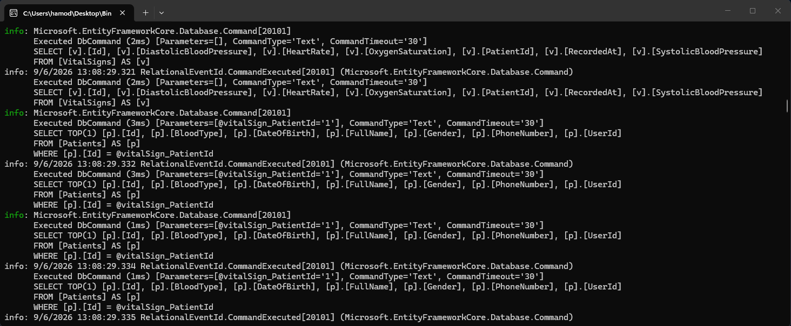

# Week 8 - Day 1

## Sprint 3 Planning & Diagnosing the N+1 Problem

### Overview

Day 1 focused on planning Sprint 3 and diagnosing database query performance issues using Entity Framework Core query logging.

The main goal was to understand how many SQL queries are actually generated by important list endpoints and identify a real N+1 query pattern using realistic test data.

---

## Learning Objectives

- Define the Sprint 3 performance goal.
- Carry forward the Sprint 2 retrospective improvement action.
- Understand the N+1 query problem.
- Enable EF Core query logging.
- Seed realistic test data.
- Measure SQL query counts for important list endpoints.
- Identify and document an N+1 query problem.

---

## Sprint 3 Planning

Sprint 3 was planned around measurable database performance improvements.

### Sprint 3 Goal

Improve the performance of the Cardiac Patient Monitoring System API by measuring database query behavior on important list endpoints, identifying and reducing N+1 query problems, and verifying measurable improvements in database query count.

### Sprint 2 Retrospective Action

The following improvement action was carried forward from Sprint 2:

```text
Write an explicit ownership-check test for every new patient-specific resource endpoint.
```

### Performance Targets

The initial Sprint 3 performance targets are:

- Enable EF Core query logging in the development environment.
- Measure the actual number of SQL queries generated by important list endpoints.
- Test endpoints using realistic data volumes of 50+ records.
- Identify at least one N+1 query problem.
- Reduce the query count of the identified N+1 case to a small fixed number.
- Compare query counts before and after optimization.

---

## EF Core Query Logging

EF Core query logging was enabled to display the actual SQL commands generated by the application.

The database configuration was updated to include:

```csharp
builder.Services.AddDbContext<ApplicationDbContext>(options =>
    options
        .UseSqlServer(
            builder.Configuration.GetConnectionString("DefaultConnection"))
        .LogTo(Console.WriteLine, LogLevel.Information)
        .EnableSensitiveDataLogging());
```

This made it possible to inspect the SQL queries directly from the application console.

`EnableSensitiveDataLogging()` is used only during development because log output may contain sensitive values.

---

## Realistic Test Data

The existing `DbSeeder` was extended to provide enough data for performance testing.

The database was seeded with:

```text
50 VitalSigns
50 Medications
50 Appointments
```

The seeding logic checks the current number of records and only inserts the missing amount.

Example:

```csharp
var vitalSignCount = await context.VitalSigns
    .CountAsync(v => v.PatientId == patient.Id);

if (vitalSignCount < 50)
{
    var vitalSigns = new List<VitalSign>();

    for (int i = vitalSignCount; i < 50; i++)
    {
        vitalSigns.Add(new VitalSign
        {
            PatientId = patient.Id,
            HeartRate = 65 + (i % 35),
            SystolicBloodPressure = 110 + (i % 20),
            DiastolicBloodPressure = 70 + (i % 15),
            OxygenSaturation = 95 + (i % 5),
            RecordedAt = new DateTime(2026, 8, 1)
                .AddHours(i * 6)
        });
    }

    context.VitalSigns.AddRange(vitalSigns);
}
```

The same approach was applied to medications and appointments.

---

## Query Count Measurements

Three important list endpoints were tested while monitoring the SQL output.

### GET /api/Appointments

The endpoint generated two SQL queries:

```text
1 query → Count total appointments
1 query → Fetch the requested page
```

Result:

```text
Actual SQL Queries: 2
N+1 Detected: No
```



The two-query pattern is expected because pagination requires both the total count and the requested page data.

---

### GET /api/VitalSigns

The endpoint generated one SQL query.

Result:

```text
Actual SQL Queries: 1
N+1 Detected: No
```



The repository retrieves the full list using one query:

```csharp
return await _context.VitalSigns
    .ToListAsync();
```

The response mapping happens in memory and does not generate additional database queries.

---

### GET /api/Medications

The endpoint generated one SQL query.

Result:

```text
Actual SQL Queries: 1
N+1 Detected: No
```



The service uses projection directly inside the EF Core query:

```csharp
return await query
    .Select(m => new MedicationResponse
    {
        Id = m.Id,
        PatientId = m.PatientId,
        Name = m.Name,
        Dosage = m.Dosage,
        Frequency = m.Frequency,
        StartDate = m.StartDate,
        EndDate = m.EndDate
    })
    .ToListAsync();
```

---

## Existing Endpoint Review

The existing list endpoints were reviewed for possible N+1 patterns.

The following services were checked:

- `PatientService`
- `AppointmentService`
- `VitalSignService`
- `VitalSignRepository`
- `MedicationService`

No existing list endpoint was found to generate an N+1 query pattern.

The project also does not use EF Core lazy-loading proxies.

This means navigation properties do not automatically generate additional queries when they are accessed.

---

## N+1 Diagnostic Case

Because the existing list endpoints were already avoiding N+1 queries, a diagnostic endpoint was added specifically for training and measurement purposes.

Endpoint:

```http
GET /api/VitalSigns/diagnostic-n-plus-one
```

The endpoint first loads all vital signs:

```csharp
var vitalSigns = await _context.VitalSigns
    .AsNoTracking()
    .ToListAsync();
```

Then it performs a separate patient query inside a loop:

```csharp
foreach (var vitalSign in vitalSigns)
{
    var patient = await _context.Patients
        .AsNoTracking()
        .FirstOrDefaultAsync(p => p.Id == vitalSign.PatientId);

    result.Add(new
    {
        vitalSign.Id,
        vitalSign.PatientId,
        vitalSign.HeartRate,
        vitalSign.RecordedAt,
        PatientName = patient?.FullName
    });
}
```

This intentionally creates the N+1 pattern.

With 50 vital sign records:

```text
1 query  → Load VitalSigns
50 queries → Load Patient once for each VitalSign
```

Result:

```text
Actual SQL Queries: 51
N+1 Detected: Yes
Response Time: 234 ms
```



The repeated SQL pattern was visible in the EF Core console logs.

---

## N+1 Baseline

The confirmed diagnostic baseline is:

```text
Endpoint:
GET /api/VitalSigns/diagnostic-n-plus-one

Records:
50 VitalSigns

Actual SQL Queries:
51

N+1:
Confirmed

Response Time:
234 ms
```

This diagnostic endpoint was introduced specifically for the performance lab and does not represent a pre-existing issue in the original production endpoints.

---

## Sprint Backlog Update

The following Sprint 3 backlog items were completed during Day 1:

```text
Enable EF Core query logging in the development environment → Done

Seed the database with 50+ realistic test records → Done

Measure query counts for 2-3 important list endpoints → Done

Identify at least one genuine N+1 problem → Done

Document the confirmed N+1 issue as a backlog task → Done
```

The confirmed optimization task was added to the backlog:

```text
Optimize VitalSigns diagnostic N+1 query from 51 queries to a small fixed number
```

Status:

```text
To Do
```

The optimization and before/after comparison remain for the next performance work.

---

## Tools Used

- ASP.NET Core Web API
- Entity Framework Core
- SQL Server
- Visual Studio
- Swagger
- EF Core Logging
- Notion
