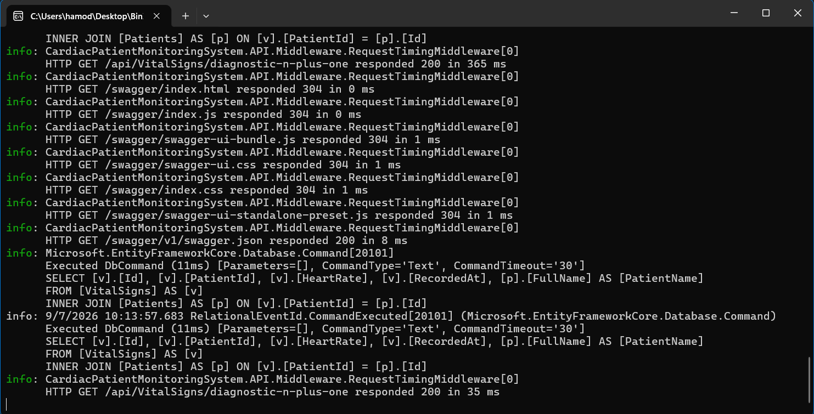

# Week 8 - Day 2

## Query Optimization with Eager & Explicit Loading

### Overview

Day 2 focused on optimizing Entity Framework Core queries after diagnosing the N+1 problem during Day 1.

The main goal was to reduce repeated database queries using eager loading with `Include`, compare that approach with projection using `Select`, and verify the actual improvement using EF Core query logging.

---

## Learning Objectives

- Fix N+1 query problems using eager loading with `Include`.
- Understand how `ThenInclude` extends eager loading to deeper relationships.
- Use projection as a leaner alternative to eager loading.
- Understand when `AsSplitQuery` is appropriate.
- Measure query-count improvements instead of assuming an optimization worked.

---

## Eager Loading with Include

The Day 1 diagnostic endpoint intentionally reproduced an N+1 query pattern.

The original implementation loaded all VitalSign records first, then queried the related Patient once for every VitalSign inside a loop.

This produced:

```text
1 query  → Load VitalSigns
50 queries → Load Patient data
```

Total:

```text
51 SQL Queries
```

The issue was fixed using eager loading:

```csharp
var vitalSigns = await _context.VitalSigns
    .AsNoTracking()
    .Include(v => v.Patient)
    .ToListAsync();
```

Using `Include` tells EF Core to load the related Patient data together with the VitalSigns instead of executing an additional query for every record.

The generated SQL used a JOIN between:

```text
VitalSigns
Patients
```

---

## ThenInclude

`ThenInclude` is used when a related entity contains another relationship that also needs to be loaded.

Example:

```csharp
var orders = await _context.Orders
    .Include(o => o.Items)
    .ThenInclude(i => i.Product)
    .ToListAsync();
```

This loads:

```text
Order
↓
Items
↓
Product
```

The current Cardiac Patient Monitoring System optimization required only the direct relationship between `VitalSign` and `Patient`, so `ThenInclude` was not required for this specific query.

---

## Before Optimization

The original diagnostic implementation performed a Patient query inside a loop:

```csharp
var vitalSigns = await _context.VitalSigns
    .AsNoTracking()
    .ToListAsync();

foreach (var vitalSign in vitalSigns)
{
    var patient = await _context.Patients
        .AsNoTracking()
        .FirstOrDefaultAsync(p => p.Id == vitalSign.PatientId);
}
```

The repeated Patient query created the N+1 problem.

Result:

```text
Records: 50 VitalSigns
SQL Queries: 51
N+1 Detected: Yes
Response Time: 273 ms
```


---

## After Optimization with Include

The diagnostic endpoint was updated to use eager loading:

```csharp
var vitalSigns = await _context.VitalSigns
    .AsNoTracking()
    .Include(v => v.Patient)
    .ToListAsync();
```

The SQL log showed one database query using an `INNER JOIN`:

```sql
SELECT ...
FROM [VitalSigns] AS [v]
INNER JOIN [Patients] AS [p]
    ON [v].[PatientId] = [p].[Id]
```

Result:

```text
Records: 50 VitalSigns
SQL Queries: 1
N+1 Detected: No
Response Time: 228 ms
```


The query count dropped from:

```text
51 → 1
```

This confirmed that the N+1 problem was removed.

---

## Projection as an Alternative to Include

Although `Include` removed the N+1 problem, it loaded the complete VitalSign and Patient entities.

For a list-style endpoint, only a small set of fields was actually required.

The endpoint was therefore changed to use projection:

```csharp
var result = await _context.VitalSigns
    .AsNoTracking()
    .Select(v => new
    {
        v.Id,
        v.PatientId,
        v.HeartRate,
        v.RecordedAt,
        PatientName = v.Patient.FullName
    })
    .ToListAsync();
```

The generated SQL selected only the required columns:

```sql
SELECT [v].[Id],
       [v].[PatientId],
       [v].[HeartRate],
       [v].[RecordedAt],
       [p].[FullName] AS [PatientName]
FROM [VitalSigns] AS [v]
INNER JOIN [Patients] AS [p]
    ON [v].[PatientId] = [p].[Id]
```

Result:

```text
Records: 50 VitalSigns
SQL Queries: 1
N+1 Detected: No
Response Time: 35 ms
```



---

## Include vs Projection

Both approaches removed the N+1 problem and produced one SQL query.

| Approach | SQL Queries | Data Retrieved |
| -------- | ----------: | -------------- |
| Original N+1 implementation | 51 | VitalSigns + repeated Patient queries |
| `Include` | 1 | Full VitalSign and Patient entity data |
| Projection with `Select` | 1 | Only the required response fields |

The main difference is that projection retrieves only the required columns.

For this list-style endpoint, projection is the leaner approach.

`Include` is more suitable when the endpoint genuinely needs the complete related entity data.

---

## Split Queries

`AsSplitQuery` can be useful when a query includes two or more collection navigation properties.

Example:

```csharp
var orders = await _context.Orders
    .Include(o => o.Items)
    .Include(o => o.StatusHistory)
    .AsSplitQuery()
    .ToListAsync();
```

This avoids a large JOIN that can produce a cartesian-product explosion.

`AsSplitQuery` was not applied in the current project because there is no endpoint that includes two or more collection navigation properties in the same query.

---

## Measuring the Improvement

The optimization was verified using the actual SQL generated by Entity Framework Core.

### Before and After Results

| Version | Records | SQL Queries | N+1 | Observed Response Time |
| ------- | ------: | ----------: | --- | ---------------------: |
| Before Optimization | 50 | 51 | Yes | 273 ms |
| After `Include` | 50 | 1 | No | 228 ms |
| After Projection | 50 | 1 | No | 35 ms |

The primary performance metric was the SQL query count.

The response time was recorded as an observed value only because execution time can vary between runs.

The confirmed query-count improvement was:

```text
Before: 51 SQL Queries
After Include: 1 SQL Query
After Projection: 1 SQL Query
```

---

## Technical Decision

For the current list-style diagnostic endpoint, projection was kept as the preferred implementation because:

- It removes the N+1 problem.
- It keeps the query count at one.
- It retrieves only the fields required by the response.
- It avoids loading unnecessary entity columns.

---

## Tools Used

- C#
- ASP.NET Core Web API
- Entity Framework Core
- SQL Server
- `Include`
- `ThenInclude`
- `Select`
- `AsNoTracking`
- `AsSplitQuery`
- EF Core Query Logging
- Visual Studio
- Swagger