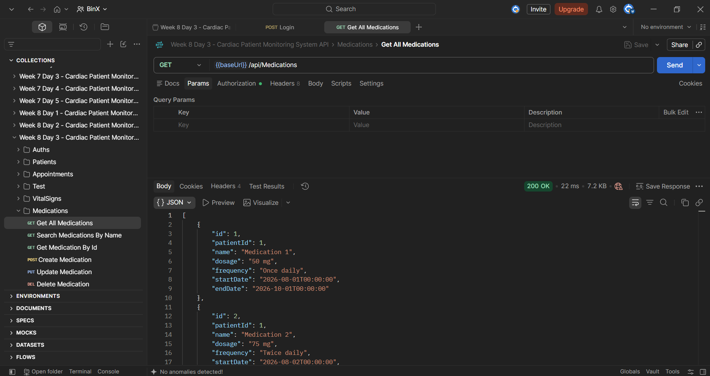
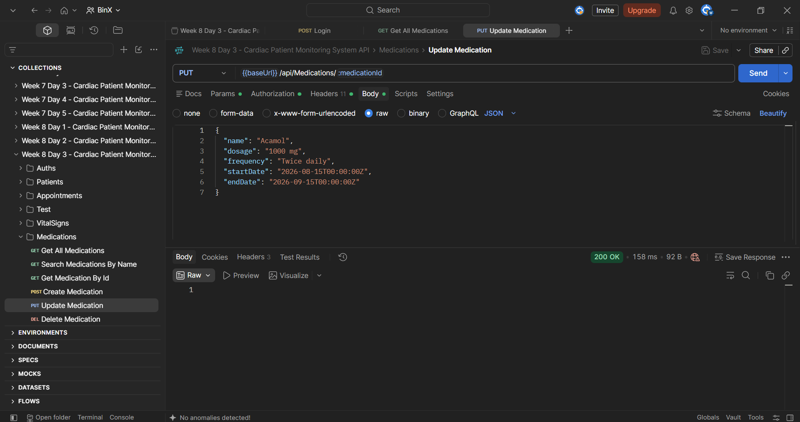
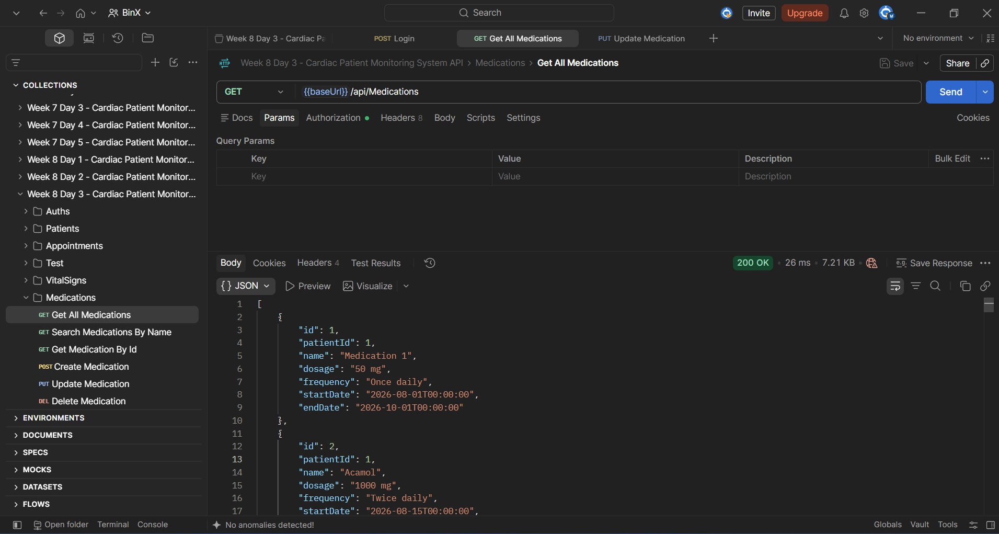

# Week 8 - Day 3

## Introducing Redis Caching

### Overview

Day 3 focused on introducing Redis caching into the Cardiac Patient Monitoring System API using ASP.NET Core's `IDistributedCache` abstraction.

The main goal was to understand which data is appropriate for caching, implement the cache-aside pattern, invalidate cached data after write operations, and measure the response-time difference between a cache miss and a cache hit.

Because the project is a healthcare-related training project, caching was applied to the Medications list endpoint for learning purposes. In a real healthcare system, sensitive patient-related data should be cached only when there is a clear need and appropriate security, privacy, expiration, and access-control measures are in place.

---

## Learning Objectives

- Identify data that is suitable for caching.
- Set up Redis locally using Docker.
- Register Redis using `IDistributedCache`.
- Implement the cache-aside pattern.
- Configure cache expiration.
- Invalidate cached data after create, update, and delete operations.
- Verify that updated data is returned immediately after invalidation.
- Measure cache miss and cache hit response times.

---

## Redis Setup

Redis was run locally using Docker.

The Redis container was created using:

```bash
docker run --name cardiac-redis -p 6379:6379 -d redis
```

The running container was verified using:

```bash
docker ps
```

Redis was available locally at:

```text
localhost:6379
```

---

## Redis Package

The following NuGet package was added to the API project:

```text
Microsoft.Extensions.Caching.StackExchangeRedis
```

This package provides the StackExchange.Redis-backed implementation of ASP.NET Core's `IDistributedCache`.

---

## Redis Connection String

The Redis connection string was added to `appsettings.json`:

```json
"ConnectionStrings": {
  "DefaultConnection": "Server=.;Database=CardiacPatientMonitoringSystemDb;Trusted_Connection=True;TrustServerCertificate=True;",
  "Redis": "localhost:6379"
}
```

---

## Registering IDistributedCache

Redis was registered in `Program.cs` using:

```csharp
builder.Services.AddStackExchangeRedisCache(options =>
{
    options.Configuration =
        builder.Configuration.GetConnectionString("Redis");
});
```

This allows application services to use the framework-provided:

```csharp
IDistributedCache
```

instead of interacting directly with the Redis client throughout the application.

---

## Selecting the Cached Endpoint

Caching was applied to:

```http
GET /api/Medications
```

The Medications endpoint was selected for the training exercise because it provides a clear list endpoint with corresponding create, update, and delete operations.

The cache key used was:

```text
medications:all
```

Filtered medication searches were not cached to avoid creating unnecessary cache entries for different search values.

---

## Cache-Aside Pattern

`IDistributedCache` was injected into `MedicationService`:

```csharp
private readonly IDistributedCache _cache;

public MedicationService(
    ApplicationDbContext context,
    IDistributedCache cache)
{
    _context = context;
    _cache = cache;
}
```

The `GetAllAsync` method was updated to follow the cache-aside pattern.

The application checks Redis first:

```csharp
var cachedMedications =
    await _cache.GetStringAsync("medications:all");
```

If cached data exists, it is deserialized and returned directly:

```csharp
if (cachedMedications is not null)
{
    return JsonSerializer.Deserialize<List<MedicationResponse>>(
        cachedMedications)!;
}
```

If the cache does not contain the data, the application queries SQL Server:

```csharp
var medications = await _context.Medications
    .Select(m => new MedicationResponse
    {
        Id = m.Id,
        PatientId = m.PatientId,
        Name = m.Name,
        Dosage = m.Dosage,
        Frequency = m.Frequency,
        StartDate = m.StartDate,
        EndDate = m.EndDate
    })
    .ToListAsync();
```

The result is then stored in Redis:

```csharp
await _cache.SetStringAsync(
    "medications:all",
    JsonSerializer.Serialize(medications),
    new DistributedCacheEntryOptions
    {
        AbsoluteExpirationRelativeToNow =
            TimeSpan.FromMinutes(10)
    });
```

The cache entry expires automatically after:

```text
10 minutes
```

---

## Cache Miss Test

The first request to:

```http
GET /api/Medications
```

did not find the list in Redis.

The application therefore queried SQL Server and stored the result in the cache.

The EF Core log showed:

```sql
SELECT [m].[Id],
       [m].[PatientId],
       [m].[Name],
       [m].[Dosage],
       [m].[Frequency],
       [m].[StartDate],
       [m].[EndDate]
FROM [Medications] AS [m]
```

Observed result:

```text
Cache Status: Miss
Database Query: Yes
Response Time: 316 ms
Status Code: 200 OK
```


---

## Cache Hit Test

The same request was immediately executed again:

```http
GET /api/Medications
```

This time, the data was already stored in Redis.

No new SQL query against the `Medications` table appeared in the application console.

Observed result:

```text
Cache Status: Hit
Database Query: No
Response Time: 13 ms
Status Code: 200 OK
```

The Postman client displayed an observed response time of approximately:

```text
22 ms
```




---

## Cache Miss vs Cache Hit

The measured results were:

| Request | Cache Status | SQL Query | Observed API Time |
| --- | --- | --- | ---: |
| First GET | Miss | Yes | 316 ms |
| Second GET | Hit | No | 13 ms |

The cache hit avoided the SQL Server query entirely.

The response time was also significantly lower during this test run.

Response time is an observed measurement and may vary between executions.

---

## Cache Invalidation

Caching the list creates a risk of returning stale data when a Medication is created, updated, or deleted.

To prevent this, the `medications:all` cache entry is removed after every successful write operation.

### Create

After saving a new Medication:

```csharp
await _context.SaveChangesAsync();

await _cache.RemoveAsync("medications:all");
```

### Update

After updating an existing Medication:

```csharp
await _context.SaveChangesAsync();

await _cache.RemoveAsync("medications:all");
```

### Delete

After deleting a Medication:

```csharp
await _context.SaveChangesAsync();

await _cache.RemoveAsync("medications:all");
```

This ensures that the next list request becomes a cache miss and retrieves fresh data from SQL Server.

---

## Cache Invalidation Test

Medication ID `2` was updated through:

```http
PUT /api/Medications/2
```

The updated values included:

```text
Name: Acamol
Dosage: 1000 mg
```

The update returned:

```text
200 OK
```



The console confirmed that SQL Server executed the Medication update.


Immediately after the update, the following endpoint was executed:

```http
GET /api/Medications
```

Because the cached list had been invalidated, the application queried SQL Server again.

The console showed:

```sql
SELECT [m].[Id],
       [m].[PatientId],
       [m].[Name],
       [m].[Dosage],
       [m].[Frequency],
       [m].[StartDate],
       [m].[EndDate]
FROM [Medications] AS [m]
```


The GET response immediately returned the updated data:

```text
Name: Acamol
Dosage: 1000 mg
```



This confirmed that stale cached data was not returned after the update.

---

## Cache Invalidation Flow

The tested flow was:

```text
GET /api/Medications
        ↓
Cache Miss
        ↓
SQL Server
        ↓
Store medications:all in Redis
        ↓
Second GET
        ↓
Cache Hit
        ↓
Return data from Redis
        ↓
PUT /api/Medications/2
        ↓
Update SQL Server
        ↓
Remove medications:all
        ↓
Next GET
        ↓
Cache Miss
        ↓
Load fresh data from SQL Server
        ↓
Store fresh list in Redis
```

---

## Caching Considerations

Caching is most useful for data that:

- Is read frequently.
- Changes relatively infrequently.
- Can tolerate a short cache lifetime.
- Benefits from avoiding repeated database queries.

Data that changes frequently or must always be current may not be a good caching candidate.

In a real healthcare system, additional care is required before caching sensitive or patient-related information. Security, privacy, authorization, expiration, encryption, and regulatory requirements should all be considered.

---

## Tools Used

- C#
- ASP.NET Core Web API
- Entity Framework Core
- Redis
- Docker
- StackExchange.Redis
- `IDistributedCache`
- `DistributedCacheEntryOptions`
- `GetStringAsync`
- `SetStringAsync`
- `RemoveAsync`
- `System.Text.Json`
- SQL Server
- Visual Studio
- Postman