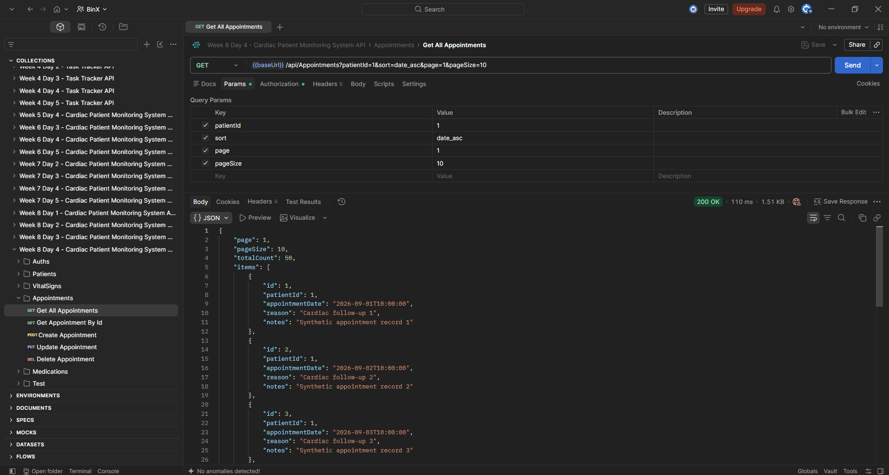
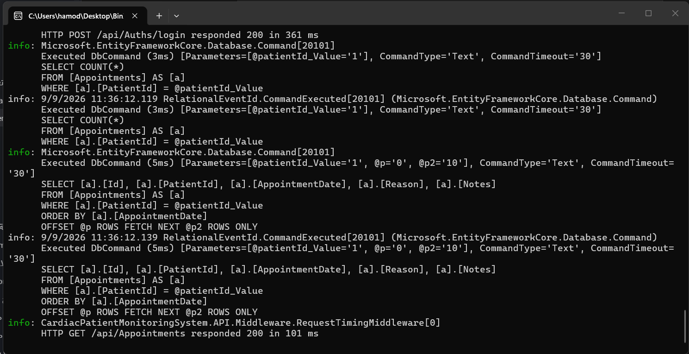
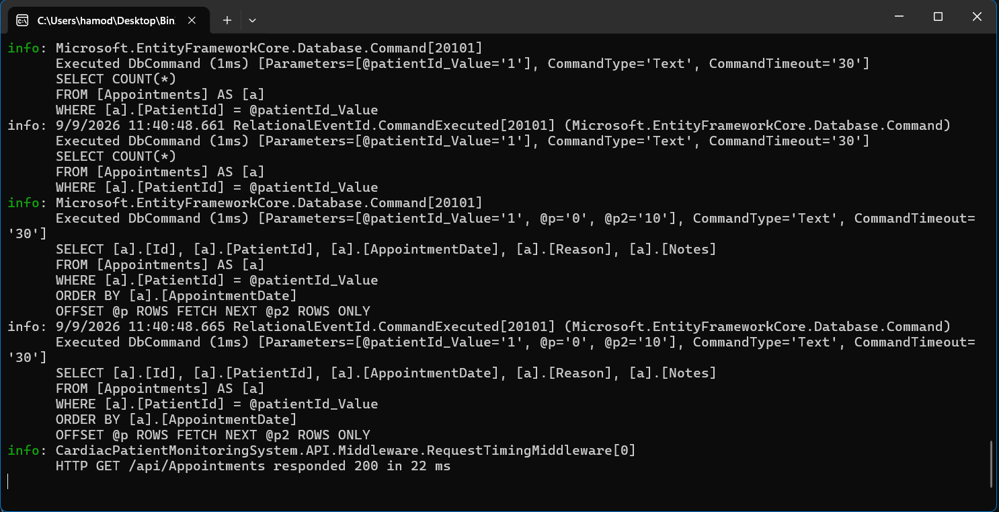
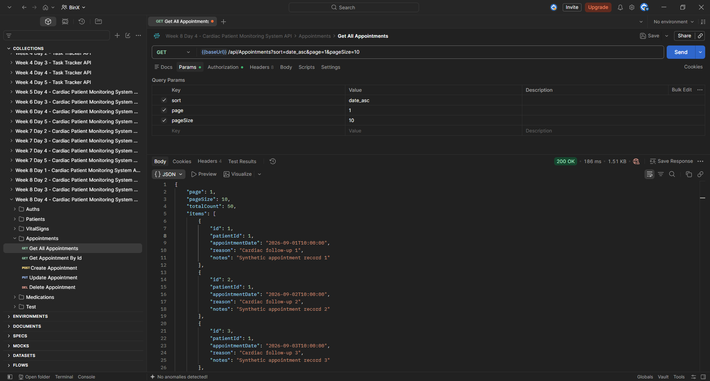
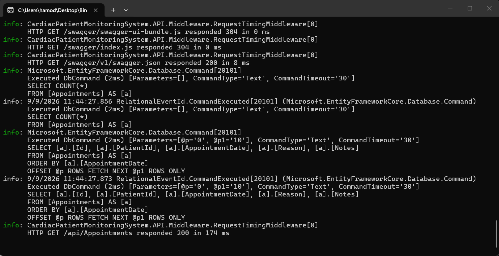
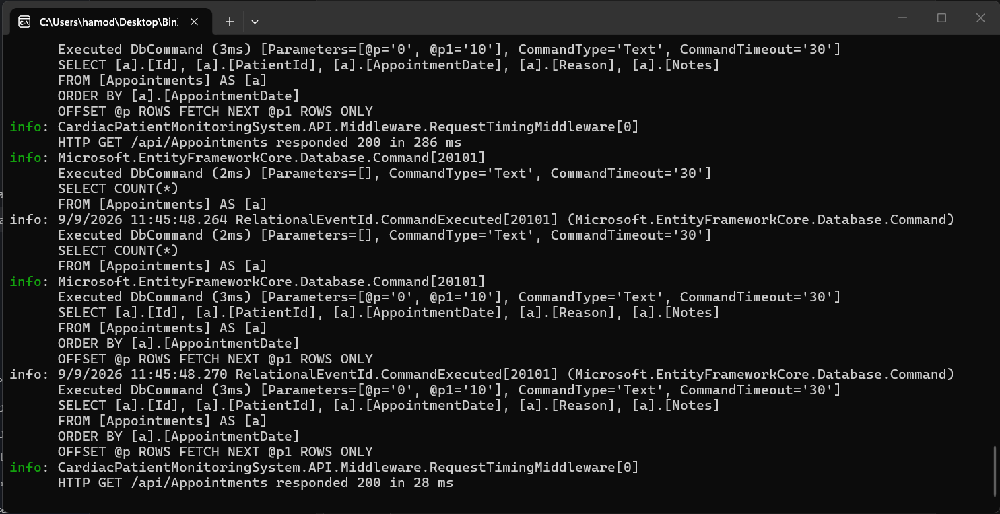
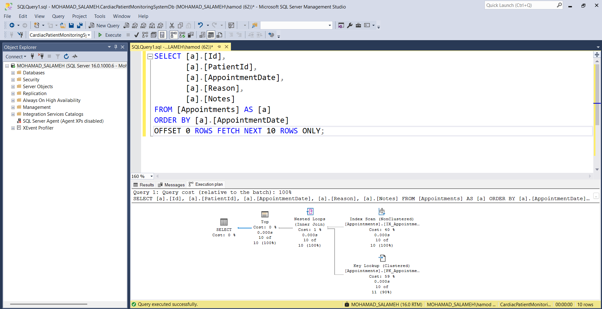
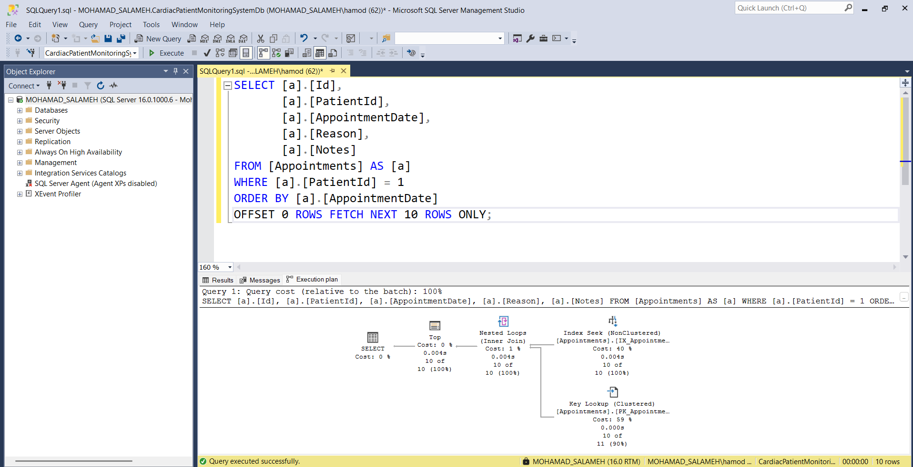

# Week 8 - Day 4

## Database Indexing & Performance Profiling

### Overview

Today focused on improving database query performance by identifying appropriate index candidates based on real query patterns in the Cardiac Patient Monitoring System API.

The work included adding a single-column index and a composite index to the `Appointments` table, creating and applying a new EF Core migration, measuring query performance before and after indexing, and validating index usage through SQL Server execution plans.

The indexing decisions were based on actual filtering and sorting behavior in the existing API rather than adding indexes without evidence.

### Learning Objectives

- Identify when a database column or column combination genuinely needs an index.
- Add a single-column index and a composite index using EF Core Fluent API.
- Create and apply a new EF Core migration for the indexes.
- Measure query behavior before and after indexing.
- Use SQL Server execution plans to verify whether the indexes are actually used.
- Prepare measured performance evidence for mentor review.

## Index Candidate Analysis

Before adding new indexes, the existing query patterns were reviewed to avoid unnecessary indexing.

The following candidates were evaluated:

- `Patient.UserId` was already configured as a unique index, so no duplicate index was added.
- `VitalSigns` did not currently contain list queries that filter or sort by columns such as `PatientId` or `RecordedAt`, so no new index was added there.
- `Medication.Name` was not selected because the current search uses `Contains`, which typically translates to `LIKE '%value%'` and is not an ideal case for a standard index.
- `Appointments` contained real filtering and sorting patterns that justified new indexes.

The selected indexes were:

- `AppointmentDate`
- `PatientId + AppointmentDate`

## Adding the Indexes with EF Core

The selected indexes were added using EF Core Fluent API inside `ApplicationDbContext`.

### Single-Column Index

```csharp
modelBuilder.Entity<Appointment>()
    .HasIndex(a => a.AppointmentDate);
```

This index supports appointment list queries that sort by `AppointmentDate`.

### Composite Index

```csharp
modelBuilder.Entity<Appointment>()
    .HasIndex(a => new { a.PatientId, a.AppointmentDate });
```

This composite index matches the existing query pattern that:

- Filters appointments by `PatientId`
- Sorts the filtered appointments by `AppointmentDate`

The order of the indexed columns was selected to match the query pattern, with `PatientId` first because it is used for filtering.

## EF Core Migration

A new EF Core migration was created to apply the appointment indexes to the database.

Migration name:

`AddAppointmentIndexes`

The migration created:

- `IX_Appointments_AppointmentDate`
- `IX_Appointments_PatientId_AppointmentDate`

The existing single-column foreign key index on `PatientId` was removed because the new composite index starts with `PatientId` and can support queries that filter by that column.

The migration was applied using:

```powershell
Update-Database
```

## Performance Measurement Strategy

To verify whether the indexes actually improved query behavior, the same appointment queries were measured before and after applying the `AddAppointmentIndexes` migration.

Two query patterns were tested:

1. Filtering appointments by `PatientId` and sorting by `AppointmentDate`.
2. Sorting all appointments by `AppointmentDate`.

Measurements included:

- API request time from the custom request timing middleware
- Postman response time
- EF Core SQL command timing
- SQL Server Actual Execution Plan

The same query parameters and test data were used for each before-and-after comparison.

## Composite Index Performance Test

The composite index was tested using the existing appointment query that filters by patient and sorts by appointment date.

Tested endpoint:

`GET /api/Appointments?patientId=1&sort=date_asc&page=1&pageSize=10`

### Before Indexing

The same request was executed before applying the `AddAppointmentIndexes` migration.

Observed results:

| Measurement | Before Index |
| --- | ---: |
| API Request Time | 101 ms |
| Postman Response Time | 110 ms |
| SQL Command Time | approximately 3–5 ms |





### After Indexing

After applying the migration, the same request was executed again with the same parameters and test data.

Observed results:

| Measurement | After Index |
| --- | ---: |
| API Request Time | 22 ms |
| Postman Response Time | 26 ms |
| SQL Command Time | approximately 1 ms |




## Single-Column Index Performance Test

The single-column `AppointmentDate` index was tested using the appointment list query without a patient filter.

Tested endpoint:

`GET /api/Appointments?sort=date_asc&page=1&pageSize=10`

### Before Indexing

Observed results:

| Measurement | Before Index |
| --- | ---: |
| API Request Time | 174 ms |
| Postman Response Time | 186 ms |
| SQL Command Time | approximately 2 ms |





### After Indexing

After applying the migration, the same request was executed again.

Observed results:

| Measurement | After Index |
| --- | ---: |
| API Request Time | 28 ms |
| Postman Response Time | 31 ms |
| SQL Command Time | approximately 2–3 ms |




The API and Postman response times were lower in the observed run, but the SQL command time remained similar.

For that reason, response time was treated as observational rather than as proof that the index alone caused the improvement.

## SQL Server Execution Plan Validation

Response-time measurements alone were not treated as enough evidence, so SQL Server Actual Execution Plans were also reviewed.

### AppointmentDate Index Execution Plan

The query that sorts appointments by `AppointmentDate` used:

`Index Scan (NonClustered)`

The execution plan showed that SQL Server used the `AppointmentDate` index and did not require a separate `Sort` operator.

A:

`Key Lookup (Clustered)`

was still required to retrieve additional columns that were not stored in the nonclustered index.



### Composite Index Execution Plan

The query that filters by `PatientId` and sorts by `AppointmentDate` used:

`Index Seek (NonClustered)`

This confirmed that SQL Server could directly seek the matching patient records through the composite index:

`PatientId + AppointmentDate`

The same index also supported the required ordering, so no separate `Sort` operation was needed.

A `Key Lookup (Clustered)` was still required to retrieve additional selected columns such as `Reason` and `Notes`.



## Performance Findings

The indexing work showed that performance decisions should be validated with real measurements rather than assumptions.

For the `AppointmentDate` index:

- SQL Server used a nonclustered index scan.
- No separate sort operation was required.
- SQL execution time remained almost unchanged because the test dataset was relatively small.

For the composite `PatientId + AppointmentDate` index:

- SQL Server used a nonclustered index seek.
- The filter on `PatientId` and the sort on `AppointmentDate` were both supported by the same index.
- No separate sort operation was required.
- The observed API and SQL timings were lower after indexing.

The composite index provided the strongest evidence of effective index usage for the current application query pattern.

## Tools Used

- C#
- ASP.NET Core Web API
- Entity Framework Core
- SQL Server
- SQL Server Management Studio
- EF Core Fluent API
- EF Core Migrations
- Actual Execution Plan
- Postman
- Visual Studio
- Git
- GitHub