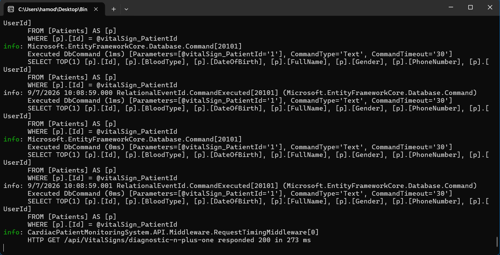
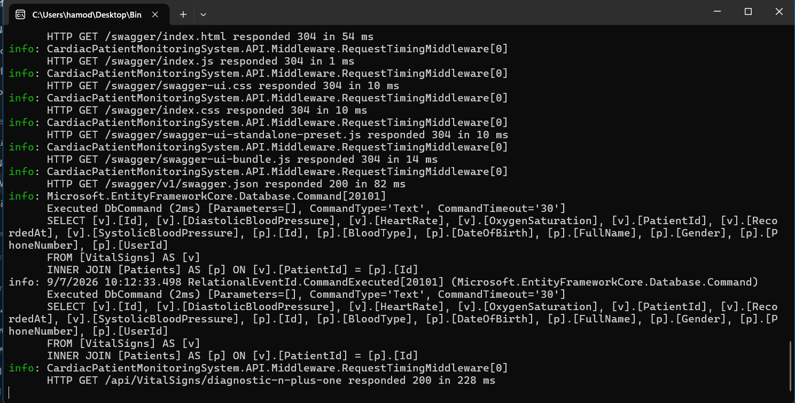
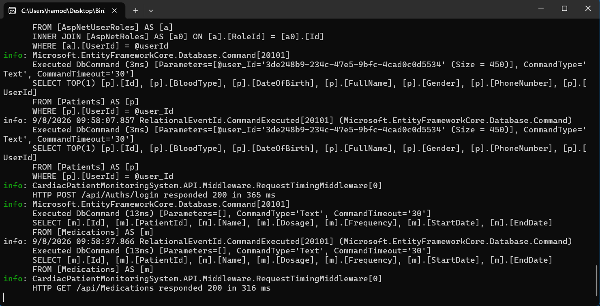
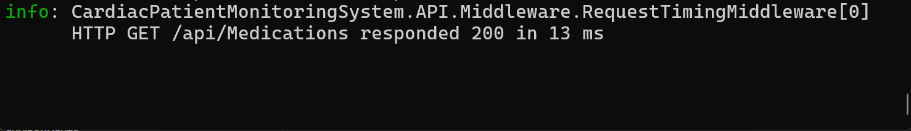
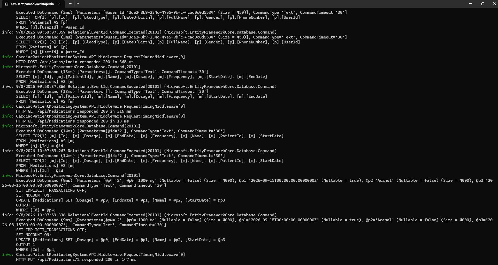
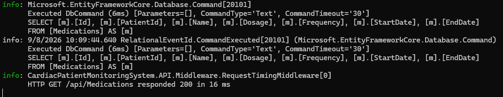

# Week 8 - Day 5

## Sprint Review, Benchmark Demo & Retrospective

### Overview

Today focused on closing Sprint 3 by reviewing the completed performance work and presenting measurable before-and-after evidence from the Cardiac Patient Monitoring System API.

The sprint review covered N+1 query optimization, Redis caching, cache invalidation, database indexing, and SQL Server execution plan validation.

The completed performance work was checked against the available measurements and evidence before preparing the Sprint 3 retrospective and the next improvement action for Sprint 4.

### Learning Objectives

- Present measurable before-and-after performance evidence from Sprint 3.
- Review completed Sprint 3 backlog items against actual results.
- Identify any remaining performance opportunities for Sprint 4.
- Write a Sprint 3 retrospective with one concrete improvement action.
- Prepare a concise Sprint 3 benchmark summary for mentor review.

## Sprint 3 Benchmark Demo

The Sprint 3 benchmark demo presented measurable before-and-after evidence from the completed performance work.

The demo covered three main areas:

- N+1 query optimization
- Redis caching and cache invalidation
- Database indexing and execution plan validation

The evidence was reused from the implementation and testing completed during Days 2, 3, and 4.

## N+1 Query Benchmark

The first benchmark demonstrated the N+1 query problem using the diagnostic VitalSigns endpoint.

Before optimization:

```text
Records: 50 VitalSigns
SQL Queries: 51
N+1 Detected: Yes
Observed Response Time: 273 ms
```



The endpoint was then optimized using eager loading with `Include`.

After `Include`:

```text
Records: 50 VitalSigns
SQL Queries: 1
N+1 Detected: No
Observed Response Time: 228 ms
```



The endpoint was then converted to projection using `Select`.

After projection:

```text
Records: 50 VitalSigns
SQL Queries: 1
N+1 Detected: No
Observed Response Time: 35 ms
```


The primary performance improvement was the reduction in SQL query count from `51` queries to `1` query.

## Redis Cache Benchmark

The Redis benchmark demonstrated the difference between an uncached request and a cached request for:

`GET /api/Medications`

### Cache Miss

The first request did not find the Medication list in Redis, so the application queried SQL Server and stored the result in the cache.

Observed result:

```text
Cache Status: Miss
Database Query: Yes
Observed API Time: 316 ms
Status Code: 200 OK
```



### Cache Hit

The same request was executed again after the Medication list had been cached.

Observed result:

```text
Cache Status: Hit
Database Query: No
Observed API Time: 13 ms
Status Code: 200 OK
```



The cache hit avoided a new SQL query against the `Medications` table.

### Cache Invalidation Verification

The Medication cache was invalidated after a successful update operation.



The next `GET /api/Medications` request queried SQL Server again and returned fresh data instead of serving stale cached values.



## Database Index Benchmark

The indexing benchmark demonstrated how SQL Server used the indexes added during Day 4.

### AppointmentDate Index

The single-column index on:

`AppointmentDate`

was validated using SQL Server Actual Execution Plan.

The execution plan showed:

`Index Scan (NonClustered)`

No separate `Sort` operator was required for the tested appointment query.


### Composite Index

The composite index on:

`PatientId + AppointmentDate`

was tested using the appointment query that filters by patient and sorts by appointment date.

The execution plan showed:

`Index Seek (NonClustered)`

This confirmed that SQL Server could use the composite index efficiently for the existing query pattern.


## Sprint 3 Review

Each Sprint 3 performance task was reviewed against measurable evidence before being marked as complete.

| Backlog Item | Evidence | Status |
| --- | --- | --- |
| Enable EF Core query logging | SQL queries inspected in the application console | Done |
| Seed realistic performance data | 50+ VitalSigns, Medications, and Appointments prepared | Done |
| Diagnose N+1 query behavior | 51 SQL queries for 50 VitalSigns | Done |
| Optimize N+1 query | Query count reduced from 51 to 1 | Done |
| Compare `Include` and projection | Both approaches executed with 1 SQL query | Done |
| Review `AsSplitQuery` | Reviewed and not applied because no current query includes multiple collection navigations | Done |
| Implement Redis caching | Cache-aside implemented for `GET /api/Medications` | Done |
| Verify cache miss and cache hit | Cache miss queried SQL Server; cache hit avoided a new SQL query | Done |
| Verify cache invalidation | Updated Medication data was returned after cache removal | Done |
| Add justified database indexes | Added `AppointmentDate` and `PatientId + AppointmentDate` indexes | Done |
| Profile index performance | Before-and-after measurements were captured | Done |
| Validate index usage | SQL Server execution plans confirmed `Index Scan` and `Index Seek` | Done |

## Sprint 4 Backlog Items

The main Sprint 3 performance work was completed successfully.

The following performance improvement opportunity was carried forward to Sprint 4:

- Add an automated regression test to verify that the optimized VitalSigns query does not return to an N+1 query pattern after future code changes.

## Sprint 3 Retrospective

### What Went Well

- Performance improvements were supported by measurable evidence.
- The N+1 query pattern was reproduced, measured, and reduced from 51 SQL queries to 1.
- Redis caching was implemented and verified using cache miss and cache hit behavior.
- Cache invalidation was tested to confirm that updated Medication data was returned immediately.
- Database indexes were selected based on real query patterns.
- SQL Server execution plans were used to verify actual index usage.

### What Could Be Improved

- Some response-time measurements varied between executions, so query counts and execution plans provide more reliable evidence.
- The current performance checks are mainly manual and are not yet protected by automated regression tests.

### Sprint 4 Action

Add an automated regression test to verify that the optimized VitalSigns query does not return to an N+1 query pattern after future code changes.

## Sprint 3 Summary

Sprint 3 focused on improving backend performance using measurable evidence.

### N+1 Query Optimization

The diagnostic VitalSigns endpoint was reduced from:

`51 SQL queries`

to:

`1 SQL query`

using eager loading and projection.

### Redis Caching

Redis caching was implemented for:

`GET /api/Medications`

Observed results:

- Cache Miss: `316 ms`
- Cache Hit: `13 ms`

Cache invalidation was also verified after Medication create, update, and delete operations.

### Database Indexing

Two indexes were added to the `Appointments` table:

- `AppointmentDate`
- `PatientId + AppointmentDate`

The composite index was validated using SQL Server Actual Execution Plans and produced:

`Index Seek (NonClustered)`

for the filtered appointment query.

### Sprint 3 Result

Sprint 3 successfully introduced measurable query optimization, Redis caching, cache invalidation, database indexing, and performance profiling into the Cardiac Patient Monitoring System API.

## Tools Used

- C#
- ASP.NET Core Web API
- Entity Framework Core
- SQL Server
- SQL Server Management Studio
- EF Core Query Logging
- Redis
- Docker
- `IDistributedCache`
- SQL Server Actual Execution Plan
- Postman
- Visual Studio
- Git
- GitHub

