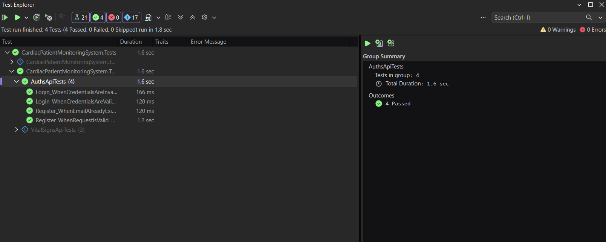
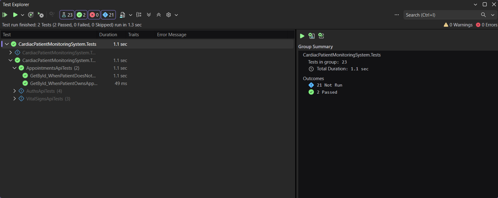
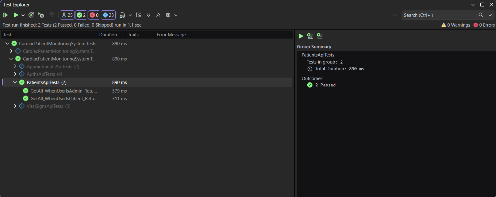
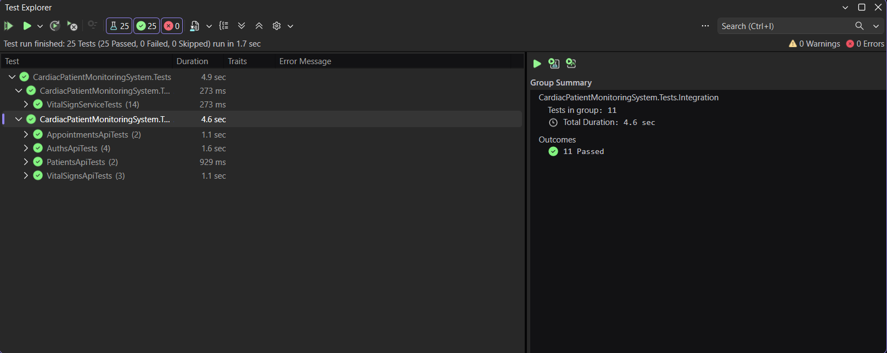

# Week 9 - Day 1

## Sprint 4 Planning & Closing Test Coverage Gaps

### Overview

Today focused on starting Sprint 4 for the Cardiac Patient Monitoring System API with an emphasis on automated testing, documentation, deployment readiness, and closing the highest-risk remaining test coverage gaps.

The existing test suite was audited against the full API endpoint list to identify routes that had happy-path coverage, error-path coverage, both, or neither.

The highest-priority gaps were selected based on risk, with authentication, authorization, ownership checks, and protected routes handled before lower-risk read-only endpoints.

New integration tests were added for authentication, registration, appointment ownership, and role-based authorization, and the complete test suite was executed successfully at the end of the day.

### Learning Objectives

- Define the Sprint 4 goal and backlog.
- Carry forward the Sprint 3 retrospective improvement action.
- Audit integration test coverage across the complete API endpoint list.
- Identify happy-path and realistic error-path coverage gaps.
- Prioritize remaining gaps based on authentication, authorization, ownership, and business risk.
- Add integration tests for the highest-priority uncovered routes.
- Run the full test suite and confirm that all tests pass.

## Sprint 4 Planning

Sprint 4 was started with a focus on completing the Cardiac Patient Monitoring System API with stronger automated test coverage, complete documentation, and deployment readiness.

The Sprint 4 goal is:

```text
Complete the Cardiac Patient Monitoring System API with strong automated test coverage, complete project documentation, and deployment readiness, while closing the highest-risk remaining test coverage gaps.
```

The initial Sprint 4 backlog included:

- Audit test coverage for every API endpoint.
- Identify happy-path and error-path coverage gaps.
- Prioritize authentication, authorization, ownership, and write-operation gaps.
- Carry forward the Sprint 3 N+1 regression-test improvement action.
- Add tests for the top 3–5 highest-priority uncovered routes.
- Run the complete test suite and confirm all tests pass.
- Prepare the remaining Sprint 4 documentation and deployment work.

## Test Coverage Audit

The existing integration test coverage was reviewed against the complete API endpoint list.

The audit confirmed that the project already had strong unit-test coverage for `VitalSignService` and integration coverage for:

`GET /api/VitalSigns/{id}`

The existing VitalSigns integration tests covered:

- `200 OK` when the VitalSign exists.
- `404 Not Found` when the VitalSign does not exist.
- `401 Unauthorized` when no JWT is provided.

The remaining API routes were reviewed for missing happy-path and realistic error-path coverage.

The highest-priority gaps were selected based on risk, with authentication, authorization, ownership, and protected routes handled first.

### Endpoint Coverage Status

The API contains 23 endpoints. Each endpoint was reviewed based on its current integration-test coverage.

Service-level unit tests are not counted as endpoint coverage in this audit.

| Controller | Endpoint | Happy Path | Error Path | Status |
|---|---|---:|---:|---|
| Auths | `POST /api/Auths/register` | ✅ | ✅ | Both |
| Auths | `POST /api/Auths/login` | ✅ | ✅ | Both |
| Patients | `GET /api/Patients` | ✅ | ✅ | Both |
| Patients | `GET /api/Patients/{id}` | ❌ | ❌ | Neither |
| Patients | `POST /api/Patients` | ❌ | ❌ | Neither |
| Patients | `PUT /api/Patients/{id}` | ❌ | ❌ | Neither |
| Patients | `DELETE /api/Patients/{id}` | ❌ | ❌ | Neither |
| VitalSigns | `GET /api/VitalSigns` | ❌ | ❌ | Neither |
| VitalSigns | `GET /api/VitalSigns/{id}` | ✅ | ✅ | Both |
| VitalSigns | `POST /api/VitalSigns` | ❌ | ❌ | Neither |
| VitalSigns | `PUT /api/VitalSigns/{id}` | ❌ | ❌ | Neither |
| VitalSigns | `DELETE /api/VitalSigns/{id}` | ❌ | ❌ | Neither |
| VitalSigns | `GET /api/VitalSigns/diagnostic-n-plus-one` | ❌ | ❌ | Neither |
| Medications | `GET /api/Medications` | ❌ | ❌ | Neither |
| Medications | `GET /api/Medications/{id}` | ❌ | ❌ | Neither |
| Medications | `POST /api/Medications` | ❌ | ❌ | Neither |
| Medications | `PUT /api/Medications/{id}` | ❌ | ❌ | Neither |
| Medications | `DELETE /api/Medications/{id}` | ❌ | ❌ | Neither |
| Appointments | `GET /api/Appointments` | ❌ | ❌ | Neither |
| Appointments | `GET /api/Appointments/{id}` | ✅ | ✅ | Both |
| Appointments | `POST /api/Appointments` | ❌ | ❌ | Neither |
| Appointments | `PUT /api/Appointments/{id}` | ❌ | ❌ | Neither |
| Appointments | `DELETE /api/Appointments/{id}` | ❌ | ❌ | Neither |

After Day 1:

- `5` endpoints have both happy-path and error-path integration coverage.
- `18` endpoints remain without endpoint-level integration coverage.
- `4` previously uncovered high-priority endpoints were covered during Day 1.

## Prioritized Test Coverage Gaps

After reviewing the API endpoint list, the remaining coverage gaps were prioritized by risk.

The highest-priority gaps selected for Day 1 were:

1. `POST /api/Auths/login`
   - Authentication route
   - Required both valid and invalid credential tests

2. `POST /api/Auths/register`
   - Identity and user-creation route
   - Required successful registration and duplicate-email coverage

3. `GET /api/Appointments/{id}`
   - Patient ownership-sensitive route
   - Required own-resource and cross-patient access tests

4. `GET /api/Patients`
   - Admin-protected route
   - Required role-based authorization coverage

These routes were prioritized before lower-risk read-only endpoints because they involve authentication, authorization, identity, or resource ownership.

## Authentication Integration Tests

Integration tests were added for the authentication endpoints to cover both successful and failure scenarios.

### Login Tests

The following cases were added for:

`POST /api/Auths/login`

- Valid credentials return `200 OK`.
- A JWT token is returned in the response.
- Invalid credentials return `401 Unauthorized`.

### Registration Tests

The following cases were added for:

`POST /api/Auths/register`

- A valid registration request returns `201 Created`.
- A duplicate email returns `400 Bad Request`.

The integration test environment also ensured that the `Patient` role exists before registration tests run.



## Appointment Ownership Integration Tests

Integration tests were added for:

`GET /api/Appointments/{id}`

to verify patient ownership behavior.

The following cases were tested:

- A Patient can access their own appointment and receives `200 OK`.
- A Patient cannot access another Patient's appointment and receives `404 Not Found`.

These tests verify that the JWT `PatientId` claim is correctly compared against the appointment's `PatientId`.



## Role-Based Authorization Integration Tests

Integration tests were added for:

`GET /api/Patients`

to verify role-based authorization behavior.

The following cases were tested:

- An Admin user can access the endpoint and receives `200 OK`.
- A Patient user is denied access and receives `403 Forbidden`.

These tests verify that the `[Authorize(Roles = "Admin")]` restriction is enforced correctly.



## Full Test Suite Result

After adding the new high-priority integration tests, the complete test suite was executed using Visual Studio Test Explorer.

Final result:

```text
Total Tests: 25
Passed: 25
Failed: 0
Skipped: 0
```

The passing suite confirmed that the new authentication, registration, ownership, and role-authorization tests were added without breaking the existing unit and integration tests.



## Test Environment Update

The integration-test environment uses EF Core InMemory through `CustomWebApplicationFactory`.

Because the registration flow uses an EF Core transaction, the InMemory test provider was configured to ignore the transaction warning during integration testing:

```csharp
options.ConfigureWarnings(warnings =>
    warnings.Ignore(InMemoryEventId.TransactionIgnoredWarning));
```

This allows the registration endpoint to be tested in the existing integration-test environment while keeping the production transaction logic unchanged.

The `Patient` role was also seeded inside the authentication integration tests before running valid registration scenarios.

## Sprint 3 Retrospective Action Status

The Sprint 3 retrospective carried forward the following improvement action:

```text
Add an automated regression test to verify that the optimized VitalSigns query does not return to an N+1 query pattern after future code changes.
```

This action remains part of the Sprint 4 backlog.

During Day 1, the focus was placed on closing four higher-priority integration-test gaps involving authentication, registration, ownership, and role-based authorization.

The N+1 regression test remains planned for Sprint 4 and was not marked as complete during Day 1.

## Tools Used

- C#
- ASP.NET Core Web API
- xUnit
- Moq
- `WebApplicationFactory<Program>`
- EF Core InMemory
- `CustomWebApplicationFactory`
- JWT Bearer Authentication
- `UserManager<IdentityUser>`
- `RoleManager<IdentityRole>`
- Visual Studio Test Explorer
- Postman
- Visual Studio
- Git
- GitHub