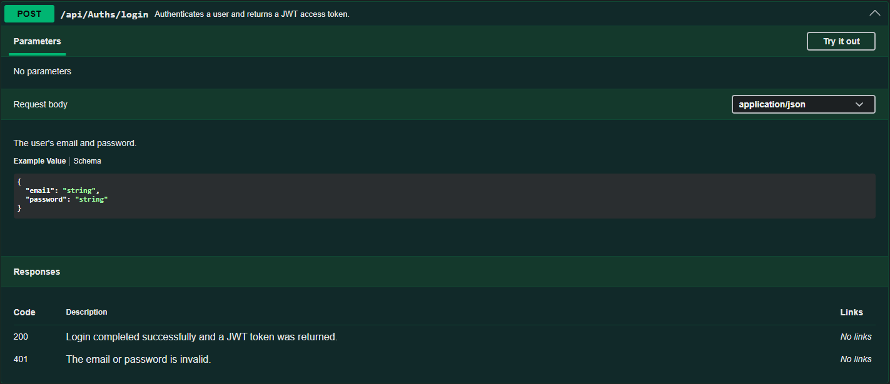
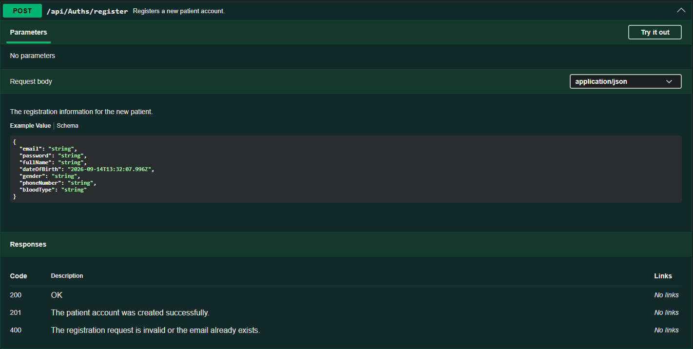
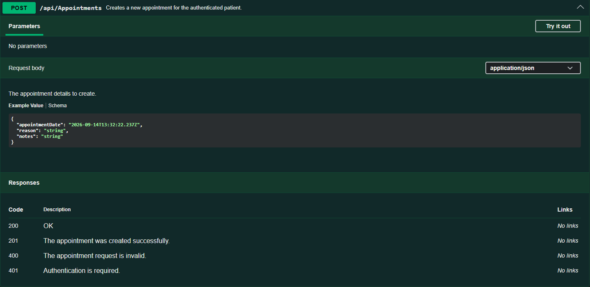
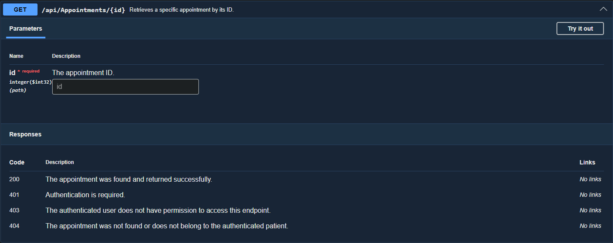
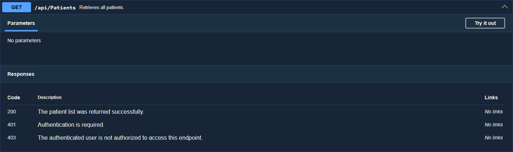
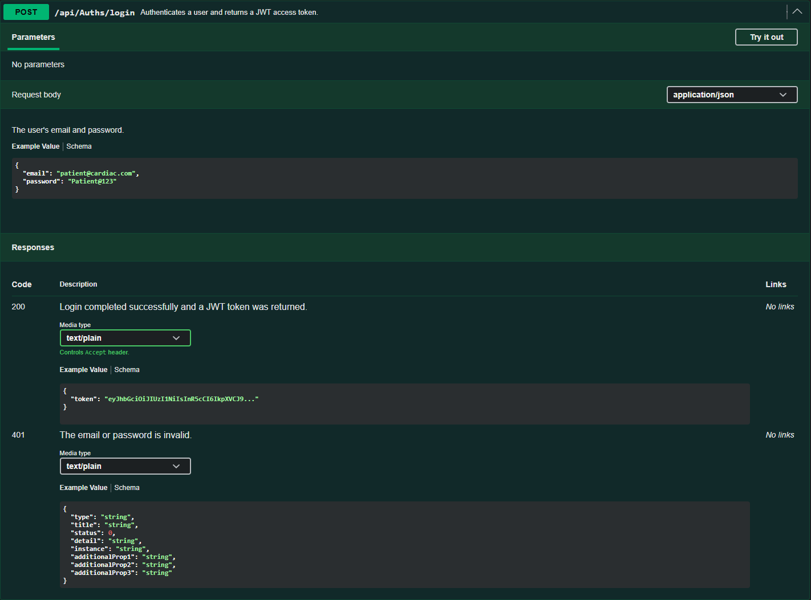
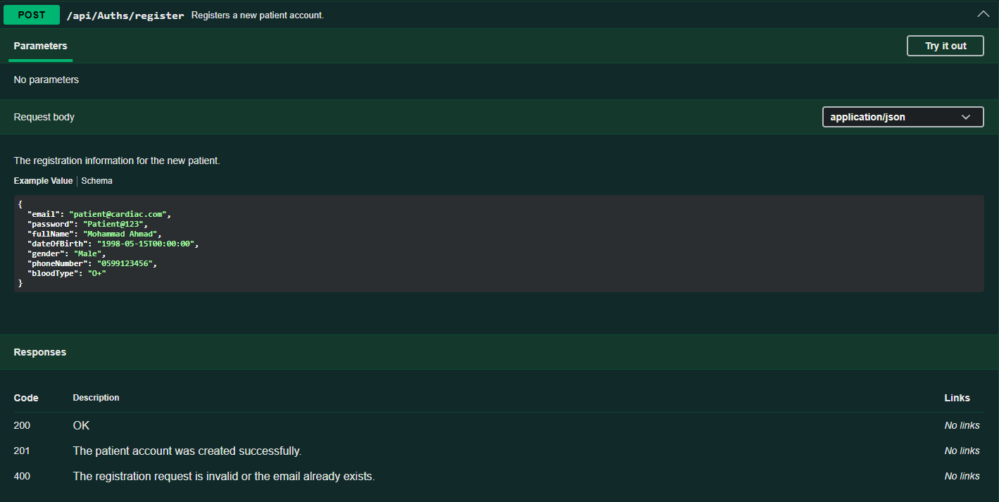
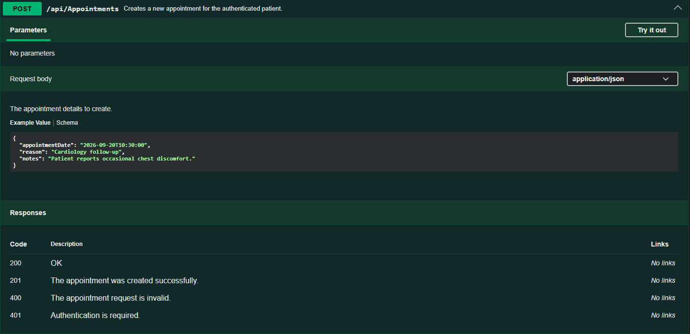

# Week 9 - Day 2

## Finalizing API Documentation (Swagger/OpenAPI & Postman)

### Overview

Today focused on finalizing the API documentation for the Cardiac Patient Monitoring System API.

Swagger/OpenAPI documentation was enriched using XML documentation comments, realistic request examples were added to important endpoints, and a documented response example was added for the login endpoint.

The Postman collection was also reviewed and finalized to ensure that all API endpoints are organized, reusable, and include at least one status-code test script.

The existing project README was reviewed and confirmed to already contain the required setup, migration, technology stack, API documentation, Postman, and testing information.

### Learning Objectives

- Enrich Swagger/OpenAPI documentation using XML documentation comments.
- Add meaningful summaries, parameter descriptions, and response descriptions to important API endpoints.
- Add realistic request and response examples in Swagger.
- Review and finalize the complete Postman collection.
- Ensure every Postman request is organized and includes at least one expected status-code test.
- Review the existing project README against the professional documentation requirements.

## Swagger XML Documentation

XML documentation output was enabled in the API project so Swagger could read and display documentation comments directly from the source code.

The project file was updated with:

```xml
<GenerateDocumentationFile>true</GenerateDocumentationFile>
<NoWarn>$(NoWarn);1591</NoWarn>
```

Swagger was then configured in `Program.cs` to include the generated XML documentation file.

Meaningful XML comments were added to five important endpoints:

- `POST /api/Auths/login`
- `POST /api/Auths/register`
- `GET /api/Appointments/{id}`
- `GET /api/Patients`
- `POST /api/Appointments`

The documentation includes:

- Endpoint summaries
- Request parameter descriptions
- Expected response status codes
- Short descriptions for each documented response











## Swagger Request and Response Examples

Realistic Swagger examples were added to make the API documentation easier to understand and use.

Request examples were added for:

- `POST /api/Auths/login`
- `POST /api/Auths/register`
- `POST /api/Appointments`

The examples use realistic values instead of the default placeholder values such as `string`.

A documented response model was also added for:

```http
POST /api/Auths/login
```

The successful login response now shows a JWT token example directly in Swagger.







## Finalizing the Postman Collection

The complete Postman collection was reviewed and finalized.

The collection was organized into logical folders:

- `Auths`
- `Patients`
- `VitalSigns`
- `Medications`
- `Appointments`

The review confirmed that all required API endpoints are present in the collection.

Collection variables are used consistently:

- `{{baseUrl}}`
- `{{adminToken}}`
- `{{patientToken}}`

The Admin and Patient login requests automatically store the returned JWT tokens in the corresponding collection variables.

At least one Postman test script was added to every request to verify the expected HTTP status code.

Examples include:

```javascript
pm.test("Status code is 200", function () {
    pm.response.to.have.status(200);
});
```

and:

```javascript
pm.test("Status code is 201", function () {
    pm.response.to.have.status(201);
});
```

The finalized collection was exported as:

```text
Week 9 Day 2 - Cardiac Patient Monitoring System API.postman_collection.json
```

## Complete Project README Review

The existing project README was reviewed against the documentation requirements for a professional backend project.

The review confirmed that the README already includes:

- Project overview
- Main features
- Technology stack
- Required development tools
- Project structure
- Database setup
- SQL Server connection-string configuration
- Entity Framework Core migration instructions
- Seed-data information
- Authentication and authorization documentation
- API endpoint documentation
- Swagger/OpenAPI information
- Postman collection information
- Automated testing information
- Instructions for running the project locally

Because these sections were already documented, the project README did not require a full rewrite during Day 2.

### What a Complete README Should Contain

A professional project README should provide enough information for a developer who has never seen the project before to understand and run it locally.

Important sections include:

- Project Overview
- Tech Stack
- Prerequisites
- Setup Instructions
- Package Restore
- Database Configuration
- Environment Variables
- EF Core Migrations
- Running the API
- Swagger / API Documentation
- Postman Collection
- Automated Testing
- Required external services

## Tools Used

- C#
- ASP.NET Core Web API
- Swashbuckle.AspNetCore
- Swagger / OpenAPI
- XML Documentation Comments
- `GenerateDocumentationFile`
- `IncludeXmlComments`
- `ProducesResponseType`
- Postman
- Postman Test Scripts
- Postman Collection Variables
- JWT Bearer Authentication
- Visual Studio
- Git
- GitHub