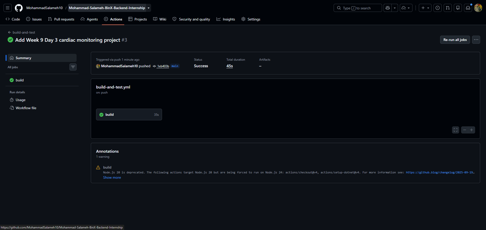
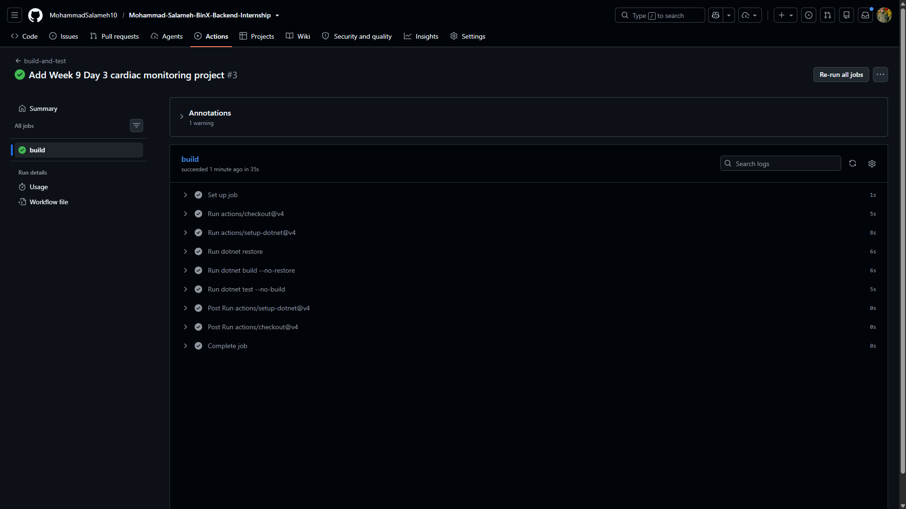
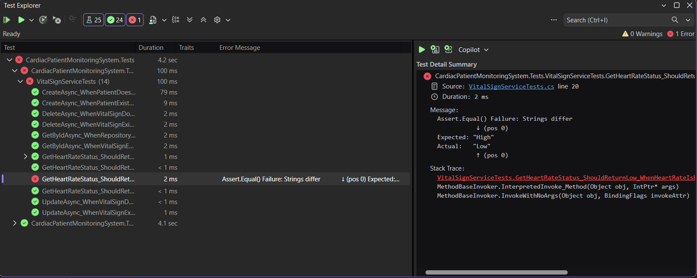
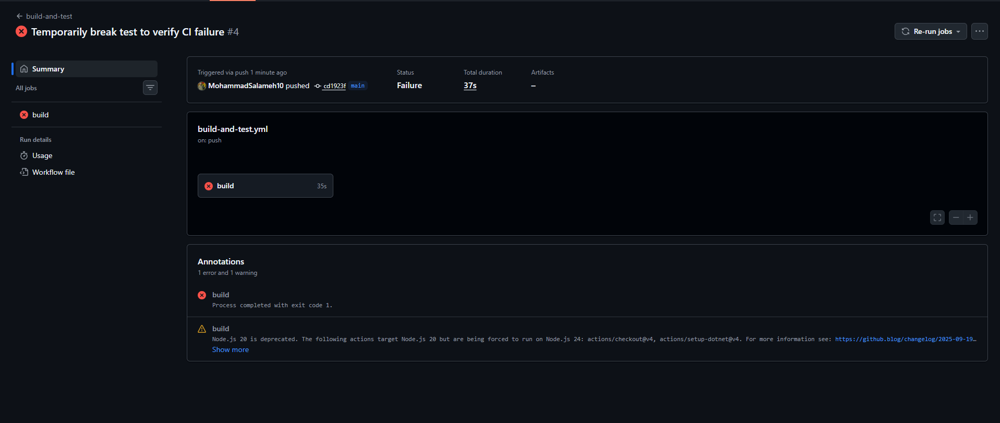
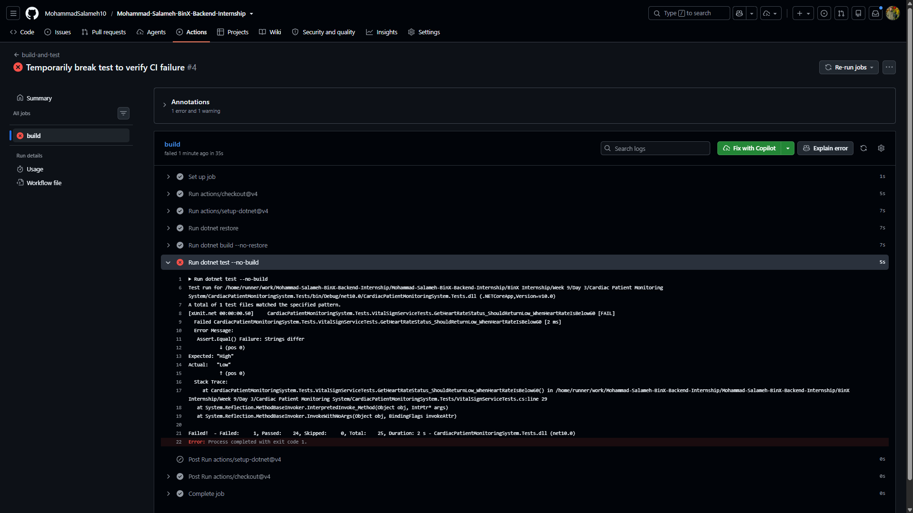

# Week 9 - Day 3: Building the CI/CD Pipeline with GitHub Actions

[](https://github.com/MohammadSalameh10/Mohammad-Salameh-BinX-Backend-Internship/actions/workflows/build-and-test.yml)

## Overview

In this day, I created and verified a GitHub Actions CI pipeline for the Cardiac Patient Monitoring System API.

The workflow automatically restores dependencies, builds the solution, and runs the test suite on every push and pull request.

I also verified that the pipeline fails when a test fails and returns to a successful state after fixing the test.

## GitHub Actions Workflow

The CI workflow is defined in:

```text
.github/workflows/build-and-test.yml
```

The workflow is triggered on:

- `push`
- `pull_request`

It runs on:

```text
ubuntu-latest
```

The pipeline performs these steps in order:

1. Checks out the repository.
2. Sets up `.NET 10`.
3. Restores dependencies.
4. Builds the solution.
5. Runs the test suite.

## Workflow Configuration

The workflow used for the CI pipeline is:

```yaml
name: build-and-test

on: [push, pull_request]

jobs:
  build:
    runs-on: ubuntu-latest

    defaults:
      run:
        working-directory: './BinX Internship/Week 9/Day 3/Cardiac Patient Monitoring System'

    steps:
      - uses: actions/checkout@v4

      - uses: actions/setup-dotnet@v4
        with:
          dotnet-version: '10.0.x'

      - run: dotnet restore

      - run: dotnet build --no-restore

      - run: dotnet test --no-build
```

## Successful CI Run

After pushing the workflow and project files to GitHub, the CI pipeline completed successfully.

The workflow successfully:

- Checked out the repository.
- Set up `.NET 10`.
- Restored project dependencies.
- Built the solution.
- Ran all tests successfully.



### Successful Workflow Steps

The workflow steps completed successfully in GitHub Actions.



## Deliberate Failure Verification

To verify that the CI pipeline correctly detects test failures, I deliberately changed one assertion in `VitalSignServiceTests.cs`.

The original assertion was:

```csharp
Assert.Equal("Low", result);
```

It was temporarily changed to:

```csharp
Assert.Equal("High", result);
```

This caused one test to fail locally:

- Total tests: `25`
- Passed: `24`
- Failed: `1`



After pushing the broken test to GitHub, the `dotnet test --no-build` step failed and the entire workflow was marked as failed.



### Failure Details

GitHub Actions correctly reported the failed assertion:

```text
Expected: "High"
Actual:   "Low"
```



## Fixing the Test and Restoring the Pipeline

After confirming that the CI pipeline correctly failed, I restored the original assertion:

```csharp
Assert.Equal("Low", result);
```

I then ran the test suite again locally and confirmed:

```text
Total tests: 25
Passed: 25
Failed: 0
Skipped: 0
```

After pushing the fix to GitHub, the workflow returned to a successful state.

This confirmed that the pipeline correctly detects failures and returns to green after the issue is fixed.

## Tools Used

- GitHub Actions