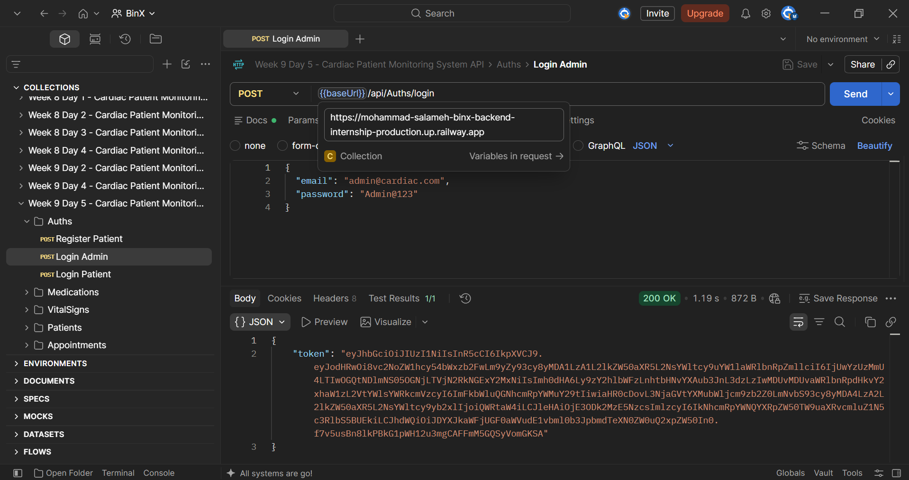
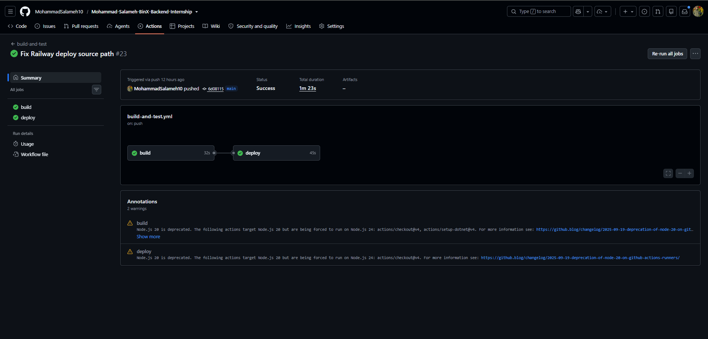
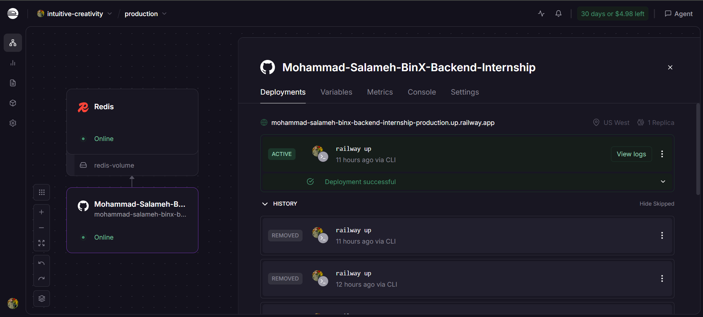

# Week 9 - Day 5: Definition of Done Audit, Sprint Review & Retrospective

## Overview

In this day, I completed the final Definition of Done audit for the Cardiac Patient Monitoring System API and verified that the project was ready for the Week 10 final presentation.

The audit was performed against the actual live project instead of relying on previous results. The live Railway deployment, Postman API verification, GitHub Actions CI/CD pipeline, project documentation, database schema, migrations, and compiler warnings were all reviewed.

Any gap found during the audit was fixed and re-checked before the project was considered complete.

The day concluded with the Sprint 4 Review and Retrospective, closing Phase 3 and preparing the project for Week 10.

## Definition of Done Audit

The final Definition of Done checklist was reviewed item by item against the completed project.

The audit results were:

- All Sprint 4 tasks completed and the live API verified without critical errors.
- Swagger/OpenAPI documentation completed.
- Postman collection verified with at least one test per endpoint.
- Database schema documented with an ERD.
- Database changes managed through Entity Framework Core migrations.
- Project README reviewed for setup instructions, technology stack, environment variables, and API documentation paths.
- Railway deployment verified using the live public URL.
- GitHub Actions CI/CD pipeline verified with successful build and deployment jobs.
- The project was built successfully with no compiler warnings.

All Definition of Done items passed after the remaining documentation gaps were corrected.

## Audit Gap and Re-Check

The audit identified a documentation gap in the main project README.

The README already contained setup instructions and the technology stack, but it needed clearer production environment variable documentation and direct API documentation paths.

The following items were added:

- `ConnectionStrings__DefaultConnection`
- `ConnectionStrings__Redis`
- `Jwt__Issuer`
- `Jwt__Audience`
- `Jwt__Key`
- Swagger UI path: `/swagger`
- OpenAPI document path: `/openapi/v1.json`

After updating the README, the documentation checklist item was reviewed again and confirmed as complete.

## Sprint 4 Review

The completed project was demonstrated using the live deployed API and the final CI/CD pipeline.

### Definition of Done Audit

| Definition of Done Item | Result |
| --- | --- |
| Sprint tasks complete and live API working | PASS |
| Swagger/OpenAPI and Postman tests complete | PASS |
| ERD and EF Core migrations complete | PASS |
| Project README complete | PASS |
| Railway deployment and CI/CD pipeline passing | PASS |
| Build completed with zero compiler warnings | PASS |

### Live API Verification

### GitHub Actions CI/CD Pipeline

### Railway Deployment

## Sprint 4 Retrospective

### What Went Well

- The highest-risk API areas were covered with integration tests.
- Swagger/OpenAPI and Postman documentation were completed.
- The automated test suite passed successfully.
- GitHub Actions CI was created and verified.
- The API was deployed successfully to Railway.
- Production SQL Server and Redis were configured successfully.
- The CI pipeline was extended into a working CI/CD pipeline.
- The final Definition of Done audit was completed successfully.

### What Could Be Improved

- Production deployment required several troubleshooting steps before the API became fully reachable.
- Deployment configuration could have been prepared earlier in the sprint.
- Production environment requirements could have been documented earlier.

### Action Item for Week 10

Prepare and practice a clear final presentation that demonstrates the project architecture, live API, automated testing, documentation, and CI/CD pipeline.

## Tools Used

- Postman
- GitHub Actions
- Railway
- Swagger / OpenAPI
- Entity Framework Core
- SQL Server
- Redis
- Visual Studio
- Git
- GitHub